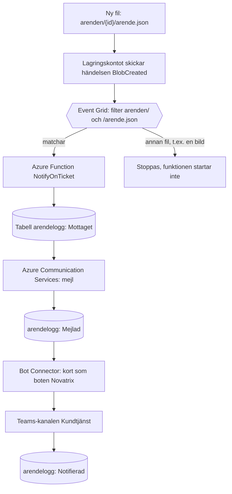
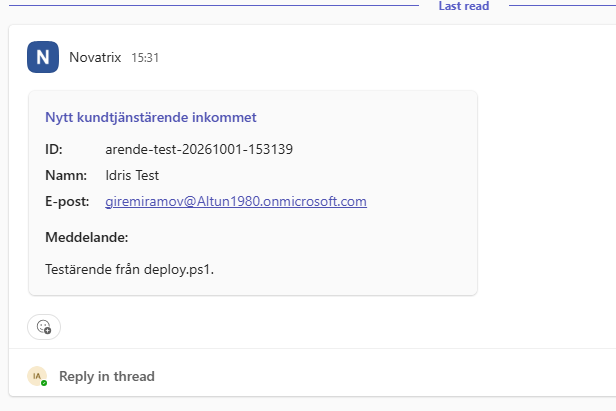
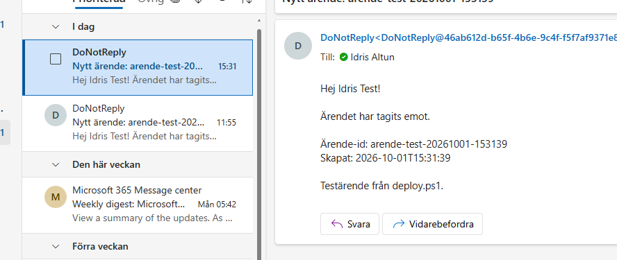

# Uppgift 6B, Modul 1 - Händelsestyrt

**Repo:** https://github.com/80idralt/azure/tree/master/6B/modul-1-handelsestyrt

**Namn:** Idris Altun

**Klass:** MOV25

**Datum:** 2026-10-01

## Syfte

I v39 skötte Power Automate ärendenotisen: appen ringde ett flöde som postade i Teams, skrev i SharePoint och skickade ett mejl. Här är samma notis ombyggd med bara Azures egna tjänster. När ett nytt ärende landar i containern `arenden` startar en Azure Function av sig själv, skriver ärendet i en tabell, skickar ett mejl och postar ett kort i Teams-kanalen `Kundtjänst`. Ingen Power Automate, inga lösenord i koden och allt driftsatt som kod.

## Kraven och var de uppfylls

| Krav i uppgiften | Uppfyllt | Var |
|---|---|---|
| Azure Function med blob-trigger | `@app.blob_trigger(...)`, publicerad som `NotifyOnTicket - [blobTrigger]` | Avsnitt 1 |
| Utlöses av en ny blob i containern `arenden` | `path="arenden/{arendeId}/arende.json"` | Avsnitt 1 |
| Läser ärendets uppgifter och gör minst en åtgärd | Läser id, namn, e-post och meddelande. Skriver en rad, skickar ett mejl och postar ett Teams-kort. | Avsnitt 3 |
| Hanterad identitet, ingen nyckel i koden | Funktionens egen identitet mot lagringen, botens identitet mot Teams | Avsnitt 2 och 4 |
| Driftsatt som kod (ARM eller Bicep) | Fyra ARM-mallar, inget framklickat i portalen | Filerna |
| **VG:** Event Grid fångar att bloben skapats och startar funktionen | `source=func.BlobSource.EVENT_GRID` + prenumerationen i `eventgrid.json` | Avsnitt 1 |
| **VG:** skriva en rad, skicka ett mejl och lägga en notis | Tabellen `arendelogg`, Azure Communication Services, Teams-bot | Avsnitt 3 och 4 |
| **VG:** motivera valet av tjänster | | Varför just dessa tjänster |
| Verifierad att den fungerar | Ärendet `arende-test-20261001-153139` gav mejl och Teams-kort | Resultat |

## Arkitektur



Två resursgrupper med olika livslängd:

| Resursgrupp | Innehåll | Livslängd |
|---|---|---|
| `rg-novatrix-6b` | Lagring, tabell, funktion, Event Grid, mejltjänst, loggar | Tillfällig, byggs och rivs vid varje test |
| `rg-novatrix-bot` | Botens identitet `id-novatrix-bot` och Azure Bot `Novatrix` | Permanent, byggs en gång och kostar inget |

## Samma notis som i v39, nya byggstenar

| I v39 (Power Automate) | I 6B (Azure) | Vad delen gör |
|---|---|---|
| Flödet | Azure Function, `function_app.py` | Gör jobbet när ett ärende kommer |
| HTTP-triggern, appen ringer flödet | Event Grid, lagringen säger själv till | Startar kedjan |
| SharePoint-listan `Ärenderegister` | Tabellen `arendelogg` | Lista över alla ärenden |
| Outlook "Skicka e-post" | Azure Communication Services | Skickar mejlet |
| "Arbetsflöden" postar kortet | Egen bot, `Novatrix` | Postar kortet i Teams |
| Omfång + larmmejl | Status i tabellen + automatiska omförsök | Hanterar fel |
| Steg som klickas ihop | Python-kod och ARM-mallar | Allt versionshanteras som text |

## 1. Triggern: en blob trigger via Event Grid

```python
@app.function_name(name="NotifyOnTicket")
@app.blob_trigger(
    arg_name="blob",
    path="arenden/{arendeId}/arende.json",
    connection="NovatrixStorage",
    source=func.BlobSource.EVENT_GRID,
)
def notify_on_ticket(blob: func.InputStream):
```

En blob trigger kan märka nya filer på två sätt. Den klassiska varianten tittar själv i containern med jämna mellanrum. Event Grid-varianten får i stället en händelse från lagringskontot i samma ögonblick som filen skapas. Jag använder Event Grid av två skäl: notisen går iväg direkt i stället för efter nästa genomsökning och det är den enda variant som funktionens plan (Flex Consumption) stöder.

Filtret sitter på två ställen. `path` i koden säger vilka filer funktionen bryr sig om och Event Grid-prenumerationen i `eventgrid.json` stoppar allt annat redan innan funktionen anropas:

```json
"filter": {
  "includedEventTypes": [ "Microsoft.Storage.BlobCreated" ],
  "subjectBeginsWith": "/blobServices/default/containers/arenden/",
  "subjectEndsWith": "/arende.json"
}
```

En bild som laddas upp i samma ärendemapp väcker alltså aldrig funktionen.

## 2. Hanterad identitet, ingen nyckel i koden

Funktionen har två identiteter:

- **Sin egen** (system-assigned), för lagringen. Mallen ger den tre roller på lagringskontot:

  | Roll | Varför |
  |---|---|
  | Storage Blob Data Owner | Läsa ärendet och hämta sin egen kod ur containern `app-package` |
  | Storage Queue Data Contributor | Blob triggern använder köer för omförsök och för en "giftkö" med ärenden som misslyckats för många gånger |
  | Storage Table Data Contributor | Läsa och skriva i `arendelogg` |

  Uppgiftens exempel använder rollen Storage Blob Data Reader. Den räcker för att läsa ärendet, men inte för triggerns kvitton och köer och inte för Flex Consumption som hämtar koden med samma identitet.

- **Botens** (user-assigned, `id-novatrix-bot`), för att posta i Teams. Den lånas från den permanenta resursgruppen.

I koden står inga nycklar eller adresser. Allt läses från inställningar som mallen sätter:

```python
endpoint=os.environ["TABLE_ENDPOINT"],
credential=DefaultAzureCredential(),
```

Ett undantag finns: mejltjänsten använder en anslutningssträng. Mallen hämtar den direkt från Azure med `listKeys()` och lägger den i funktionens inställningar, så den finns aldrig i koden eller i repot.

## 3. Tre samordnade åtgärder

```python
status = hamta_status(tabell, arende["id"])

if status == "Notifierad":
    return

if status != "Mejlad":
    logga(tabell, arende, "Mottaget")
    skicka_mejl(arende)
    logga(tabell, arende, "Mejlad")

skicka_teams(arende)
logga(tabell, arende, "Notifierad")
```

Tabellen är både logg och minne. Azure gör automatiskt om en körning som misslyckas, upp till fem gånger och lägger sedan ärendet i en giftkö. Statusen gör att ett nytt försök fortsätter där det förra stannade:

| Status när funktionen startar | Vad som händer |
|---|---|
| ingen rad | Hela kedjan körs |
| `Mejlad` | Mejlet har redan gått, bara Teams-kortet skickas |
| `Notifierad` | Allt är redan gjort, inget skickas |

Kunden får alltså aldrig samma mejl två gånger, inte ens om Teams är nere en stund. Det motsvarar Omfånget i v39: ett trasigt steg ska inte förstöra de andra.

## 4. Teams via en egen bot

Kortet är samma Adaptive Card som i v39, nu byggt i Python (`teams_kort()`). Det postas med Bot Framework:

```python
biljett = ManagedIdentityCredential(client_id=os.environ["BOT_CLIENT_ID"]).get_token(
    "https://api.botframework.com/.default"
)
```

```
POST https://smba.trafficmanager.net/teams/v3/conversations
```

Funktionen loggar in som boten med botens identitet och skickar kortet till kanalens id. Inget lösenord finns någonstans, boten är av typen `UserAssignedMSI`.

Varför en bot? Microsoft låter inte vilket program som helst posta i en Teams-kanal. Avsändaren måste vara en app som en administratör har godkänt och som är installerad i teamet. Så gör företag som vill ha notiser i Teams från egna system. Alternativen föll bort:

| Alternativ | Varför inte |
|---|---|
| Gamla Incoming Webhooks | Läggs ned av Microsoft |
| Teams "Arbetsflöden"-webhook | Är Power Automate och det är just det som ska ersättas |
| Mejl till kanalens e-postadress | Testat, se Buggar på vägen. Teams släpper inte in mejl från mejltjänstens testdomän |

Boten består av tre delar:

1. **`templates/bot.json`**: identiteten, Azure Bot på gratisnivån `F0` och Teams aktiverat på boten. Ligger i `rg-novatrix-bot`.
2. **`teams-app/`**: Teams-appen (`manifest.json` och två ikoner). Manifestet pekar på botens id och säger att boten bara får finnas i team och bara skickar notiser:

   ```json
   "bots": [{
     "botId": "c98c45fe-35de-406b-a95a-4ab0d970afde",
     "scopes": ["team"],
     "isNotificationOnly": true
   }]
   ```

3. **`/api/messages`** i funktionen. Teams hälsar på boten när den installeras och kräver en adress dit. Funktionen svarar bara "OK", eftersom boten aldrig tar emot meddelanden.

Varför två resursgrupper? Om botens identitet låg i `rg-novatrix-6b` skulle den få ett nytt id vid varje deploy och då skulle Teams-appen behöva byggas om och laddas upp igen varje gång. Identiteter och appregistreringar lever länge, testmiljöer kommer och går. Därför ligger boten för sig och kostar ingenting där.

## Varför just dessa tjänster

**Event Grid** gör kedjan händelsestyrd på riktigt: lagringskontot säger till direkt när en fil skapas och filtret ser till att bara ärenden väcker funktionen.

**Azure Functions på Flex Consumption** är serverless. Det finns ingen server att sköta, funktionen kör bara när ett ärende kommer och kostar ingenting däremellan. Jag har satt minnet till lägsta nivån, 512 MB, eftersom funktionen bara läser en liten JSON-fil och skickar två meddelanden. Taket på 40 samtidiga instanser är det lägsta som går att välja och skyddar mot skenande kostnader.

**Table Storage** är det enklaste och billigaste sättet att spara en rad per ärende. Den ligger i samma lagringskonto som ärendena, så ingen ny tjänst behövs. En databas som Cosmos DB eller SQL hade varit överdrivet för en status per ärende.

**Azure Communication Services** är Azures egen mejltjänst. Den skickar från en färdig avsändardomän utan att någon brevlåda behövs.

**En Teams-bot** är det sätt Microsoft själva anvisar för notiser från egna system, se avsnitt 4.

## Buggar på vägen

- **`func new --template "Azure Blob Storage trigger"` hittade ingen mall.** `func init` skapade ett projekt i Pythons nya programmeringsmodell (v2), där alla funktioner skrivs med dekoratorer i en enda `function_app.py`. Mallnamnet i uppgiftens exempel hör till den äldre modellen. Löst genom att skriva triggern direkt i `function_app.py`.
- **`listKeys` i `variables` stoppade `eventgrid.json`.** ARM tillåter inte `listKeys()` eller `reference()` bland variablerna, bara i resursernas egenskaper. Löst genom att flytta uttrycket in i prenumerationens `endpointUrl`.
- **Mejl till kanalens e-postadress kom aldrig fram.** Första Teams-försöket mejlade kanalens adress via mejltjänsten. Funktionen rapporterade att allt gått bra och kundmejlet kom fram, men inget syntes i kanalen. Ett mejl från en vanlig Hotmail-adress till samma kanaladress syntes direkt. Slutsatsen: Teams släpper inte in mejl från mejltjänstens anonyma testdomän (`azurecomm.net`). Löst genom att byta till en bot.

## Filerna

| Fil | Vad den gör |
|---|---|
| `novatrix-fn/function_app.py` | Funktionen: trigger, tabell, mejl, Teams och `/api/messages` |
| `novatrix-fn/requirements.txt` | Python-paketen som Azure installerar vid publicering |
| `novatrix-fn/host.json` | Standardinställningar för Functions, skapad av `func init` |
| `templates/azuredeploy.json` | Lagring, tabell, funktion, roller, mejltjänst, loggar och Event Grid-källan |
| `templates/azuredeploy.parameters.json` | Region, mejlmottagare och Teams-kanalens id |
| `templates/eventgrid.json` | Kopplar lagringskontot till funktionen, körs efter publiceringen |
| `templates/bot.json` | Botens identitet och Azure Bot, körs en gång |
| `teams-app/` | Teams-appen: manifest och ikoner |
| `deploy.ps1` | Bygger, publicerar, kopplar Event Grid och skickar ett testärende |
| `destroy.ps1` | River `rg-novatrix-6b` |

`eventgrid.json` är en egen mall eftersom prenumerationen behöver funktionens nyckel för blob-händelser och den finns först när koden har publicerats.

## Parametrar att fylla i

- `mejlTill`, mottagaren av mejlet. I testmiljön en fast testbrevlåda. I skarpt läge tas adressen från ärendet.
- `teamsKanalId`, kanalens id i formen `19:...@thread.tacv2`. Det står i kanallänken (**⋯** → **Hämta länk till kanal**).

## Kommandon

### En gång: boten och Teams-appen

```powershell
az group create --name rg-novatrix-bot --location swedencentral
az deployment group create --resource-group rg-novatrix-bot --template-file templates/bot.json
```

Utdatan visar `botClientId`. Det ska stå som `botId` i `teams-app/manifest.json`. Packa sedan appen:

```powershell
cd teams-app
Compress-Archive -Path manifest.json,color.png,outline.png -DestinationPath $env:TEMP\novatrix-teams-app.zip -Force
```

Ladda upp zip-filen i Teams administrationscenter under **Teams apps** → **Manage apps** → **Upload new app**. Lägg sedan till appen i teamet i Teams: **Apps** → **Built for your org** → **Novatrix** → **Add to a team**.

### Varje test

```powershell
.\6B\modul-1-handelsestyrt\deploy.ps1
.\6B\modul-1-handelsestyrt\destroy.ps1
```

`deploy.ps1` gör fyra steg: bygger resurserna, publicerar koden (med nya försök om rollerna inte hunnit slå igenom), kopplar Event Grid och laddar upp ett testärende med ett unikt id.

### Samma steg för hand

```powershell
az group create --name rg-novatrix-6b --location swedencentral
az deployment group create --resource-group rg-novatrix-6b --template-file templates/azuredeploy.json --parameters "@templates/azuredeploy.parameters.json"
$out = az deployment group show --resource-group rg-novatrix-6b --name azuredeploy --query properties.outputs -o json | ConvertFrom-Json
cd novatrix-fn
func azure functionapp publish $out.funcName.value --python
cd ..
az deployment group create --resource-group rg-novatrix-6b --template-file templates/eventgrid.json
az storage blob upload --account-name $out.storageName.value --container-name arenden --name arende-test-001/arende.json --file arende.json --auth-mode key
az storage entity query --account-name $out.storageName.value --table-name arendelogg --auth-mode key --query "items[].{id:RowKey,status:Status}" -o table
az group delete --name rg-novatrix-6b --yes --no-wait
```

## Resultat

Testet kördes med `deploy.ps1`, som laddade upp ärendet `arende-test-20261001-153139`. Kortet kom från boten Novatrix i kanalen `Kundtjänst`:



Mejlet med samma ärende-id kom i samma minut:



## Kostnad

| Del | Kostnad |
|---|---|
| Funktionen (Flex Consumption, 512 MB) | Per körning, ryms i den månatliga gratiskvoten |
| Lagring, tabell, Event Grid | Bråkdelar av öre vid testvolymer |
| Mejltjänsten | Bråkdelar av öre per mejl |
| Azure Bot F0 och identiteten | Gratis, Teams är en standardkanal |

`rg-novatrix-6b` rivs direkt efter varje test. `rg-novatrix-bot` står kvar och kostar inget.

## Begränsningar och fortsättning

- **Formuläret från v39 är inte inkopplat.** v39:s lagringskonto är nätverkslåst, så bara webb-VM:en når det. En funktion på Flex Consumption kommer utifrån och skulle stängas ute. Här har funktionen därför ett eget lagringskonto och ärenden laddas upp med `az storage blob upload`. För att koppla in formuläret behövs VNet-integration, så att funktionen kopplas in i samma nätverk som VM:en.
- **Ingen larmar om något går fel.** Misslyckade ärenden hamnar i giftkön, men ingen får veta det. Det hör till Modul 3: ett larm i Azure Monitor på funktionens fel, med en action group som skickar mejl.
- **Mejlet går från testdomänen `azurecomm.net`.** I skarpt läge kopplas en egen domän till mejltjänsten.
