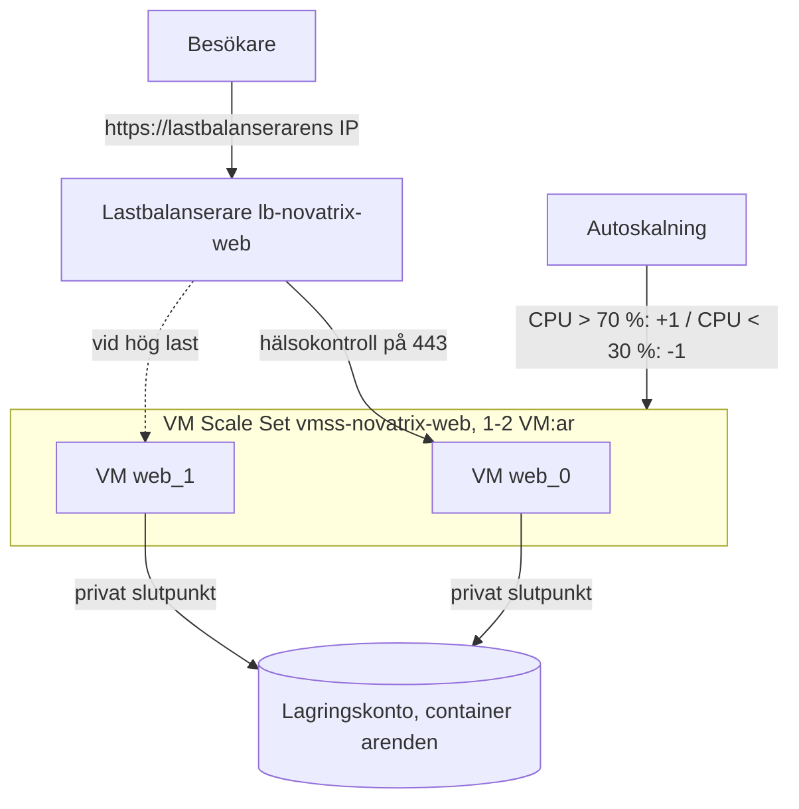
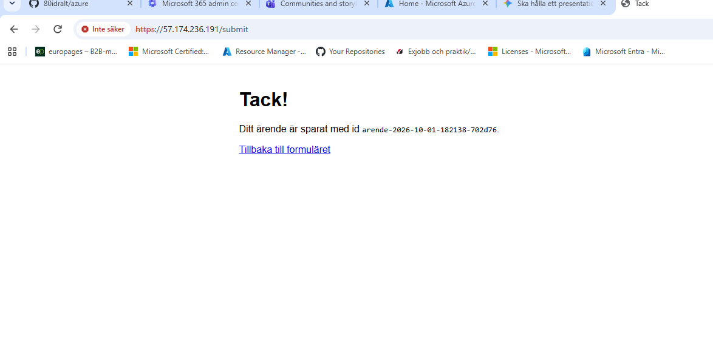
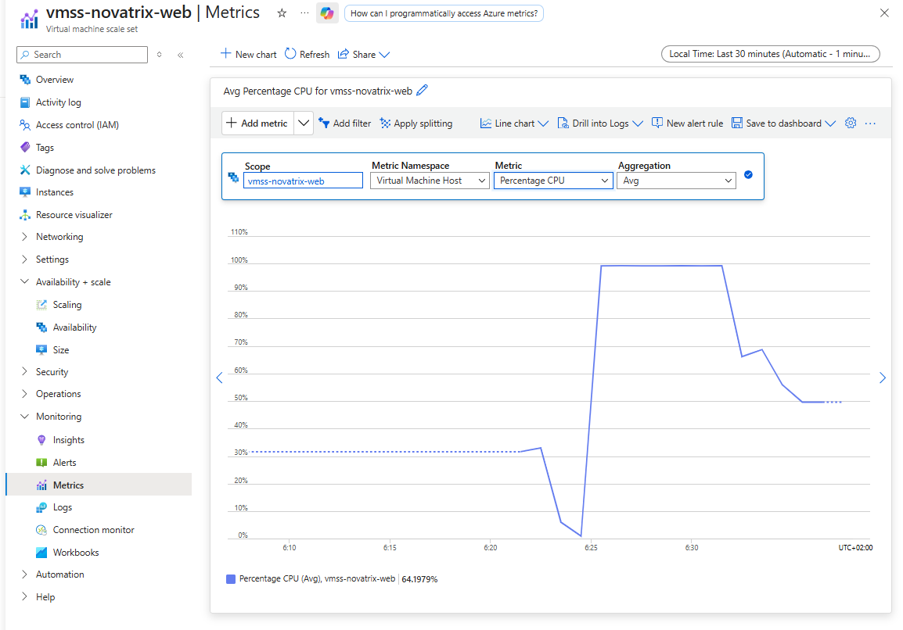
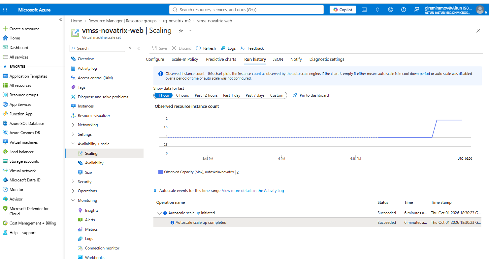
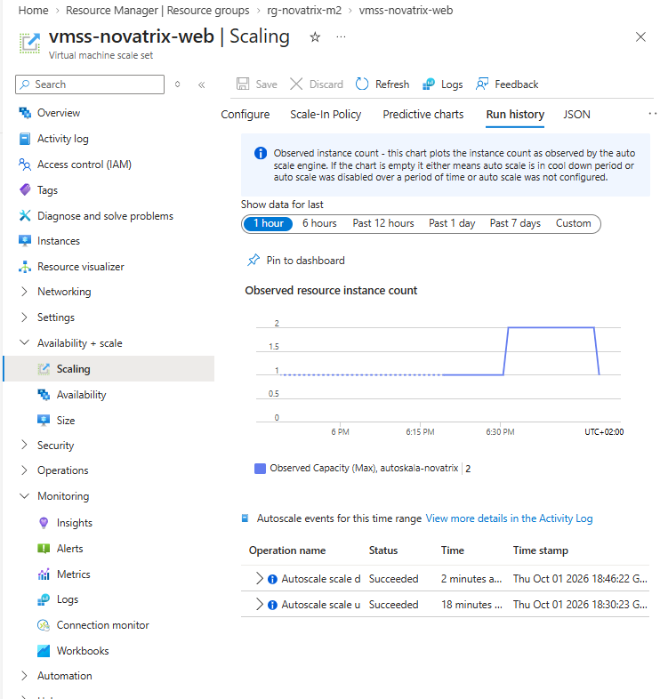
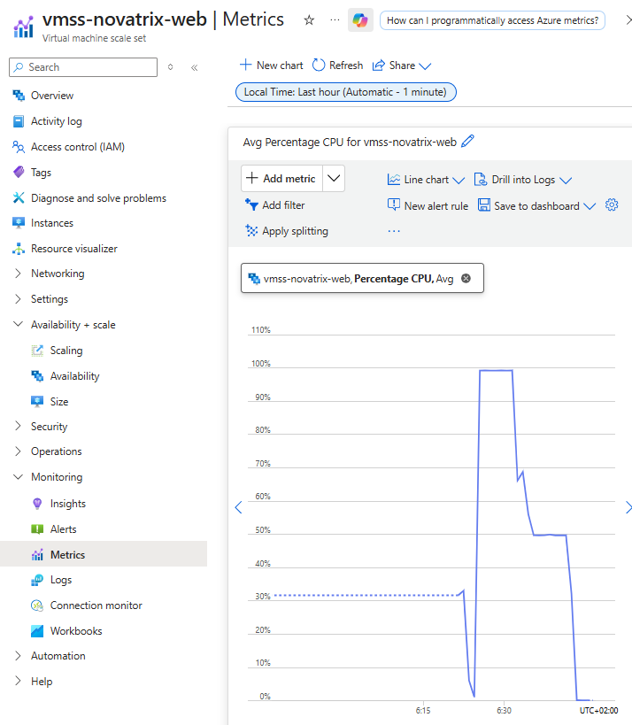

# Uppgift 6B, Modul 2 - Elastiskt

**Repo:** https://github.com/80idralt/azure/tree/master/6B/modul-2-elastiskt

**Namn:** Idris Altun

**Klass:** MOV25

**Datum:** 2026-10-01

## Syfte

I v39 kör hela Novatrix webbsida på en enda VM. Går den VM:en sönder eller startas om är sidan nere och kommer det plötsligt många besökare blir den överbelastad. Här är webben ombyggd till ett VM Scale Set bakom en lastbalanserare: flera likadana VM:ar som Azure själv gör fler när det är mycket att göra och färre när det är lugnt och en enda adress för besökaren. Allt är driftsatt som kod.

## Kraven och var de uppfylls

| Krav i uppgiften | Uppfyllt | Var |
|---|---|---|
| Scale set som reser webben från samma cloud-init som den enskilda VM:en | v39:s cloud-init oförändrad, plus verktyget `stress-ng` för lasttestet | Avsnitt 2 |
| Lastbalanserare framför, en adress, trafiken fördelas | Standard Load Balancer med publik IP, hälsokontroll och regler för 80 och 443 | Avsnitt 1 |
| Verifierat att sidan svarar genom lastbalanseraren | `200` från lastbalanserarens IP och ett sparat ärende via formuläret | Resultat |
| Driftsatt som kod | ARM-mall, inget framklickat | Filerna |
| **VG:** autoskalningsregler | CPU över 70 % ger en VM till, under 30 % en mindre, minst 1 och högst 2 | Avsnitt 3 |
| **VG:** lasttest som visar att antalet växer och krymper | `stress-ng` på VM:en, förloppet 1 → 2 → 1 dokumenterat | Avsnitt 4 och Resultat |
| **VG:** motiverade gränsvärden | | Avsnitt 3 |
| Budgetlarm innan testet | `giremirabudget`, 100 kr per månad, som kod | Avsnitt 5 |

## Arkitektur



## Samma webb som i v39, nya byggstenar

| I v39 | I Modul 2 | Vad det gör |
|---|---|---|
| En webb-VM | VM Scale Set | En grupp likadana VM:ar som kan bli fler eller färre |
| VM:ens cloud-init | Samma cloud-init | Varje ny VM bygger sig själv |
| VM:ens publika IP | Lastbalanserare med publik IP | En adress, trafiken fördelas |
| `vmSize` | Samma, `Standard_B2ats_v2` | Storlek per VM |
| *(fanns inte)* | Autoskalning | Regler för när VM:ar läggs till och tas bort |

Nätverket, hoppvärden, det låsta lagringskontot, den privata slutpunkten och identiteten `id-novatrix-app` är oförändrade från v39.

## 1. Lastbalanseraren

| Del | Vad den gör |
|---|---|
| Publik IP `pip-lb-novatrix-web` | Den enda adress besökaren ser |
| Backend pool | VM:arna som får trafik. Scale setet ställer in varje ny VM här automatiskt. |
| Hälsokontroll `probe-https` | Frågar varje VM på port 443 var 5:e sekund. En VM som inte svarar två gånger i rad får ingen trafik förrän den svarar igen. |
| Regler för 443 och 80 | Skickar vidare till en frisk VM. Port 80 omdirigerar till HTTPS precis som i v39. |
| Utgående regel | Låter VM:arna nå internet för `cloud-init` |

```json
"probes": [{
  "name": "probe-https",
  "properties": { "protocol": "Https", "port": 443, "requestPath": "/", "intervalInSeconds": 5, "probeThreshold": 2 }
}]
```

**Varför HTTPS i hälsokontrollen?** nginx svarar på port 80 med en omdirigering (`301`) och lastbalanseraren räknar bara `200` som frisk. På 443 svarar startsidan med `200`.

**Varför `loadDistribution: SourceIP`?** Varje VM skapar sitt eget självsignerade certifikat. Med `SourceIP` hamnar samma besökare på samma VM, så webbläsaren inte hoppar mellan certifikat och visar varningen på nytt.

**Varför en egen utgående regel?** VM:arna i scale setet har ingen egen publik IP. Azure fasar ut den automatiska internetåtkomsten för sådana VM:ar, så utgående trafik styrs uttryckligen genom lastbalanseraren. Utan den kunde `cloud-init` inte installera paket eller hämta appen från GitHub.

## 2. Scale setet

| Inställning | Värde | Varför |
|---|---|---|
| cloud-init | v39:s, plus `stress-ng` | Varje ny VM blir en exakt kopia av v39:s webb-VM |
| Identitet | `id-novatrix-app` | Alla VM:ar sparar ärenden utan nyckel, som i v39 |
| Nätverk | `snet-web` + lastbalanserarens backend pool | En ny VM ställer sig bakom lastbalanseraren av sig själv |
| Startantal | 1 | Billigast, autoskalningen lägger till vid behov |
| `overprovision` | `false` | Annars skapar Azure tillfälligt fler VM:ar än som behövs, vilket kostar och tar kvot |
| Läge | `Uniform` | Alla VM:ar är identiska kopior, vilket passar en webbfarm |

## 3. Autoskalningen

```json
"capacity": { "minimum": "1", "maximum": "2", "default": "1" },
"rules": [
  { "metricTrigger": { "metricName": "Percentage CPU", "timeWindow": "PT5M", "timeAggregation": "Average", "operator": "GreaterThan", "threshold": 70 },
    "scaleAction":   { "direction": "Increase", "type": "ChangeCount", "value": "1", "cooldown": "PT5M" } },
  { "metricTrigger": { "metricName": "Percentage CPU", "timeWindow": "PT5M", "timeAggregation": "Average", "operator": "LessThan", "threshold": 30 },
    "scaleAction":   { "direction": "Decrease", "type": "ChangeCount", "value": "1", "cooldown": "PT5M" } }
]
```

**Motivering av gränsvärdena:**

- **70 % för att skala ut.** Det lämnar marginal innan VM:en blir helt överbelastad. En ny VM tar några minuter att starta, så den måste beställas innan det redan är för sent.
- **30 % för att skala in.** Glappet mellan 30 och 70 förhindrar att skalningen "fladdrar". Med samma gräns åt båda håll kunde en ny VM sänka snittet precis under gränsen, vilket gav nedskalning, sedan uppskalning igen och så vidare.
- **5 minuters snitt.** En kort topp på några sekunder ska inte kosta en ny VM. Det krävs en verklig belastning.
- **5 minuters vilotid.** Ger en ny VM tid att starta och börja ta trafik innan nästa beslut fattas.
- **Minst 1, högst 2.** En VM räcker i vila. Taket på 2 håller kostnaden nere och ryms i kvoten: 2 webb-VM:ar och hoppvärden blir 6 av 10 tillåtna kärnor i B-familjen.

## 4. Lasttestet

Lasten skapas med `stress-ng` direkt på VM:en, startad med `az vmss run-command`:

```powershell
az vmss run-command invoke --resource-group rg-novatrix-m2 --name vmss-novatrix-web --instance-id 0 --command-id RunShellScript --scripts "nohup stress-ng --cpu 0 --timeout 20m > /dev/null 2>&1 &"
```

`--cpu 0` belastar alla kärnor och `--timeout 20m` stänger av lasten av sig själv, så att en bortglömd stress aldrig kör för evigt. Jag valde att belasta CPU:n direkt i stället för att skicka massor av webbtrafik. Det ger en förutsägbar last som syns direkt i just det mätvärde som autoskalningen följer och den kräver inget extra verktyg utanför Azure.

## 5. Budget och kostnad

Budgetlarmet sattes innan testet och finns som kod i `templates/budget.json`. Det deployas på prenumerationsnivå (`az deployment sub create`), så det överlever när testmiljöns resursgrupp rivs:

| Larm | Typ | Nivå |
|---|---|---|
| `forecasted_GreaterThan_50_Percent` | Prognos | 50 kr |
| `forecasted_GreaterThan_70_Percent` | Prognos | 70 kr |
| `forecasted_GreaterThan_90_Percent` | Prognos | 90 kr |
| `actual_GreaterThan_80_Percent` | Faktisk | 80 kr |

Prognoslarmen varnar innan pengarna är slut. Larmet på faktisk kostnad är ett säkerhetsbälte för när prognosen inte hunnit reagera, till exempel efter ett kort test i början av månaden. Ett budgetlarm stoppar ingenting, det varnar bara. Därför revs resursgruppen direkt efter testet.

## Observationer från testet

- **Fördröjningen är längre än regeln.** Regeln säger 5 minuter, men uppskalningen kom cirka 6 minuter efter att lasten startade och nedskalningen cirka 4–5 minuter efter att den stoppades. Mätvärdena når autoskalningen med ett par minuters eftersläpning och den kontrollerar reglerna ungefär en gång i minuten. Det är värt att räkna med när gränsvärden sätts.
- **Mätvärdet är ett snitt över alla VM:ar.** När den andra VM:en startade föll snittet från 100 % till cirka 50 %, trots att VM 0 fortfarande körde för fullt: (100 + 0) / 2. Med fler VM:ar sjunker alltså snittet av sig självt, vilket är just det som gör att skalningen stannar på en rimlig nivå.
- **Portalens graf kan lura.** Med tidsintervallet "Last 24 hours" visar portalen 15-minuterssnitt och då såg CPU:n ut att ligga runt 50 % fast den låg på 100 %. Med "Last 30 minutes" och upplösningen 1 minut syns samma värden som autoskalningen räknar på.
- **B-serien har CPU-krediter.** `Standard_B2ats_v2` är en "burstable" VM som bromsas till sin grundnivå när krediterna är slut. Här fanns krediter kvar (cirka 57) och CPU:n nådde 100 %. Under längre last skulle bromsen kunna hålla mätvärdet under 70 %, så att autoskalningen aldrig reagerar. För en produktionsmiljö som ska autoskala på CPU passar en VM-serie utan kreditsystem bättre.

## Filerna

| Fil | Vad den gör |
|---|---|
| `templates/azuredeploy.json` | v39:s mall med webb-VM:en utbytt mot lastbalanserare, scale set och autoskalning |
| `templates/azuredeploy.parameters.json` | Samma parametrar som v39 |
| `templates/budget.json` | Budgetlarmet, deployas på prenumerationsnivå |

## Parametrar att fylla i

- `adminIp`, din publika IP-adress. Den kan ändras, så ta fram den före varje deploy:
  ```powershell
  curl.exe -s https://api.ipify.org
  ```
- `sshPublicKey`, den publika delen av din SSH-nyckel:
  ```powershell
  Get-Content $HOME\.ssh\id_ed25519.pub
  ```
- Övriga parametrar har färdiga värden, samma som v39. `flowUrl` lämnas tom, så inga Power Automate-notiser skickas under lasttestet.

## Kommandon

Budgetlarmet (en gång, `startDate` ska vara samma som den befintliga budgetens):

```powershell
az deployment sub create --location swedencentral --template-file 6B/modul-2-elastiskt/templates/budget.json --parameters startDate=2026-09-01
```

Bygg, från `6B/modul-2-elastiskt/templates`:

```powershell
az group create --name rg-novatrix-m2 --location swedencentral
az deployment group validate --resource-group rg-novatrix-m2 --template-file azuredeploy.json --parameters "@azuredeploy.parameters.json"
az deployment group create --resource-group rg-novatrix-m2 --template-file azuredeploy.json --parameters "@azuredeploy.parameters.json"
az deployment group show --resource-group rg-novatrix-m2 --name azuredeploy --query properties.outputs.webUrl.value -o tsv
```

Kontrollera att sidan svarar genom lastbalanseraren (adressen från förra kommandot):

```powershell
curl.exe -k -s -o NUL -w "%{http_code}" https://57.174.236.191/
```

Visa antalet VM:ar:

```powershell
az vmss list-instances --resource-group rg-novatrix-m2 --name vmss-novatrix-web --query "[].{namn:name, status:provisioningState}" -o table
```

Starta och stoppa lasten:

```powershell
az vmss run-command invoke --resource-group rg-novatrix-m2 --name vmss-novatrix-web --instance-id 0 --command-id RunShellScript --scripts "nohup stress-ng --cpu 0 --timeout 20m > /dev/null 2>&1 &"
az vmss run-command invoke --resource-group rg-novatrix-m2 --name vmss-novatrix-web --instance-id 0 --command-id RunShellScript --scripts "pkill stress-ng"
```

Riv:

```powershell
az group delete --name rg-novatrix-m2 --yes --no-wait
```

## Resultat

**Sidan svarar genom lastbalanseraren:**

```
PS> curl.exe -k -s -o NUL -w "%{http_code}" https://57.174.236.191/
200
```

Ett ärende skickades in via formuläret på lastbalanserarens adress och sparades av VM:en i scale setet:



**Utgångsläget, en VM:**

```
Namn                 Status
-------------------  ---------
vmss-novatrix-web_0  Succeeded
```

**Lasten startades cirka 18:25.** CPU:n gick till 100 % och kl. 18:30:23 lade autoskalningen till en VM:





```
Namn                 Status
-------------------  ---------
vmss-novatrix-web_0  Succeeded
vmss-novatrix-web_1  Succeeded
```

**Lasten stoppades cirka 18:42.** Snittet föll under 30 % och kl. 18:46:22 tog autoskalningen bort en VM:

```
Namn                 Status
-------------------  ---------
vmss-novatrix-web_0  Succeeded
```

Hela förloppet, 1 → 2 → 1, i autoskalningens historik och i CPU-grafen:





| Tid | Händelse |
|---|---|
| 18:21 | Ärende sparat via lastbalanseraren |
| ca 18:25 | Lasten startad, CPU 100 % |
| 18:30:23 | Autoscale scale up, 1 → 2 |
| ca 18:42 | Lasten stoppad |
| 18:46:22 | Autoscale scale down, 2 → 1 |

Resursgruppen revs direkt efteråt.

## Begränsningar och fortsättning

- **Tillgänglighetszoner är inte använda.** Med `"zones": ["1", "2", "3"]` på scale setet skulle VM:arna spridas över olika datacenter i regionen, så att ett avbrott i ett av dem inte tar ner sidan. Standard Load Balancer klarar det redan. Jag har prioriterat att få skalningen verifierad.
- **Varje VM har sitt eget självsignerade certifikat.** I produktion används ett riktigt certifikat, helst på en Application Gateway framför VM:arna, så att alla VM:ar delar samma.
- **Lasten kördes bara på en VM.** Det räckte för att trigga skalningen, men ett test med verklig webbtrafik mot lastbalanseraren skulle också visa att trafiken fördelas över båda VM:arna.
