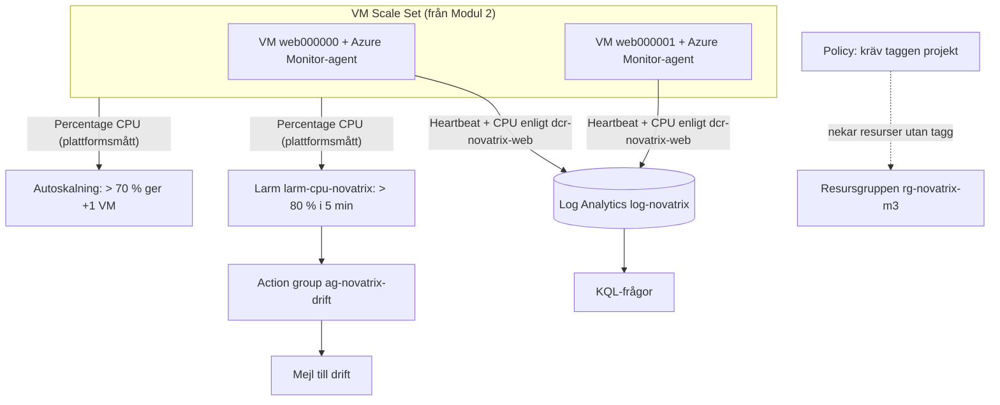
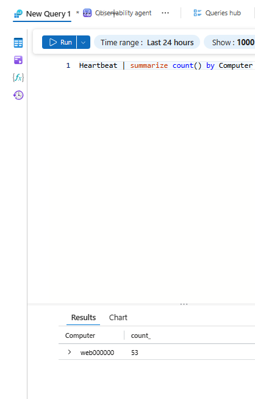
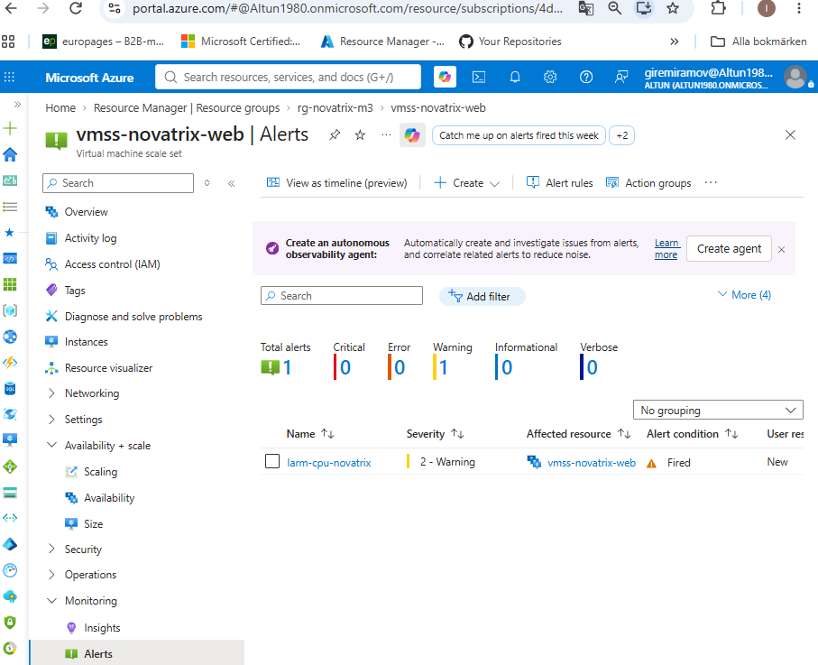
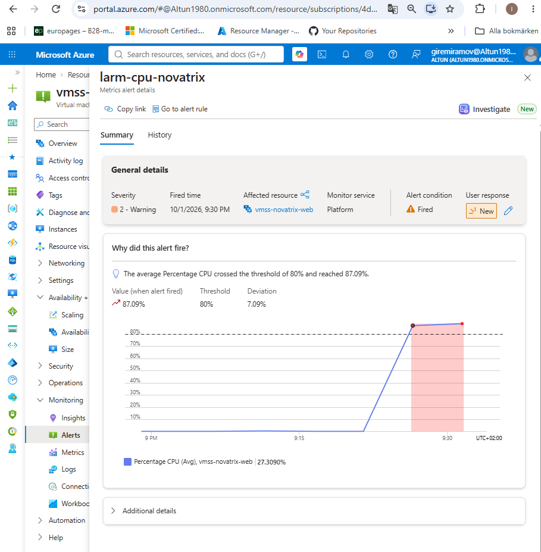
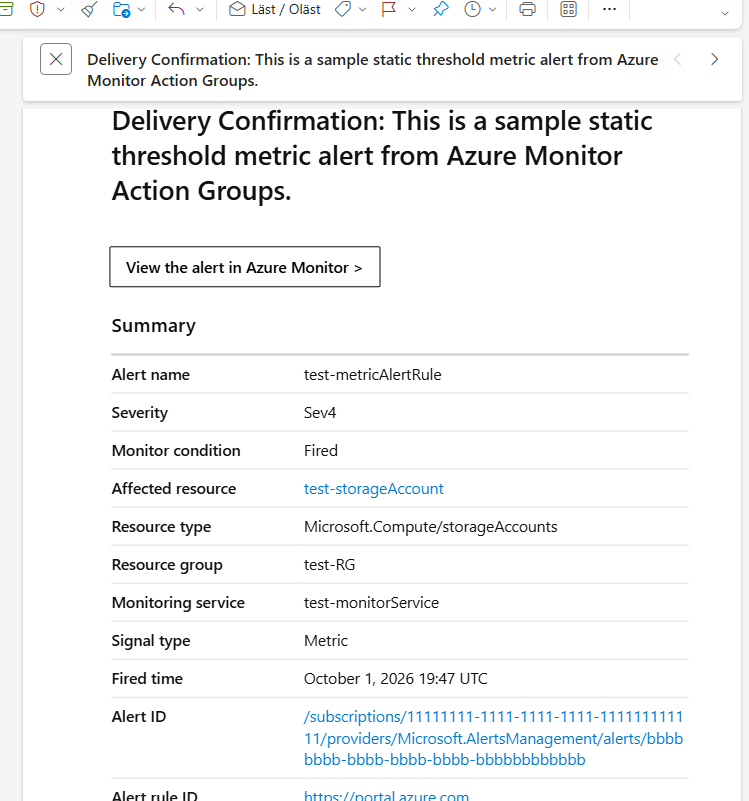
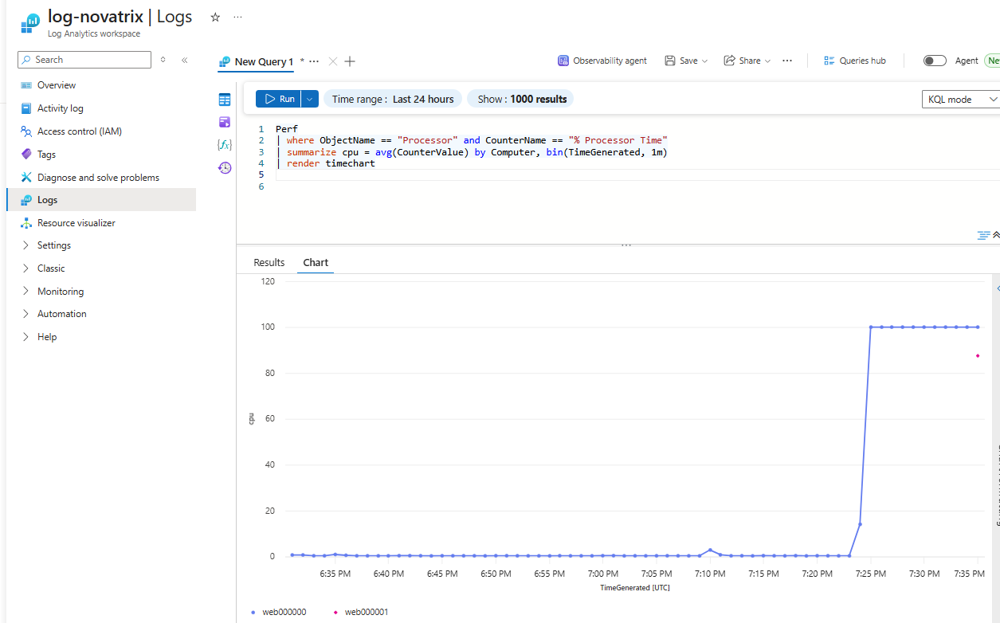

# Uppgift 6B, Modul 3 - Övervakat och styrt

**Repo:** https://github.com/80idralt/azure/tree/master/6B/modul-3-overvakat

**Namn:** Idris Altun

**Klass:** MOV25

**Datum:** 2026-10-01

## Syfte

Modul 1 och 2 byggde en lösning som fungerar. Men någon måste också få veta när den slutar fungera, man måste kunna ställa frågor om vad som har hänt och det måste finnas regler så att miljön inte byggs hur som helst. Modul 3 lägger ett lager ovanpå webben från Modul 2 som **ser** (loggar och mätvärden), **larmar** (mejl vid hög CPU) och **håller ordning** (en policy som kräver taggar).

## Kraven och var de uppfylls

| Krav i uppgiften | Uppfyllt | Var |
|---|---|---|
| Larm i Azure Monitor kopplat till en action group som skickar mejl | `larm-cpu-novatrix` + `ag-novatrix-drift` | Avsnitt 2 |
| Dokumenterat vad som utlöser larmet och vad som händer | | Avsnitt 2 |
| KQL-fråga i Log Analytics | `Heartbeat \| summarize count() by Computer` | Avsnitt 3 |
| **VG:** minst en Azure Policy som visar styrning | Inbyggd policy som kräver taggen `projekt` | Avsnitt 4 |
| **VG:** KQL-fråga som säger något användbart | CPU per VM över tid | Avsnitt 3 |
| **VG:** hur övervakning och styrning hänger ihop med de andra modulerna | | Avsnitt 5 |
| Driftsatt som kod | Två ARM-mallar | Filerna |
| Verifierat | Larmet gick, frågorna gav svar, policyn nekade en resurs | Resultat |

## Arkitektur



## Samma behov som tidigare, nya byggstenar

| Tidigare | I Modul 3 | Vad det gör |
|---|---|---|
| Larmmejlet i v39-flödet ("Larm: Fel i Novatrix") | Larm + action group | Mejlar när något går fel |
| Körhistoriken i Power Automate | Log Analytics + KQL | Visar vad som har hänt, med egna frågor |
| Grafen i portalen i Modul 2 | KQL-fråga per VM | Visar varje VM för sig, inte bara snittet |
| Budgetlarmet (ordning på pengar) | Azure Policy (ordning på resurser) | Regler för hela miljön |

## 1. Insamlingen: Log Analytics, agent och datainsamlingsregel

| Del | Vad den gör |
|---|---|
| **Log Analytics** `log-novatrix` | Arkivet där loggarna sparas och frågorna ställs |
| **Azure Monitor-agenten** | Ett tillägg på varje VM i scale setet. Rapporterar att VM:en lever (`Heartbeat`) och skickar de värden som datainsamlingsregeln anger. |
| **Datainsamlingsregel** `dcr-novatrix-web` | Bestämmer *vad* som samlas in (CPU varje minut) och *vart* det skickas (arbetsytan) |
| **Koppling** `dcr-koppling-web` | Kopplar regeln till hela scale setet, så att även VM:ar som autoskalningen skapar senare övervakas |

Agenten loggar in med samma identitet som appen, `id-novatrix-app`, så ingen nyckel behövs:

```json
"settings": { "authentication": { "managedIdentity": {
  "identifier-name": "mi_res_id",
  "identifier-value": "[resourceId('Microsoft.ManagedIdentity/userAssignedIdentities', variables('appIdentityName'))]"
}}}
```

Datainsamlingsregeln, kärnan:

```json
"performanceCounters": [{
  "name": "cpu",
  "streams": ["Microsoft-Perf"],
  "samplingFrequencyInSeconds": 60,
  "counterSpecifiers": ["\\Processor(*)\\% Processor Time"]
}]
```

## 2. Larmet: vad som utlöser det och vad som händer

```json
"criteria": {
  "odata.type": "Microsoft.Azure.Monitor.SingleResourceMultipleMetricCriteria",
  "allOf": [{
    "name": "HogCpu",
    "metricName": "Percentage CPU",
    "operator": "GreaterThan",
    "threshold": 80,
    "timeAggregation": "Average"
  }]
},
"evaluationFrequency": "PT1M",
"windowSize": "PT5M",
"autoMitigate": true
```

**Vad som utlöser larmet:** Den genomsnittliga CPU:n för alla VM:ar i scale setet ligger **över 80 % under 5 minuter**. Azure kontrollerar villkoret varje minut.

**Vad som händer när det går:**
1. Larmet får status **Fired** och syns under **Alerts** på scale setet, med allvarlighetsgrad 2 (Warning).
2. Action groupen `ag-novatrix-drift` anropas och skickar ett mejl till drift.
3. När snittet åter ligger under 80 % löser Azure larmet själv (`autoMitigate`), statusen blir **Resolved** och ett nytt mejl skickas.

**Varför 80 % när autoskalningen reagerar på 70 %?** De två ska samarbeta. Autoskalningen är första försvarslinjen och försöker lösa problemet själv genom att lägga till en VM. Larmet ligger högre och betyder att lasten ändå är så hög att en människa bör titta på det, till exempel för att scale setet redan har nått sitt tak på två VM:ar.

## 3. KQL-frågorna

**Grundkravet, vilka VM:ar lever:**

```kusto
Heartbeat
| summarize count() by Computer
```

Varje rad är en VM och siffran är hur många gånger den har rapporterat. En VM som har slutat rapportera har gått sönder eller stängts av. Samma fråga med `max(TimeGenerated)` i stället för `count()` visar när varje VM senast hördes av.

**VG, CPU per VM över tid:**

```kusto
Perf
| where ObjectName == "Processor" and CounterName == "% Processor Time"
| summarize cpu = avg(CounterValue) by Computer, bin(TimeGenerated, 1m)
| render timechart
```

Den här frågan säger något som portalens vanliga graf inte gör. Larmet och autoskalningen ser bara **snittet** för hela scale setet, medan frågan ritar **en linje per VM**. Då syns om lasten är jämnt fördelad eller om en enskild VM drar iväg och man ser exakt när en ny VM från autoskalningen börjar arbeta.

## 4. Policyn: kräv taggen `projekt`

```json
"policyDefinitionId": "[tenantResourceId('Microsoft.Authorization/policyDefinitions', '871b6d14-10aa-478d-b590-94f262ecfa99')]",
"parameters": { "tagName": { "value": "projekt" } }
```

`871b6d14-…` är Microsofts inbyggda policy **"Require a tag on resources"**. Tilldelad på resursgruppen nekar den varje ny resurs som saknar taggen `projekt`. Mallen sätter taggarna `projekt=novatrix` och `modul=6b-modul3` på alla resurser och resursgruppen skapas med samma taggar.

**Varför en egen mall som körs sist?** Policyn ska styra det som byggs *efter* att den är på plats, inte stoppa själva bygget. Det finns också rapporter om att just metric alerts kan nekas av den här policyn trots att taggen finns. Med policyn i en separat mall byggs hela miljön först och reglerna läggs på efteråt.

## 5. Hur det hänger ihop med de andra modulerna

**Mätvärden driver skalningen.** Autoskalningen i Modul 2 och larmet här bevakar samma mätvärde, `Percentage CPU`. Mätvärdet är alltså inte bara något att titta på, det styr hur många VM:ar som körs. Autoskalningen agerar vid 70 % och larmet tar över vid 80 % när automatiken inte räcker.

**Larm kan starta en åtgärd.** Action groupen skickar här ett mejl, men samma action group kan också anropa en webhook, en Logic App eller en Azure Function, till exempel funktionen från Modul 1. Ett larm kan alltså starta en automatisk åtgärd, inte bara väcka en människa.

**Taggar ger kostnadsuppföljning.** Med `projekt=novatrix` på varje resurs kan Cost Management gruppera kostnaderna per projekt och per modul. Policyn garanterar att ingen resurs glöms bort och hamnar utanför uppföljningen. Det kopplar till budgetlarmet från Modul 2, som bevakar den totala summan.

**Övervakningen täcker hål i de andra modulerna.** I Modul 1 hamnar ett ärende som misslyckas fem gånger i en giftkö utan att någon får veta det. Samma teknik som här, ett larm med en action group, kan bevaka funktionens fel.

## Observationer från testet

- **Larmet gick redan på första stressen.** Snittet låg över 80 % (87,09 %) i flera minuter innan den andra VM:en från autoskalningen började dra ner det. Med en längre uppstartstid för nya VM:ar hinner larmet alltså gå även när autoskalningen fungerar som den ska. Det är rimligt, eftersom användarna faktiskt hade det långsamt under de minuterna.
- **Det riktiga larmmejlet kom inte fram, men testmejlet gjorde det.** Larmet stod som Fired i portalen, men inget mejl syntes. **Test action group** levererade däremot ett mejl direkt. Mejlvägen fungerar alltså och frågan är varför den riktiga utlösningen inte gav något mejl. Nästa steg i felsökningen är larmets **History**-flik, som visar om action groupen anropades.
- **KQL-grafen visar UTC.** Tidsaxeln är `TimeGenerated [UTC]`, två timmar efter svensk sommartid. 19:25 i grafen motsvarar 21:25 hos oss.
- **Policyn gällde direkt.** Microsoft anger att en ny tilldelning kan ta en stund att börja gälla, men resursen utan tagg nekades redan första gången.

## Filerna

| Fil | Vad den gör |
|---|---|
| `templates/azuredeploy.json` | Modul 2:s mall plus Log Analytics, agent, datainsamlingsregel, action group, larm och taggar |
| `templates/azuredeploy.parameters.json` | Samma parametrar som Modul 2 |
| `templates/policy.json` | Policytilldelningen, körs sist |

## Parametrar att fylla i

- `adminIp`, din publika IP-adress, tas fram på nytt före varje deploy:
  ```powershell
  curl.exe -s https://api.ipify.org
  ```
- `sshPublicKey`, den publika delen av din SSH-nyckel:
  ```powershell
  Get-Content $HOME\.ssh\id_ed25519.pub
  ```
- `larmEpost` har standardvärdet `idrisaltun@hotmail.com` och byts mot den som ska få larmen.

## Kommandon

Bygg, från `6B/modul-3-overvakat/templates`:

```powershell
az group create --name rg-novatrix-m3 --location swedencentral --tags projekt=novatrix modul=6b-modul3
az deployment group create --resource-group rg-novatrix-m3 --template-file azuredeploy.json --parameters "@azuredeploy.parameters.json"
az deployment group show --resource-group rg-novatrix-m3 --name azuredeploy --query properties.outputs -o json
```

Starta lasten och se larmet gå:

```powershell
az vmss run-command invoke --resource-group rg-novatrix-m3 --name vmss-novatrix-web --instance-id 0 --command-id RunShellScript --scripts "nohup stress-ng --cpu 0 --timeout 20m > /dev/null 2>&1 &"
```

KQL-frågorna körs i portalen under **log-novatrix** → **Logs** i **KQL mode**, eller i terminalen:

```powershell
az monitor log-analytics query --workspace eaa1ffb2-8504-431e-b297-9d783857534a --analytics-query "Heartbeat | summarize count() by Computer" -o table
```

Lägg på policyn och prova den:

```powershell
az deployment group create --resource-group rg-novatrix-m3 --template-file policy.json
az network public-ip create --resource-group rg-novatrix-m3 --name pip-utan-tagg --sku Standard
az network public-ip create --resource-group rg-novatrix-m3 --name pip-med-tagg --sku Standard --tags projekt=novatrix
```

Riv:

```powershell
az group delete --name rg-novatrix-m3 --yes --no-wait
```

## Resultat

**Sidan svarade genom lastbalanseraren:**

```
PS> curl.exe -k -s -o NUL -w "%{http_code}" https://20.240.195.236/
200
```

**Heartbeat, VM:en rapporterar:**



**Larmet gick kl. 21:30** när snittet nådde 87,09 %:





**Action groupens mejl**, från **Test action group**:



**CPU per VM.** `web000000` går upp till 100 % när lasten startar och `web000001` börjar rapportera när autoskalningen har startat den:



**Policyn nekade en resurs utan tagg:**

```
PS> az network public-ip create --resource-group rg-novatrix-m3 --name pip-utan-tagg --sku Standard
(RequestDisallowedByPolicy) Resource 'pip-utan-tagg' was disallowed by policy.
Policy identifiers: '[{"policyAssignment":{"name":"Kräv taggen projekt på resurser i Novatrix testmiljö",
"id":"/subscriptions/.../resourcegroups/rg-novatrix-m3/providers/Microsoft.Authorization/policyAssignments/krav-tagg-novatrix"},
"policyDefinition":{"name":"Require a tag on resources","id":"/providers/Microsoft.Authorization/policyDefinitions/871b6d14-10aa-478d-b590-94f262ecfa99","version":"1.0.1"}}]'.
Code: RequestDisallowedByPolicy
```

**och släppte igenom samma resurs med taggen:**

```
PS> az network public-ip create --resource-group rg-novatrix-m3 --name pip-med-tagg --sku Standard --tags projekt=novatrix
"provisioningState": "Succeeded",
"tags": { "projekt": "novatrix" }
```

Resursgruppen revs direkt efteråt.

## Kostnad

| Del | Kostnad |
|---|---|
| VM:ar, lastbalanserare, IP-adresser | Som Modul 2, under en krona per testtimme |
| Log Analytics | De första 5 GB per månad är gratis, testet skickade några MB |
| Larm och action group | I praktiken gratis, mejlen är gratis |
| Azure Policy | Gratis |

## Begränsningar och fortsättning

- **Policyn gäller bara testmiljöns resursgrupp.** I ett företag tilldelas den på prenumerationen eller en hanteringsgrupp, oftast tillsammans med policyn "Inherit a tag from the resource group", som kopierar taggen automatiskt i stället för att bara neka.
- **Larmet bevakar bara CPU.** Ett larm på `Heartbeat` som går när en VM slutar rapportera och ett larm på funktionens fel i Modul 1, vore naturliga nästa steg.
- **Det riktiga larmmejlet är inte bekräftat.** Se Observationer.
