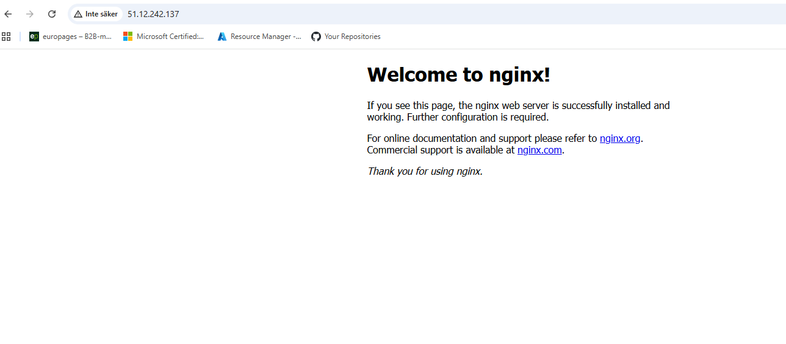
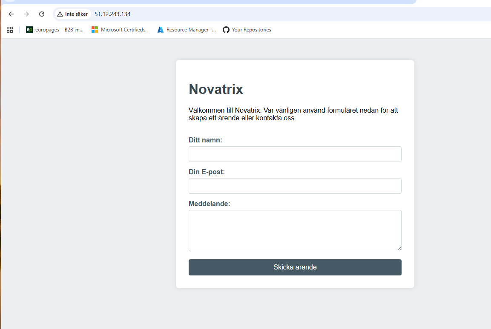
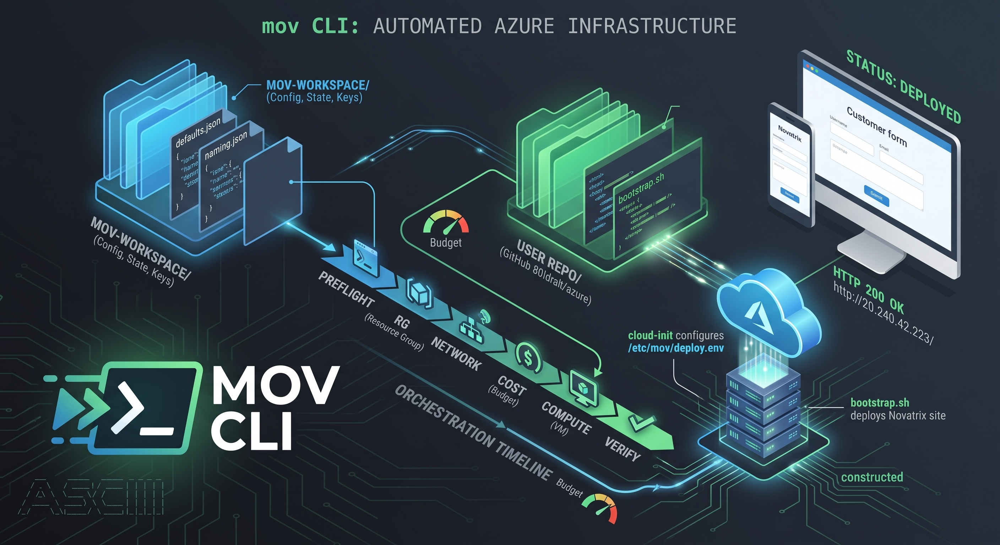

# Uppgift V34 - Compute: driftsättning av Novatrix kundtjänst

**Repo:** https://github.com/80idralt/azure/tree/master/v34

**Namn:** Idris Altun

**Klass:** MOV25

**Datum:** 2026-08-24

## Syfte
Novatrix AB vill flytta sin kundtjänst till molnet. Den här veckan sätts en virtuell server upp i Azure och en enkel webbsida med ett ärendeformulär (namn, e-post, meddelande) driftsätts på den.

## Genomförande

### 1. Resursgrupp och VM
Skapade resursgruppen och den virtuella maskinen via Azure-portalens guide "Create a virtual machine".

- **Resursgrupp:** `rg-novatrix-v34`, region `swedencentral`
- **VM-namn:** `vm-novatrix-web`
- **Image:** Ubuntu Server 24.04 LTS (`canonical:ubuntu-24_04-lts:server`)
- **Storlek:** `Standard_B2ats_v2` billig burstable ARM-instans, vald med tanke på kostnad eftersom Novatrix inte behöver mer prestanda än så för en enkel kundtjänstsida
- **Autentisering:** SSH-nyckelpar genererades av portalen under skapandet och laddades ner som `vm-novatrix-web-key.pem`, admin-användare `azureuser-web`
- **Nätverk:** publikt IP `51.12.243.134`, nätverkssäkerhetsgrupp `vm-novatrix-web-nsg` med inkommande regler för SSH (port 22) och HTTP (port 80)

Verifierade att resurserna skapats korrekt genom att gå igenom dem manuellt i Azure Portal:

- **Resursgrupper** → `rg-novatrix-v34` → status `Succeeded`, innehåller VM, disk, nätverkskort, publikt IP och nätverkssäkerhetsgrupp.
- **vm-novatrix-web** → Overview → Status: `Running`, Public IP address: `51.12.243.134`.
- **vm-novatrix-web-nsg** → Inbound security rules → `SSH` (port 22) och `nginx-allow-http` (port 80), båda `Allow`.

### 2. Cost management: budget och alerts
Satte upp en budget på resursgruppsnivå i Azure Portal (Cost Management) för att hålla koll på förbrukningen mot startkrediten.

Verifierade i Azure Portal under **Cost Management + Billing → Budgets** att budgeten `bg-rg-novatrixvecka34` visas med rätt belopp, omfattning och alert-trösklar:

| Fält | Värde |
|---|---|
| Budget | 100 SEK / månad |
| Omfattning | Resursgrupp `rg-novatrix-v34` |
| Period | 2026-08-01 – 2026-12-31 |
| Aktuell förbrukning | 0,0 SEK |
| Alert 1 | E-post vid **50 %** av budget (> 50 SEK) till `idrisaltun@hotmail.com` |
| Alert 2 | E-post vid **90 %** av budget (> 90 SEK) till `idrisaltun@hotmail.com` |

Budgeten `bg-rg-novatrixvecka34` är satt till 100 SEK/månad för resursgruppen `rg-novatrix-v34`, med två aktiva mailnotifieringar till `idrisaltun@hotmail.com`: vid 50 % och vid 90 % av budgeten. Aktuell förbrukning vid kontrolltillfället: 0,0 SEK.

### 3. Anslutning via SSH
Satte behörighet på SSH-nyckeln så att endast min användare kan läsa den. Första försöket gav felet `Bad permissions ... This private key will be ignored` eftersom grupper som `Autentiserade användare` fortfarande hade rättigheter kvar på filen. Löste det genom att nollställa behörigheterna helt innan de sattes om.

```powershell
icacls .\vm-novatrix-web-key.pem /reset
icacls .\vm-novatrix-web-key.pem /inheritance:r
icacls .\vm-novatrix-web-key.pem /grant:r "$($env:USERNAME):R"
icacls .\vm-novatrix-web-key.pem
```

```
.\vm-novatrix-web-key.pem IDRISDESKTOP\altun:(R)
```

Anslöt sedan till servern:

```powershell
ssh -i .\vm-novatrix-web-key.pem azureuser-web@51.12.243.134
```

Resultat: Inloggad som `azureuser-web` på `vm-novatrix-web` (Ubuntu 24.04.4 LTS), prompt `azureuser-web@vm-novatrix-web:~$`.

### 4. Installera Nginx
Uppdaterade paketlistan och installerade webbservern Nginx.

```bash
sudo apt update
sudo apt install nginx -y
systemctl status nginx
```

Resultat:

```
● nginx.service - A high performance web server and a reverse proxy server
     Loaded: loaded (/usr/lib/systemd/system/nginx.service; enabled; preset: enabled)
     Active: active (running) since Thu 2026-08-20 12:25:45 UTC; 12s ago
   Main PID: 8346 (nginx)
      Tasks: 3 (limit: 977)
```

Nginx körs och är aktiverat för att starta automatiskt vid omstart.

Verifierade genom att surfa till `http://51.12.243.134` i webbläsaren. Nginx standardsida ("Welcome to nginx!") visades direkt, vilket bekräftar att port 80 redan var öppen i nätverkssäkerhetsgruppen och att webbservern svarar.



### 5. Driftsätt kundtjänstsidan
Skrev kundtjänstsidan (`public/index.html`) med rubrik och ärendeformulär (namn, e-post, meddelande) lokalt, och kopierade sedan filen till servern via `scp`. Flyttade den därefter till Nginx webbrot med `sudo mv`.

```powershell
scp -i E:\MOV25\Uppgifter\Azure\vm-novatrix-web-key.pem -r E:\MOV25\GitHub\azure\v34\public\* azureuser-web@51.12.243.134:~/
ssh -i E:\MOV25\Uppgifter\Azure\vm-novatrix-web-key.pem azureuser-web@51.12.243.134 "sudo mv ~/index.html /var/www/html/"
```

Resultat: `index.html` flyttad till `/var/www/html/` på servern och ersatte Nginx standardsida.

### 6. Verifiering
Surfade till `http://51.12.243.134` och kontrollerade att Novatrix kundtjänstsida visas med ärendeformuläret (fälten Ditt namn, Din E-post och Meddelande, samt knappen "Skicka ärende").



## Resultat
En Ubuntu-VM (`vm-novatrix-web`) kör Nginx och serverar Novatrix kundtjänstsida med ärendeformulär, nåbar på `http://51.12.243.134`. Koden och dokumentationen ligger versionshanterade i detta repo.

## Utmaning för Väl godkänt (VG)
För att visa att jag förstår de bakomliggande koncepten för G-nivån genomförde jag först uppgiften manuellt enligt stegen ovan. För att uppnå VG-kravet rev jag sedan ner miljön och byggde upp den helt från grunden med kod och automatisering (IaC), där jag slipper klicka i portalen.

### Verktyget: mov CLI

Automatiseringen gjordes med `mov`, ett profildrivet CLI som orkesterar en hel Azure-miljö som JSON och driftsätter den med ARM-mallar. Principen är att en profil beskriver *vad* miljön är, medan arbetsytan avgör *var* den hamnar.



En viktig uppdelning: arbetsytan (`mov-workspace/`) håller konfiguration, state och nycklar, medan repot håller koden som servern hämtar. Servern får aldrig filer uppladdade till sig — den klonar det här repot själv.

### Konfigurationsfilerna

| Fil | Innehåller |
|---|---|
| `mov-workspace/mov.workspace.json` | Vilken tenant och subscription miljön hör till |
| `mov-workspace/naming.json` | Namnmönster, t.ex. `rg-{company}-{env}` med `company: novatrix` |
| `mov-workspace/defaults.json` | Allt varje miljö ärver: region, budget, VM-storlek, paket, källrepo |
| `mov-workspace/profiles/v34.json` | Bara det som är unikt för vecka 34 |

Värdena slås ihop i tur och ordning: `defaults.json` → profilen → `itemDefaults` → `${referenser}` → strikt validering. En profil behöver därför bara deklarera sina avvikelser.

### Miljön som kod

Hela vecka 34 beskrivs av `profiles/v34.json`:

```json
{
  "env": "v34",
  "stages": ["preflight", "rg", "network", "cost", "compute", "verify"],
  "network": {
    "addressSpace": "10.34.0.0/16",
    "subnets": [{ "purpose": "web", "prefix": "10.34.1.0/24", "nsg": "web" }],
    "nsg": {
      "web": [
        { "name": "http",  "priority": 100, "ports": ["80"] },
        { "name": "https", "priority": 110, "ports": ["443"] },
        { "name": "ssh",   "priority": 120, "ports": ["22"], "source": "${admin.sshSource}" }
      ]
    }
  },
  "compute": { "vms": [{ "purpose": "web", "subnet": "web" }] }
}
```

Allt som inte står här ärvs: Ubuntu 24.04, `Standard_B2ts_v2`, statiskt publikt IP, genererat SSH-nyckelpar, paketen `git` och `nginx`, samt budgeten på 200 SEK/månad med mailvarningar vid 50, 80 och 90 procent av faktisk förbrukning och vid 100 procent av prognosen.

Driftsättningen körs i sex steg, i ordning: `preflight` (kontrollerar verktyg, inloggning, subscription och VM-storlekens tillgänglighet), `rg`, `network`, `cost`, `compute` och `verify`.

### Vad servern kör

`mov` laddar inte upp några filer. Cloud-init skriver `/etc/mov/deploy.env` med variablerna `MOV_ENV`, `MOV_REPO`, `MOV_REF`, `MOV_PATH` och `MOV_APP_DIR`, varefter servern klonar `80idralt/azure` och kör `scripts/bootstrap.sh` som root. Det scriptet läser variablerna och kopierar innehållet i `v34/public/` till webbroten.

Eftersom servern hämtar från GitHub måste ändringar vara pushade innan driftsättning — en lokalt sparad fil når aldrig servern.

### Kommandon

```powershell
mov check          # kontrollerar verktyg, inloggning och subscription
mov plan v34       # visar vad som skulle ändras, utan att ändra något
mov up v34         # driftsätter
mov status v34     # vad som är driftsatt, VM-status och stegens historik
mov ssh v34        # ansluter med arbetsytans egen nyckel
mov stop v34       # deallokerar VM:en, disk och IP finns kvar
mov start v34      # startar den igen
mov rebuild v34    # river allt och bygger om från profilen
mov down v34       # raderar resursgruppen, budgeten och nycklarna
```

### Resultat

`mov up v34` byggde hela miljön från grunden: resursgrupp `rg-novatrix-v34` i `swedencentral`, virtuellt nätverk `vnet-novatrix`, säkerhetsgrupp `nsg-novatrix-web`, publikt IP, nätverkskort och VM:en `vm-novatrix-web`, samt budgeten `budget-novatrix-v34`.

Sista steget `verify` bekräftade automatiskt att sidan svarar innan körningen räknades som lyckad:

```
6/6 verify Prove the deployment answers
     OK   web: http://20.240.42.223/ -> 200 in 60s
```

Verifieringen kontrollerar att servern svarar med HTTP 200 och att sidan innehåller texten "Novatrix", med upp till 420 sekunders väntan medan servern startar och installerar sig själv. Hela miljön kan därmed rivas och byggas om identiskt med ett enda kommando, utan ett enda klick i portalen.
