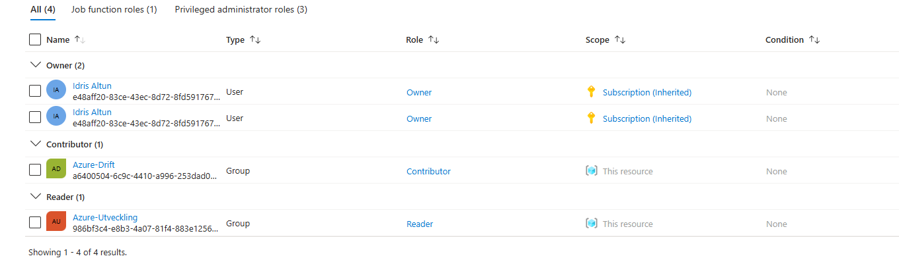
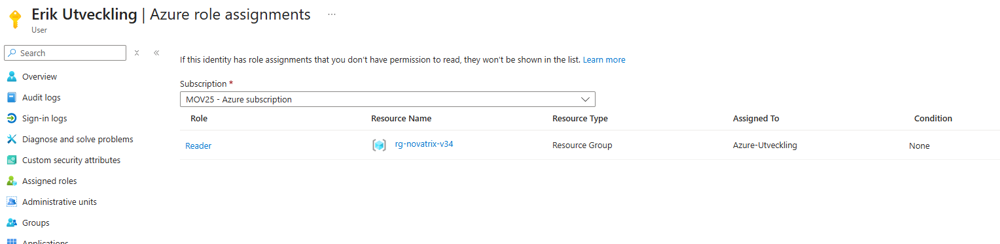
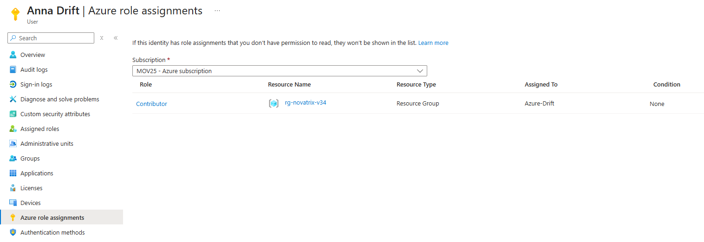
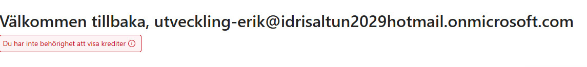
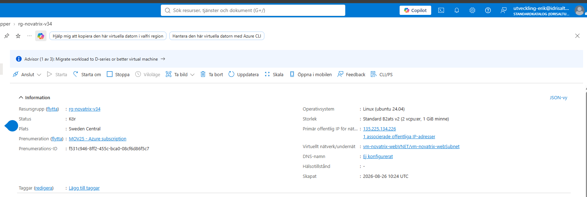
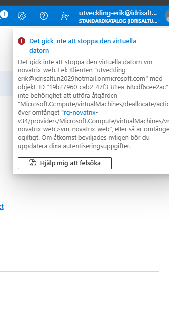
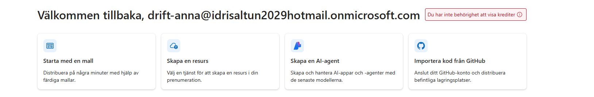
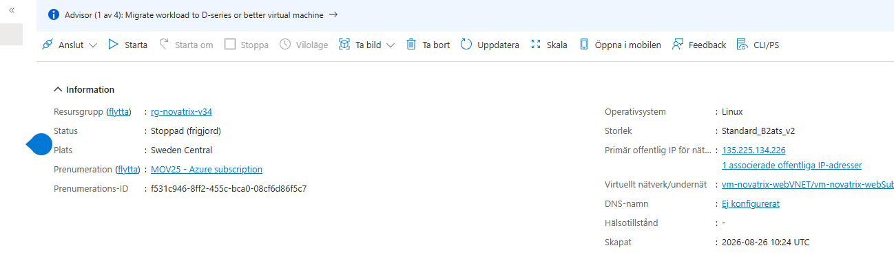
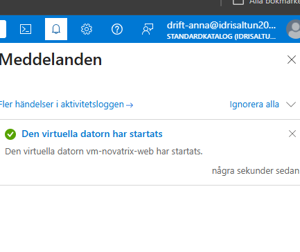

# Uppgift V35 - IAM och identitet

**Repo:** https://github.com/80idralt/azure/tree/master/v35

**Namn:** Idris Altun

**Klass:** MOV25

**Datum:** 2026-08-27

## Syfte
Novatrix har sedan v34 en server i Azure. Nu ska jag bestämma vem som får göra vad med den. Driften behöver kunna sköta servern, utvecklarna behöver bara kunna titta. Ingen ska ha mer behörighet än den behöver för sitt jobb.

Grunduppgiften gjorde jag för hand i Azure Portal. VG-delen längst ner byggde jag med kod i stället.

## Utgångsläge
Jag bygger vidare på miljön från v34:

- Resursgrupp: `rg-novatrix-v34` i `swedencentral`
- I den ligger `vm-novatrix-web` med disk, nätverkskort, nätverk, publikt IP och NSG

## Vad jag gjorde

### 1. Skapade två användare
Jag gick till **Microsoft Entra ID -> Users -> New user -> Create new user** och skapade en användare för varje roll på företaget.

| Namn | Inloggning |
|---|---|
| Anna Drift | `drift-anna@idrisaltun2029hotmail.onmicrosoft.com` |
| Erik Utveckling | `utveckling-erik@idrisaltun2029hotmail.onmicrosoft.com` |

Jag döpte dem efter mönstret `roll-förnamn`, så syns det redan på inloggningsnamnet vilket team de tillhör.

### 2. Skapade två grupper
Sen gjorde jag en grupp per roll under **Entra ID -> Groups -> New group**. Jag valde **Security** som grupptyp och **Assigned** som medlemskap, och la in rätt person i varje grupp direkt när jag skapade dem.

| Grupp | Medlem |
|---|---|
| Azure-Drift | Anna Drift |
| Azure-Utveckling | Erik Utveckling |

Anledningen till att jag använder grupper är att folk byter jobb men rollerna finns kvar. Kommer det in en ny utvecklare lägger jag bara till hen i `Azure-Utveckling`, så får hen rätt åtkomst automatiskt. Jag behöver aldrig gå in och peta i behörigheterna på resursgruppen igen.

### 3. Gav grupperna behörighet
Behörigheterna satte jag på resursgruppen under **rg-novatrix-v34 -> Access control (IAM) -> Add -> Add role assignment**. Jag valde rollen först och sen gruppen. Ingen av användarna har fått behörighet direkt på sitt konto, allt går via grupperna.

| Grupp | Roll | Scope | Motivering |
|---|---|---|---|
| Azure-Drift | Contributor | Resursgruppen `rg-novatrix-v34` | Ska kunna sköta driften, men inte dela ut behörigheter |
| Azure-Utveckling | Reader | Resursgruppen `rg-novatrix-v34` | Behöver bara se hur miljön är byggd |

Så här ser det ut i **Access control (IAM) -> Role assignments** på resursgruppen efteråt:



Två saker syns i listan. **Type** säger `Group`, alltså ligger behörigheten på grupperna och inte på personerna. Och **Scope** säger `This resource`, medan mitt eget Owner står som `Subscription (Inherited)`. Det är skillnaden mellan en behörighet som bara gäller den här miljön och en som ärvs uppifrån.

Bilden visar de två roller jag satte manuellt. Modellen byggdes senare ut till sex, vilket står under VG längre ner.

**Varför resursgruppen och inte hela prenumerationen:** roller ärvs nedåt i Azure. Hade jag lagt dem på prenumerationen skulle de gälla varje ny resursgrupp jag skapar resten av kursen. Nu gäller de bara Novatrix miljö.

**Varför drift fick Contributor:** de ska kunna sköta driften själva, alltså starta och stoppa servern, ändra brandväggsregler och skapa nya resurser när det behövs. Contributor ger dem det, men inte rätten att dela ut behörigheter. Därför Contributor och inte Owner, för en Owner kan höja sina egna rättigheter.

**Varför utveckling bara fick Reader:** utvecklarna behöver se hur miljön är byggd när de felsöker, men de behöver inte ändra något. Reader kan bara läsa.

**Ingen fick Owner.** Den rollen har jag kvar på mitt eget adminkonto.

Att behörigheten går via gruppen och inte via kontot syns när man öppnar en användare i Entra ID och går till **Azure role assignments**. Rollen står där, men kolumnen **Assigned To** visar gruppen.





### Kontroll av det jag gjort
Så här läste jag av att allt blev rätt, allt i portalen:

- **Att rätt person hamnat i rätt grupp:** Entra ID -> Groups -> gruppen -> **Members**. `Azure-Drift` innehåller Anna, `Azure-Utveckling` innehåller Erik.
- **Att grupperna fått rätt roll:** rg-novatrix-v34 -> Access control (IAM) -> fliken **Role assignments**, som på bilderna ovan.

Samma sak går att läsa av med två kommandon, efter `az login`:

```powershell
az ad group member list --group "Azure-Drift" --query "[].displayName" -o tsv
az ad group member list --group "Azure-Utveckling" --query "[].displayName" -o tsv
```

```
Anna Drift
Erik Utveckling
```

```powershell
az role assignment list --resource-group rg-novatrix-v34 --query "[].{Namn:principalName, Typ:principalType, Roll:roleDefinitionName}" -o table
```

```
Namn              Typ    Roll
----------------  -----  -----------
Azure-Drift       Group  Contributor
Azure-Utveckling  Group  Reader
```

### 4. Förberedde en identitet åt appen

I v37 ska ärendeformuläret kunna skriva in ärenden i lagringen helt själv, utan att någon människa loggar in. Det enkla sättet vore att lägga en nyckel i koden, men då hamnar ett lösenord i repot. En hanterad identitet löser det genom att Azure sköter inloggningen åt appen, så det finns inget lösenord som kan läcka.

Jag skapade den i portalen under **Managed Identities -> Create**, med namnet `id-novatrix-app` i resursgruppen `rg-novatrix-v34`. Samma sak från kommandoraden:

```powershell
az identity create --name id-novatrix-app --resource-group rg-novatrix-v34 --location swedencentral
```

Den har medvetet ingen roll än. Den kopplas ihop med lagringen först i v37, och får då bara rätt att skriva filer i lagringskontot.

### 5. Verifiering

Att rolltilldelningen syns i portalen bevisar bara att jag gjort den, inte att den faktiskt stoppar någon. Så jag öppnade ett inkognitofönster på portal.azure.com, för att inte råka använda min egen adminsession, och loggade in som `utveckling-erik@idrisaltun2029hotmail.onmicrosoft.com`. Redan på startsidan syntes att kontot är begränsat: kostnadsrutan sa **"Du har inte behörighet att visa krediter"**, eftersom Erik bara har behörighet på resursgruppen och inte på prenumerationen.



**Läsningen fungerade.** Erik kunde öppna `rg-novatrix-v34` och gå in på `vm-novatrix-web`, och såg allt han behöver för att felsöka: status **Kör**, storlek, publik IP-adress och nätverk. Det är precis vad Reader ska ge.



**Ändringen stoppades.** Knapparna Starta om, Stoppa och Ta bort syns visserligen i menyn, portalen gråar inte ut dem. Men när jag klickade på Stoppa som Erik vägrade Azure, med ett tydligt besked om exakt vilken åtgärd han saknar behörighet för.



Tillsammans är de två bilderna beviset: Erik kan se miljön men inte röra den. Att knapparna går att klicka på spelar ingen roll, för behörigheten kontrolleras när åtgärden körs, inte av vad portalen visar.

### Anna med Contributor kan det Erik inte kan

Sen gjorde jag samma test med Anna, för att se att skillnaden mellan rollerna faktiskt märks. Jag loggade in som `drift-anna@idrisaltun2029hotmail.onmicrosoft.com` i ett eget inkognitofönster.

Redan på startsidan dök något intressant upp. Anna får samma varning som Erik: **"Du har inte behörighet att visa krediter"**. Hon är Contributor, men bara på resursgruppen. Kostnaderna ligger på prenumerationen, och dit når hon inte. Behörigheten slutar precis där jag satte den.



Sen stoppade jag servern som henne. Det gick igenom direkt, utan felmeddelande, och statusen slog om till **Stoppad (frigjord)**. Frigjord betyder att servern är helt avstängd och att resurserna lämnats tillbaka, så den slutar kosta pengar medan den står still.



En detalj i den bilden: nu är Starta om, Stoppa och Viloläge utgråade medan Starta är aktiv. Det ser ut som Eriks fall men är något annat. Här är knapparna släckta för att maskinen redan är stoppad, inte för att Anna saknar behörighet.

Till sist startade jag servern igen som Anna, så att miljön var tillbaka som den var.



### Skillnaden mellan rollerna

| | Erik, Reader | Anna, Contributor |
|---|---|---|
| Se resursgruppen och VM:en | Ja | Ja |
| Stoppa och starta servern | Nej, nekades | Ja |
| Se prenumerationens krediter | Nej | Nej |

## Resultat

| Vem | Vad de får göra | Var |
|---|---|---|
| Anna Drift, via Azure-Drift | Contributor, sköta hela miljön men inte dela ut behörigheter | `rg-novatrix-v34` |
| Erik Utveckling, via Azure-Utveckling | Reader, bara titta | `rg-novatrix-v34` |
| Jag själv, admin | Owner | Prenumerationen |

Ingen har behörighet direkt på sitt konto, ingen roll sträcker sig utanför resursgruppen, och rätten att dela ut åtkomst har bara jag. Och det är verifierat på riktigt, inte bara inställt.

## Utmaning för Väl godkänt (VG)

### Modellen

Jag byggde ut modellen från två roller till sex, en per funktion på företaget. Alla ligger på resursgruppen `rg-novatrix-v34`.

| Grupp | Roll | Vad rollen får göra | Varför just den |
|---|---|---|---|
| Azure-Drift | Contributor | Skapa, ändra och radera allt i resursgruppen, men inte dela ut behörigheter | Driften ansvarar för hela miljön och måste kunna sköta den utan att fråga någon |
| Azure-Utveckling | Reader | Bara läsa | Utvecklarna behöver se hur miljön är byggd när de felsöker, inte ändra i den |
| Azure-Natverk | Network Contributor | Allt som rör nätverk: virtuella nätverk, undernät, NSG-regler och IP-adresser. Inget på servrar | Den som öppnar och stänger portar ska inte kunna radera servern på köpet |
| Azure-Backup | Backup Operator | Sköta säkerhetskopiering och återställning, men inte ta bort säkerhetskopior eller skapa valv | Backup är en egen uppgift. Den som kör den behöver inte kunna förvalta servrarna |
| Azure-Support | Reader | Bara läsa | Novatrix är en kundtjänst. Supporten måste kunna se om servern är uppe när kunder ringer, men aldrig röra den |
| Azure-Ekonomi | Cost Management Reader | Läsa kostnader, budgetar och prognoser. Ser inte innehållet i resurserna | Ekonomi ska följa förbrukningen mot budgeten från v34, ingenting annat |

Varje roll är vald efter frågan **vad är minsta roll som räcker för det här jobbet**. Ingen har fått något "för säkerhets skull".

Två val är värda att lyfta fram.

**Backup fick Operator, inte Contributor.** Backup Contributor kan ta bort säkerhetskopior. Backup Operator kan det inte. Skillnaden spelar roll den dagen någon råkar radera fel sak, eller den dagen ett konto kapas. Jag valde den snävare av de två.

**Support och Utveckling har samma roll av olika skäl.** Båda får Reader, men det är inte samma behov: utveckling felsöker, supporten svarar kunder. Att de landar i samma roll är ett resultat av frågan "vad behöver de göra", inte av att jag klumpat ihop dem.

### Varför resursgruppen som scope, inte prenumerationen

Roller ärvs nedåt i Azure. En roll på prenumerationen gäller automatiskt i varje resursgrupp under den, även sådana som inte finns än. Hade jag lagt Contributor där skulle driften få behörighet i varje ny miljö jag bygger resten av kursen, utan att någon bestämt det.

Ekonomirollen är det tydligaste exemplet. Kostnader ligger normalt på prenumerationsnivå, och det var där jag först tänkte lägga den. Men resursgruppen räcker: där ser ekonomi vad Novatrix miljö kostar, vilket är precis det de ska följa. Att flytta upp rollen hade gett dem insyn i allt annat i prenumerationen också, utan att någon behövde det.

Regeln jag följt är att en behörighet aldrig ska ligga bredare än behovet, även när det breda alternativet är bekvämare.

### Varför grupper i stället för enskilda personer

Personer byter jobb, roller består. Ligger behörigheten på personen måste någon komma ihåg att ta bort den när hen slutar, och komma ihåg att sätta rätt behörighet när någon börjar. Det är precis den sortens sak som glöms bort, och glömda behörigheter är den vanligaste orsaken till att en miljö sakta blir osäker.

Med grupper är personalfrågor och behörighetsfrågor två olika saker. En ny utvecklare läggs in i `Azure-Utveckling` och får rätt åtkomst automatiskt. Slutar någon tas hen ur gruppen och åtkomsten försvinner i samma sekund. Rolltilldelningarna på resursgruppen rörs aldrig.

Det gör också frågan "vem kan göra vad?" möjlig att svara på. Sex rader i IAM-bladet beskriver hela företaget, oavsett hur många anställda som finns.

### Varför ingen får Owner

Owner och Contributor skiljer sig på en enda punkt: Owner får dela ut behörigheter. Det låter litet men är avgörande, för den som får dela ut behörigheter kan ge sig själv vad som helst. En begränsning som personen själv kan häva är ingen begränsning.

Därför stannar Owner hos mitt administratörskonto. Driften kan bygga och riva i miljön, men inte bjuda in någon ny eller höja sin egen roll. Vill ett team ha mer måste någon annan fatta det beslutet, och då syns det.

### Rolltilldelningarna som kod

Portalen är bra för att förstå vad som händer, men det man klickar fram går inte att göra om exakt likadant, och det syns inte i repot vad någon ändrat. Därför ligger rolltilldelningarna som ett skript i veckans mapp: **[rbac-novatrix.sh](rbac-novatrix.sh)**. Varje tilldelning är en rad som ser ut så här:

```bash
az role assignment create --assignee $DRIFT --role "Contributor" --scope $RG
```

**Så fungerar den.** Första halvan hämtar id till variabler. Inget id är skrivet för hand i filen — resursgruppens fullständiga id hämtas med `az group show`, och varje grupps id med `az ad group show`. Andra halvan är en rad per roll, och varje rad består av samma tre delar som i portalen: `--assignee` är vem, `--role` är vad, `--scope` är var.

Att inga id står i filen betyder att den fungerar i vilken prenumeration som helst. Byter man arbetsplats eller bygger om miljön hämtas de nya värdena automatiskt.

**Vad skriptet inte gör.** Det skapar inte grupperna. De ligger i Entra ID och skapas där, precis som i grunduppgiften. Det uppgiften vill se i kod är rolltilldelningarna, alltså kopplingen mellan grupp, roll och resursgrupp, och det är den delen filen bygger upp från noll.

### Att kunna riva är lika viktigt

**[rbac-novatrix-delete.sh](rbac-novatrix-delete.sh)** tar bort samma sex tilldelningar och är byggd som en spegelbild av den första. Enda skillnaden är ordet `delete` i stället för `create`:

```bash
az role assignment delete --assignee $DRIFT --role "Contributor" --scope $RG
```

Regeln att komma ihåg: create och delete måste ha **samma tre delar**. Skiljer sig `--assignee`, `--role` eller `--scope` det minsta tas ingenting bort, och kommandot säger inte alltid ifrån.

### Beviset: modellen byggd från noll

Jag tog bort alla rolltilldelningar, kontrollerade att listan var tom, och körde sedan skriptet.

```powershell
az role assignment list --resource-group rg-novatrix-v34 --query "[?principalType=='Group'].{Grupp:principalName, Roll:roleDefinitionName}" -o table
```

Före körningen: tom lista. Efter:

```
Grupp             Typ    Roll
----------------  -----  ----------------------
Azure-Backup      Group  Backup Operator
Azure-Drift       Group  Contributor
Azure-Ekonomi     Group  Cost Management Reader
Azure-Natverk     Group  Network Contributor
Azure-Support     Group  Reader
Azure-Utveckling  Group  Reader
```

Sex tilldelningar, alla med `Typ: Group` och alla på resursgruppen. Grupperna och användarna rördes aldrig under rivningen, bara kopplingen mellan dem och resursgruppen. Det är skillnaden mellan identitet och behörighet i praktiken.

De fyra nya grupperna har inga medlemmar än, så de går inte att inloggningstesta som jag gjorde med Erik och Anna. De är förberedda för de funktioner Novatrix faktiskt anställer till, och tilldelningarna är kontrollerade i listan ovan.

### En fallgrop jag fastnade i

Första gången jag körde skriptet fick jag sex likadana fel:

```
(MissingSubscription) The request did not have a subscription or a valid tenant level resource provider.
```

Filen var korrekt, `az group show` gav rätt svar och jag var inloggad. Felet satt i skalet.

Git Bash bygger på MSYS, som översätter mellan Linux-sökvägar och Windows-sökvägar. Ett argument som börjar med snedstreck tolkas som en sökväg och skrivs om innan programmet startar. Mitt scope började med snedstreck, så `az` fick aldrig se den text jag skickat, och Azure tog emot ett scope utan prenumerations-id.

Lösningen är raden överst i båda filerna:

```bash
export MSYS_NO_PATHCONV=1
```

Den stänger av översättningen. På riktig Linux, till exempel i Azure Cloud Shell, finns ingen sådan variabel och raden ignoreras. Filerna fungerar därför på båda ställena.

### Hur modellen skalar

**Nytt team** är en grupp och en rad till i skriptet. Ska Novatrix anställa testare skapas `Azure-Test`, får `Reader` och läggs till som en rad. Ingenting befintligt behöver ändras.

**Ny person** är ett gruppmedlemskap. Skriptet rörs inte alls.

**Ny miljö** är att byta namnet i `RG`-raden. Kommer `rg-novatrix-prod` körs samma fil mot den, med samma grupper. Vill man ha strängare regler i produktion ger man samma team snävare roller där, medan testmiljön får vara som den är.

Det som gör att modellen håller när den växer är att den vilar på tre regler: behörighet läggs alltid på en grupp, aldrig på en person; scopet sätts så smalt som behovet tillåter; och rätten att dela ut åtkomst är skild från rätten att förvalta resurser.
