# Uppgift V36 - Nätverk och säkerhet

**Repo:** https://github.com/80idralt/azure/tree/master/v36

**Namn:** Idris Altun

**Klass:** MOV25

**Datum:** 2026-09-04

## Syfte

Efter v34 har Novatrix en server i molnet, men på nätverksnivå finns inget skydd runt den. Den här veckan bygger jag det. Tanken är enkel: ärendeformuläret ska gå att nå för vem som helst, medan lagringen där ärenden och bilagor ska hamna från och med v37 ska ligga avskilt, dit ingen utifrån kommer åt. Grunddelen gjorde jag för hand i portalen.

## Utgångsläge

Jag utgår från det som redan finns: `vm-novatrix-web` från v34 och behörighetsmodellen från v35, allt i resursgruppen `rg-novatrix-v34` i `swedencentral`. Nätverket som VM-guiden satte upp i v34 var ett enda platt nät utan uppdelning, så det gör jag om. En VM kan inte byta VNet i efterhand, så jag raderade den och skapade en ny från samma OS-disk i det nya subnätet. Webbsidan och allt installerat följde med.

## 1. Repo

La till mappen för v36 och skrev den här README:n.

## 2. Virtuellt nätverk

Jag skapade ett eget VNet och delade det i två subnät, ett för webben och ett för den kommande lagringen.

| Namn | Adressintervall | Roll |
|---|---|---|
| `vnet-novatrix-v36` | `10.0.0.0/16` | Hela nätet, `swedencentral` |
| `snet-web` | `10.0.1.0/24` | Publikt, för webbservern med formuläret |
| `snet-db` | `10.0.2.0/24` | Privat subnät (ingen väg ut till internet), tomt än så länge, förberett för lagringen i v37 |
| `snet-admin` | `10.0.3.0/24` | Admin-subnät, tillkom i VG-delen. Här står hoppvärden, se avsnitt 8 |
| `default` | `10.0.0.0/24` | Standardsubnätet som skapades automatiskt, användes inte, borttaget |

`/16` på nätet och `/24` per subnät, det räcker gott och är lätt att hålla ordning på. Poängen med uppdelningen är att webben och lagringen ska behandlas olika. Webben måste gå att nå utifrån, lagringen ska inte det. Kommer någon in via webben ska de inte komma åt lagringen på köpet.

```
az network vnet subnet list -g rg-novatrix-v34 --vnet-name vnet-novatrix-v36 \
  --query "[].{Namn:name, Prefix:addressPrefixes[0], NSG:networkSecurityGroup.id}" -o table

Namn      Prefix       NSG
--------  -----------  -----------------
default   10.0.0.0/24
snet-web  10.0.1.0/24  .../nsg-web-v36
snet-db   10.0.2.0/24  .../nsg-db-v36
```

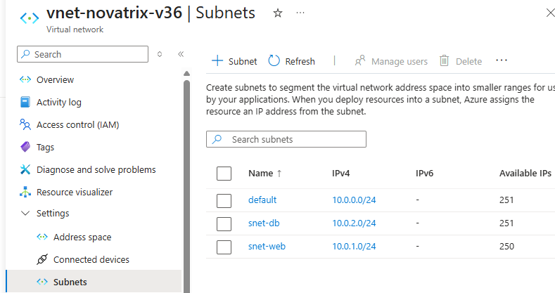
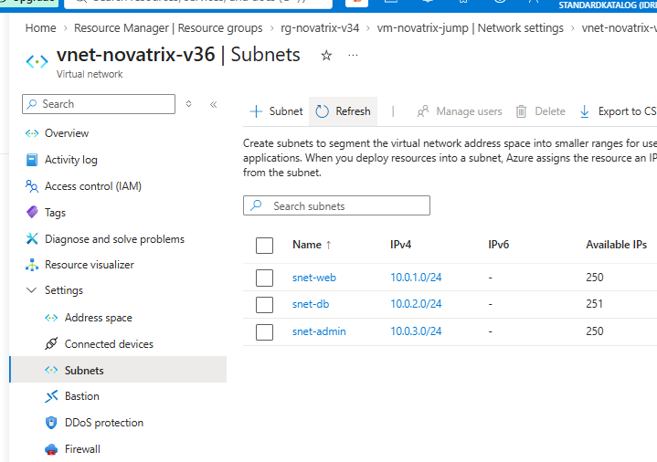

## 3. NSG:er

Varje subnät fick en egen nätverkssäkerhetsgrupp. Utgående trafik rörde jag inte, den ligger kvar på Azures standard.

**`nsg-web-v36`** på `snet-web`:

| Prio | Namn | Riktning | Källa | Port | Åtgärd | Varför |
|---|---|---|---|---|---|---|
| 100 | `Allow-Http-Https` | In | `*` (internet) | 80, 443 | Allow | Formuläret ska nås av kunder |
| 200 | `Allow-SSh` | In | `31.208.59.112` | 22 | Allow | Jag måste kunna sköta servern, men bara jag |
| 4096 | `Deny-All-Inbound` | In | `*` | `*` | Deny | Gör "stäng allt annat" tydligt i listan |

Adressen i tabellen är den som gällde när jag dokumenterade, och den syns även i skärmdumparna. Min operatör har bytt den sedan dess, mer om det i avsnitt 8.

**`nsg-db-v36`** på `snet-db`:

| Prio | Namn | Riktning | Källa | Port | Åtgärd | Varför |
|---|---|---|---|---|---|---|
| 100 | `Allow-Web-To-Storage` | In | `10.0.1.0/24` | 443 | Allow | Bara webben ska nå lagringen, och bara över HTTPS |
| 4096 | `Deny-All-Inbound` | In | `*` | `*` | Deny | Stoppar allt utom webben, även trafik från andra subnät |

Längst ner i varje NSG ligger Azures egna regler, och den sista, `DenyAllInBound`, nekar allt som ingen tidigare regel har släppt igenom. Grundläget är alltså redan stängt.

Jag la ändå in en egen `Deny-All-Inbound` överst bland mina regler i båda grupperna, men av två olika skäl. På webben är den mest för tydlighetens skull, så att "stäng allt annat" står i klartext i listan i stället för att bara vara underförstått. På det privata subnätet gör den verklig nytta: Azures inbyggda regler släpper in all trafik som kommer inifrån VNet:et, alltså även från `default`-subnätet och det jag bygger senare. Min neka-regel stänger den dörren, så att bara webben (`10.0.1.0/24`) faktiskt når lagringen.

Portalen sätter en varningstriangel på reglerna eftersom de går före Azures regel för trafik från lastbalanserare. Det gör inget här, det finns ingen lastbalanserare.

I VG-delen tillkom en tredje säkerhetsgrupp, `nsg-admin-v36`, för hoppvärdens subnät. Dess regler och varför den ser ut som den gör står i avsnitt 8.

Det här är defense in depth i praktiken. Behörigheterna från v35 är ett lager. NSG:n framför webben är ett till. Att lagringen ligger i ett eget subnät som bara webben når är ett tredje. Och att SSH inte når webben direkt från internet, utan bara via hoppvärden (avsnitt 8), är ett fjärde. Går ett lager sönder finns nästa kvar.

```
az network nsg rule list -g rg-novatrix-v34 --nsg-name nsg-web-v36 -o table

Name              Priority  SourceAddressPrefixes  Access  Protocol  DestinationPortRanges
----------------  --------  ---------------------  ------  --------  ---------------------
Allow-Http-Https  100       *                      Allow   TCP       80 443
Allow-SSh         200       31.208.59.112          Allow   TCP       22
Deny-All-Inbound  4096      *                      Deny    *         *

az network nsg rule list -g rg-novatrix-v34 --nsg-name nsg-db-v36 -o table

Name                  Priority  SourceAddressPrefixes  Access  Protocol  DestinationPortRanges
--------------------  --------  ---------------------  ------  --------  ---------------------
Allow-Web-To-Storage  100       10.0.1.0/24            Allow   TCP       443
Deny-All-Inbound      4096      *                      Deny    *         *
```

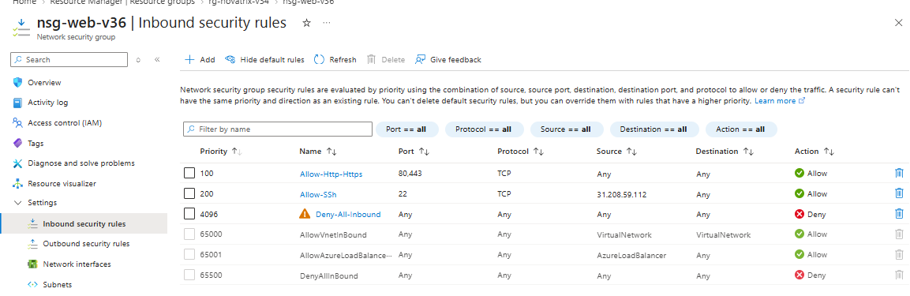
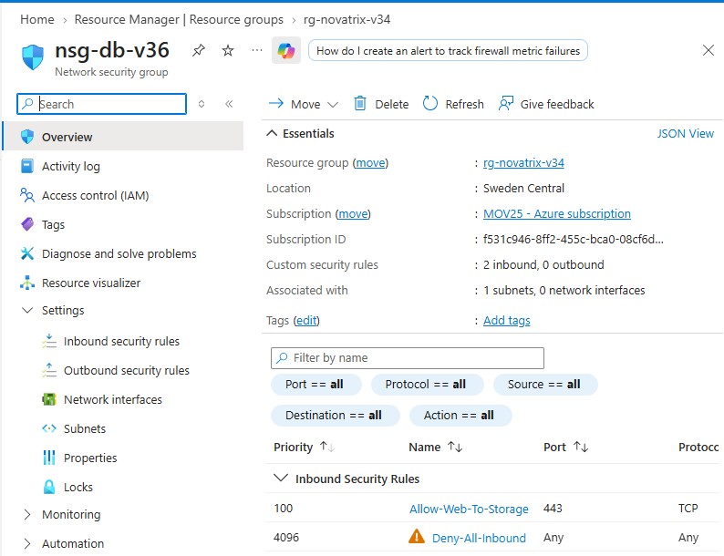

## 4. Lösningen i nätverket

Den nya `vm-novatrix-web` kör nu i `snet-web` med privat IP `10.0.1.4` och samma publika IP som förut, `20.240.247.212`. NSG:n satte jag på subnätet och inte på nätverkskortet, det blir enklare att hålla reda på och räcker här. Verktyget Effective security rules bekräftar att reglerna i `nsg-web-v36` verkligen slår igenom på maskinen fast de ligger på subnätet. `snet-db` står tomt och väntar på v37.

Sen städade jag. Det gamla platta VNet:et, dess nätverkskort, den gamla NSG:n och en publik IP som ingen längre använde fick åka. Kvar i resursgruppen ligger bara det som faktiskt används.

```
az network nic delete       -g rg-novatrix-v34 -n vm-novatrix-webVMNic
az network public-ip delete  -g rg-novatrix-v34 -n vm-novatrix-web-ip
az network vnet delete       -g rg-novatrix-v34 -n vm-novatrix-webVNET
az network nsg delete        -g rg-novatrix-v34 -n vm-novatrix-webNSG

az resource list -g rg-novatrix-v34 --query "[].{Namn:name, Typ:type}" -o table

Namn                     Typ
-----------------------  -----------------------------------------------
vnet-novatrix-v36        Microsoft.Network/virtualNetworks
nsg-web-v36              Microsoft.Network/networkSecurityGroups
nsg-db-v36               Microsoft.Network/networkSecurityGroups
nic-web-v36              Microsoft.Network/networkInterfaces
vm-novatrix-web          Microsoft.Compute/virtualMachines
vm-novatrix-web-osdisk   Microsoft.Compute/disks
vm-novatrix-webPublicIP  Microsoft.Network/publicIPAddresses
id-novatrix-app          Microsoft.ManagedIdentity/userAssignedIdentities
```

`id-novatrix-app` är den hanterade identiteten från v35. Den rörde jag inte, den kopplas in först i v37.

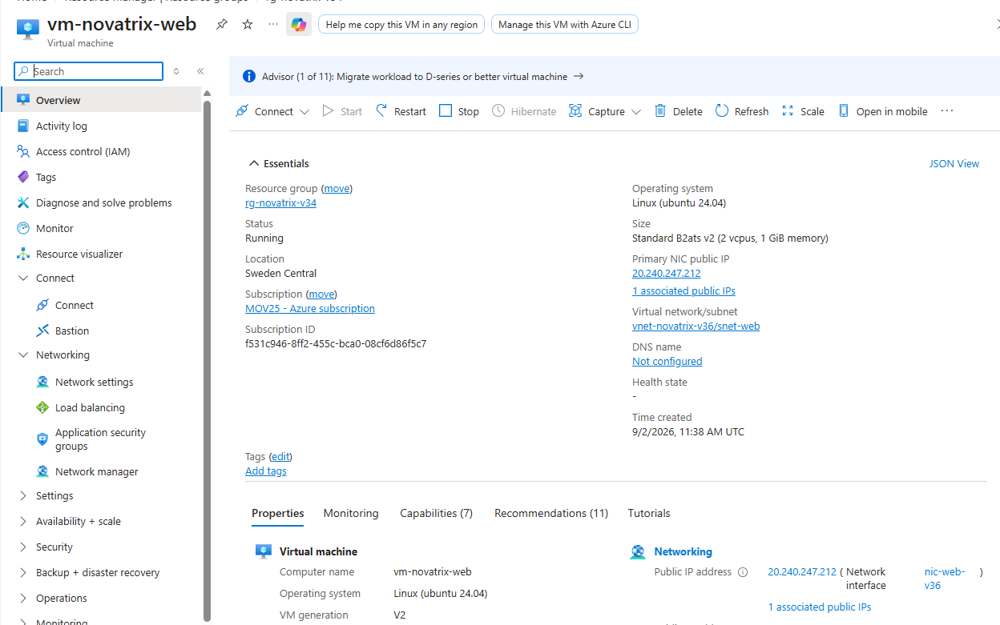
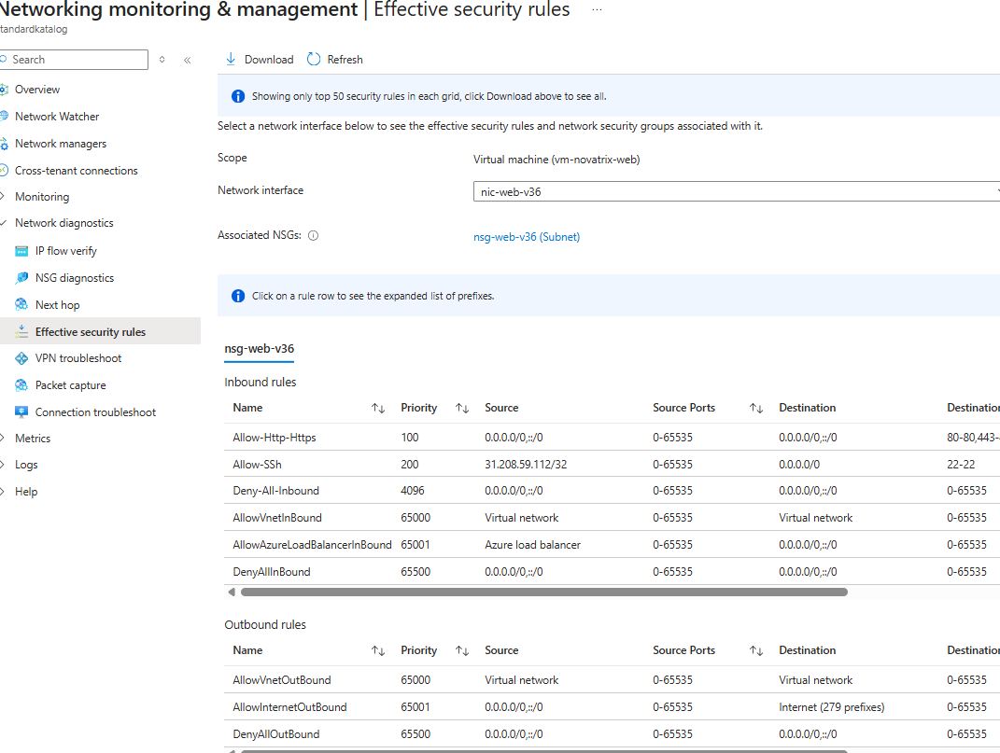
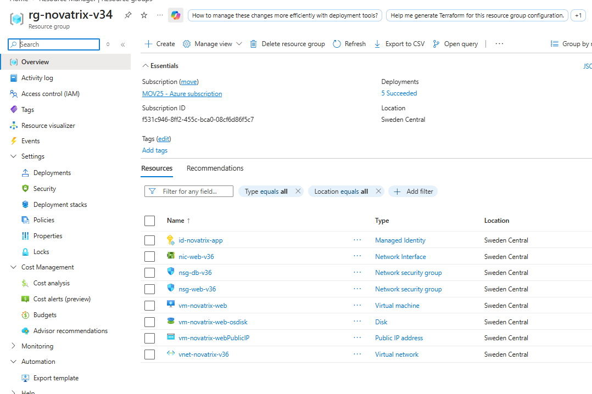

## 5. Verifiering

Att reglerna syns i portalen bevisar bara att jag lagt in dem, inte att de gör något. Så jag testade på två sätt.

Först med Network Watcher och IP flow verify, som simulerar ett paket och säger vilken regel som avgör:

| Paket | Resultat | Regel |
|---|---|---|
| `10.0.1.4:80` från `8.8.8.8` | Allowed | `Allow-Http-Https` |
| `10.0.1.4:443` från `8.8.8.8` | Allowed | `Allow-Http-Https` |
| `10.0.1.4:22` från `8.8.8.8` | Denied | `Deny-All-Inbound` |
| `10.0.1.4:22` från `31.208.59.112` | Allowed | `Allow-SSh` |
| `10.0.1.4:3389` från `8.8.8.8` | Denied | `Deny-All-Inbound` |

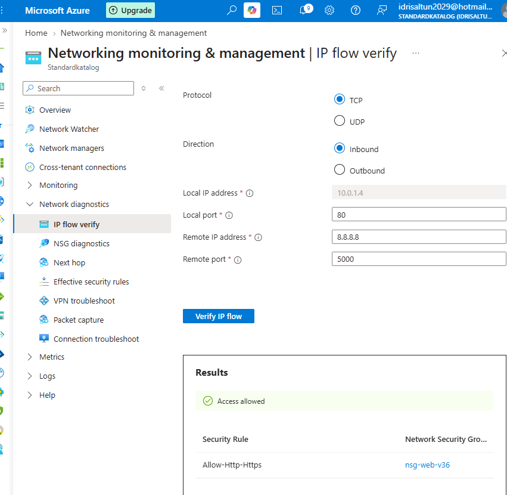
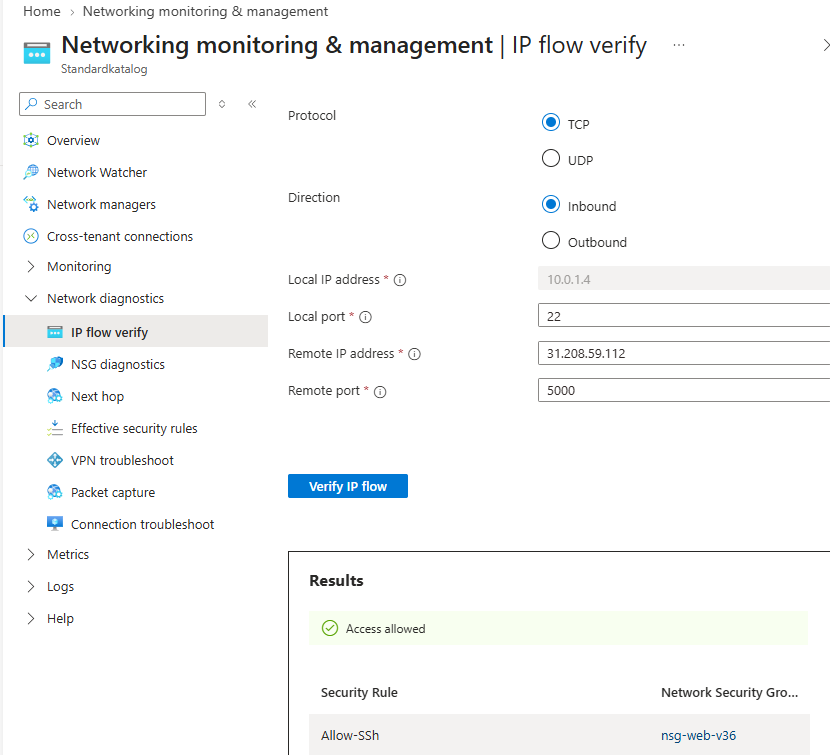
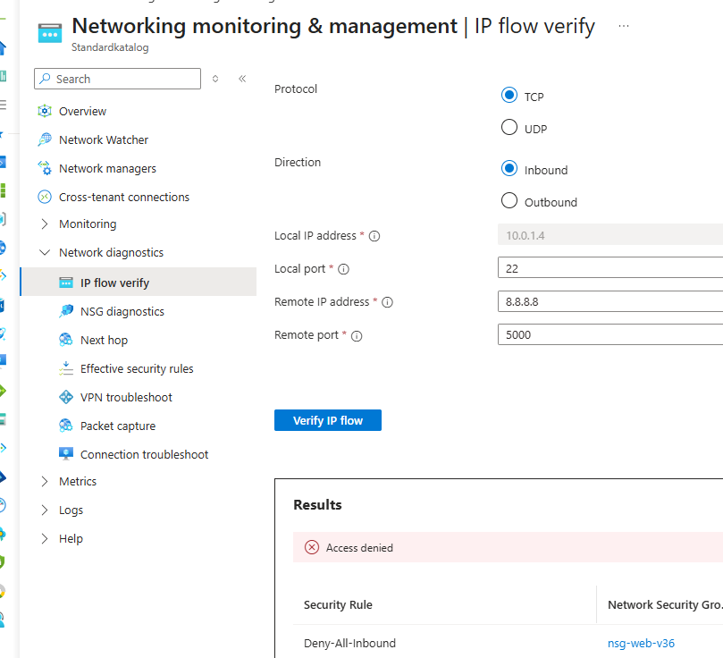

Raden `10.0.1.4:22 från 31.208.59.112 → Allowed` gällde fram till hoppvärden byggdes. Efter VG-delen pekar `Allow-SSh` bara på admin-subnätet, inte på min adress — de uppdaterade testerna står i avsnitt 8.

Sen på riktigt. Från min egen dator:

```
curl.exe -I http://20.240.247.212                -> HTTP/1.1 200 OK
curl.exe -I --max-time 5 https://20.240.247.212  -> curl: (7) Could not connect
ssh azureuser-web@20.240.247.212 "hostname"      -> vm-novatrix-web
```

HTTP funkar. HTTPS gör det inte, men det är inte nätverket som stoppar det, porten är öppen i NSG:n. Nginx kör bara ingen TLS än. SSH funkar från min adress.

Och från en annan maskin, en Windows Server-VM jag kör i Hyper-V som går ut mot internet med en annan publik adress (`31.208.57.44`):

```
ssh azureuser-web@20.240.247.212    -> ssh: connect to host ... port 22: Connection timed out
curl.exe -s ifconfig.me             -> 31.208.57.44
curl.exe -I http://20.240.247.212   -> HTTP/1.1 200 OK
```

Samma bild från båda hållen. Webben är öppen för alla, SSH bara för mig, resten stängt. Att en helt annan maskin når sidan men blir utelåst från SSH visar att regeln tittar på var trafiken kommer ifrån, inte bara vilken port det gäller.

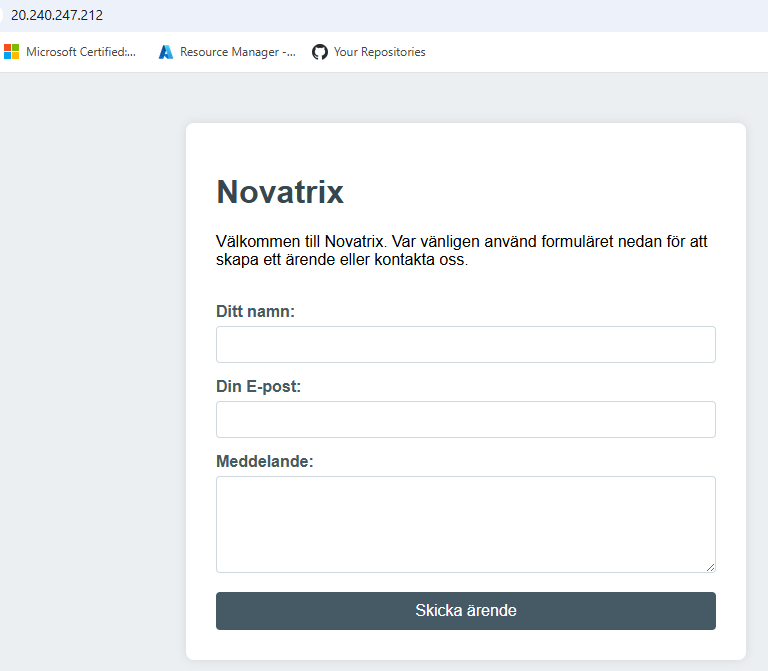

## 6. Nätverksskiss

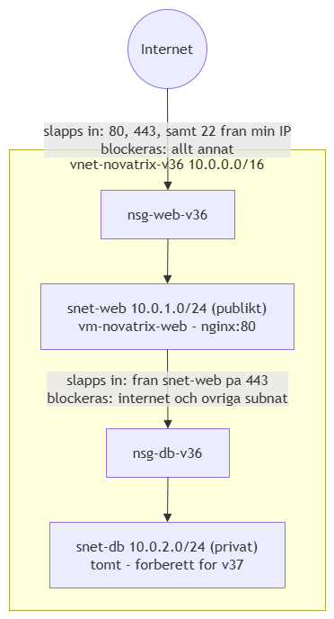

## 7. Resultat

| Trafik | Vad som händer |
|---|---|
| HTTP och HTTPS från internet mot webben | Släpps in |
| SSH från min IP mot hoppvärden | Släpps in |
| SSH från admin-subnätet (`10.0.3.0/24`) mot webben | Släpps in |
| SSH mot webben direkt från internet | Stoppas — ingen väg förbi hoppvärden |
| SSH, RDP och allt annat från andra adresser | Stoppas |
| Internet mot det privata subnätet | Stoppas |
| Webben mot det privata subnätet på port 443 | Släpps in |

Kort sagt: 80 och 443 öppet för alla, SSH mot webben bara via hoppvärden, SSH mot hoppvärden bara från min adress, allt annat stängt, och lagringssubnätet helt utan väg in från internet.

## 8. Väl godkänt (VG)

### Nätverket som kod

G-delen klickade jag fram i portalen. Problemet med det är att ingen kan se *hur* nätet byggdes, bara att det finns. Försvinner det får jag klicka igen och hoppas att jag minns alla värden rätt.

Därför ligger hela nätverkslagret nu som ett skript: **[scripts/natverk-novatrix.sh](scripts/natverk-novatrix.sh)**. Elva kommandon i sex block.

| Block | Kommando | Skapar |
|---|---|---|
| 1 | `az network vnet create` | VNet:et och `snet-web` |
| 2 | `az network vnet subnet create` | `snet-db` |
| 3 | `az network nsg create` ×2 | De två säkerhetsgrupperna |
| 4 | `az network nsg rule create` ×3 | Reglerna i `nsg-web-v36` |
| 5 | `az network nsg rule create` ×2 | Reglerna i `nsg-db-v36` |
| 6 | `az network vnet subnet update` ×2 | Kopplar grupperna till subnäten |

Ordningen spelar roll. Nätet måste finnas före subnäten, subnäten före något kan placeras i dem, och säkerhetsgrupperna måste ha sina regler innan de kopplas på. Hade jag kopplat en tom NSG först hade webbsidan legat nere tills reglerna var inne.

Två val i skriptet är värda att förklara.

**Värdena ligger överst som variabler:**

```
RG="${RG:-rg-novatrix-v34}"
LOC="swedencentral"
VNET="vnet-novatrix-v36"
```

`${RG:-...}` betyder "använd den resursgrupp jag matar in, annars den här". Vill någon bygga nätet någon annanstans skriver de `RG=min-grupp bash natverk-novatrix.sh` och behöver aldrig röra filen.

**Admin-adressen hämtas när skriptet körs:**

```
--source-address-prefixes $(curl -s ifconfig.me)
```

`$(...)` kör kommandot inuti och stoppar in svaret på platsen. Ingen IP-adress hamnar alltså i repot, och en kollega som kör skriptet får sin egen adress insläppt i stället för min.

### Beviset: nätet byggt från noll

Att skriptet ser rätt ut i filen betyder inte att det fungerar. Så jag skapade en tom resursgrupp, körde skriptet mot den och tittade på vad som kom ut.

```
az group create --name rg-novatrix-v36-test --location swedencentral
RG=rg-novatrix-v36-test bash natverk-novatrix.sh

az network vnet subnet list -g rg-novatrix-v36-test --vnet-name vnet-novatrix-v36 -o table

Namn      NSG
--------  --------------------------------------
snet-web  .../networkSecurityGroups/nsg-web-v36
snet-db   .../networkSecurityGroups/nsg-db-v36

az network nsg rule list -g rg-novatrix-v36-test --nsg-name nsg-web-v36 -o table

Namn              Prio  Riktning  Kalla         Access
----------------  ----  --------  ------------  ------
Allow-Http-Https  100   Inbound   *             Allow
Allow-SSh         200   Inbound   31.208.56.70  Allow
Deny-All-Inbound  4096  Inbound   *             Deny

az network nsg rule list -g rg-novatrix-v36-test --nsg-name nsg-db-v36 -o table

Namn                  Prio  Riktning  Kalla        Access
--------------------  ----  --------  -----------  ------
Allow-Web-To-Storage  100   Inbound   10.0.1.0/24  Allow
Deny-All-Inbound      4096  Inbound   *            Deny

az resource list -g rg-novatrix-v36-test -o table

Namn               Typ
-----------------  ---------------------------------------
vnet-novatrix-v36  Microsoft.Network/virtualNetworks
nsg-web-v36        Microsoft.Network/networkSecurityGroups
nsg-db-v36         Microsoft.Network/networkSecurityGroups
```

Samma nät som det jag har i drift, byggt på under en minut utan att klicka någonstans. Sedan raderade jag testgruppen igen. Hela testet kostade noll kronor, eftersom VNet, subnät och NSG är gratis.

### Hoppvärd i stället för SSH mot webben

I G-delen pekade `Allow-SSh` på webbservern rakt på min egen publika adress — fungerar, men porten ligger ändå öppen mot en adress som byts med jämna mellanrum.

VG-lösningen flyttar den dörren till en egen maskin, `vm-novatrix-jump`, i ett eget subnät (`snet-admin`, `10.0.3.0/24`) som inte gör något annat än att släppa vidare inloggningar. Till webben tar jag mig genom att först logga in på hoppvärden och därifrån hoppa vidare till webbens privata adress.

| NSG | Regel | Vad den gör |
|---|---|---|
| `nsg-admin-v36` | `Allow-SSh-Admin` — 22 från min IP | Enda vägen in i nätet från internet |
| `nsg-web-v36` | `Allow-SSh` — 22 från `10.0.3.0/24` | SSH mot webben bara från admin-subnätet — man måste redan stå på hoppvärden |
| båda | `Deny-All-Inbound` (4096) | Allt annat nekas |

Webbservern har med det ingen SSH-yta mot internet alls — ett skanningsförsök mot port 22 blir timeout, paketet slängs i NSG:n före SSH.

Ligger som skript: **[scripts/hoppvard-novatrix.sh](scripts/hoppvard-novatrix.sh)**, körd efter `natverk-novatrix.sh`. Sex block: subnätet, säkerhetsgruppen, dess två regler, kopplingen till subnätet, hoppvärds-VM:en (`--nsg ""`, skyddet ligger på subnätet), och sist ompekningen av webbens `Allow-SSh` från min adress till `10.0.3.0/24` — det sista blocket är det som skiljer VG från G.

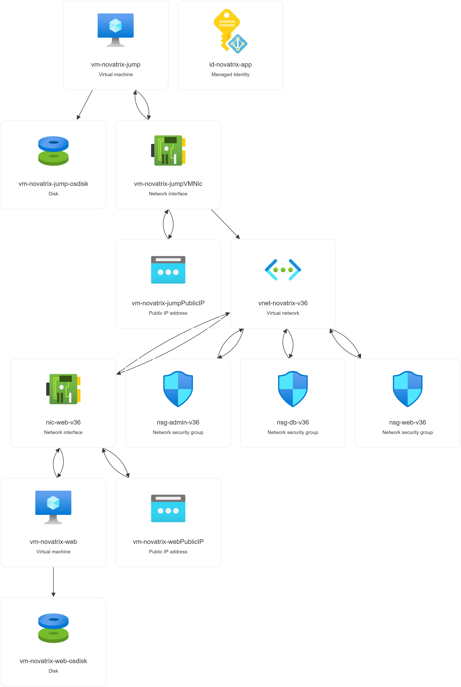
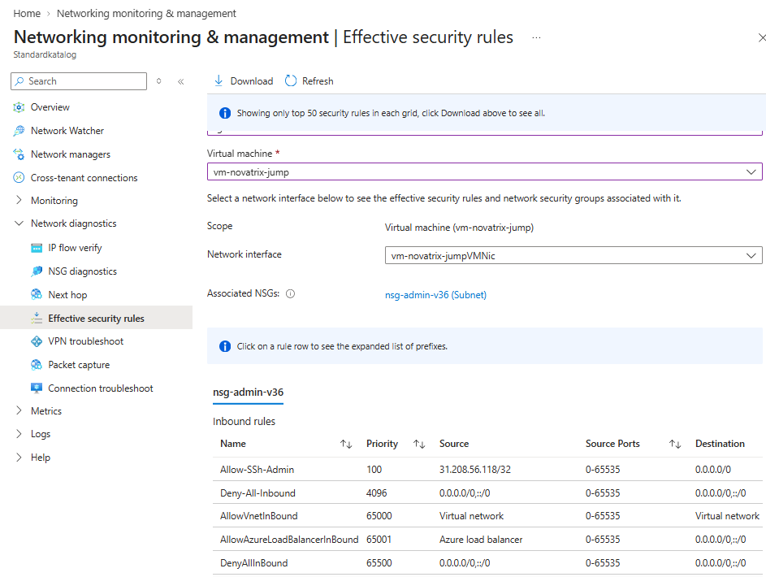
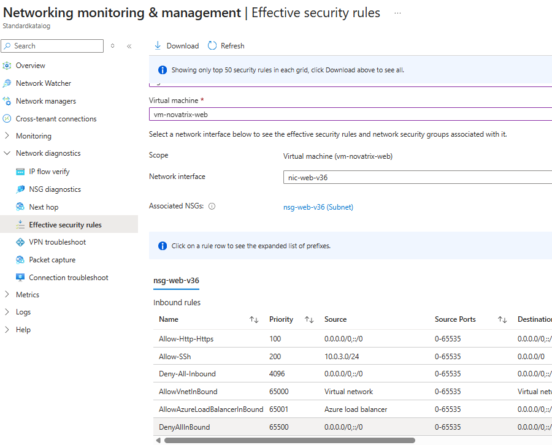
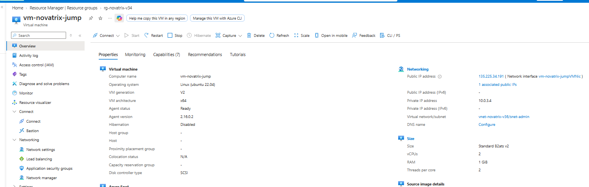

Inloggningen sker med ProxyJump (`-J`), så trafiken tunnlas genom hoppvärden och nyckeln aldrig lämnar en kopia där:

```
ssh-add ~/.ssh/id_rsa
ssh -J azureuser-web@135.225.34.191 azureuser-web@10.0.1.4
```

Verifierat på riktigt, från min dator:

```
ssh -J azureuser-web@135.225.34.191 azureuser-web@10.0.1.4 "hostname"   -> vm-novatrix-web
ssh -o ConnectTimeout=8 azureuser-web@20.240.247.212                    -> Connection timed out
ssh azureuser-web@135.225.34.191 "hostname"                             -> vm-novatrix-jump
```

Direkt mot webben blir det timeout, inte "Permission denied" — beviset att NSG:n stoppar paketet före SSH ens svarar. Network Watcher IP flow verify bekräftar samma sak på regelnivå:

| Paket | Resultat | Regel |
|---|---|---|
| `10.0.1.4:22` från `8.8.8.8` | Denied | `Deny-All-Inbound` (nsg-web-v36) |
| `10.0.1.4:22` från `10.0.3.4` | Allowed | `Allow-SSh` (nsg-web-v36) |
| `10.0.3.4:22` från min IP | Allowed | `Allow-SSh-Admin` (nsg-admin-v36) |

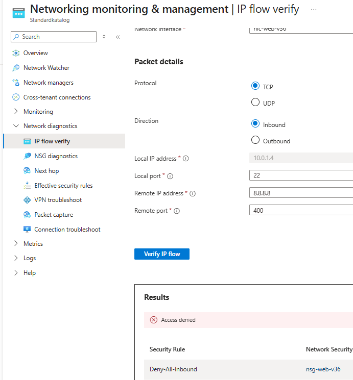
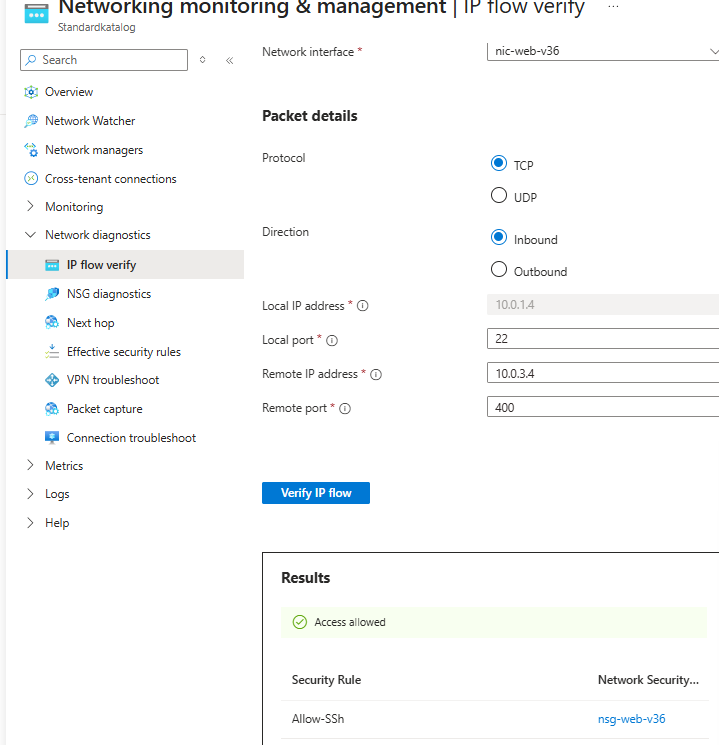
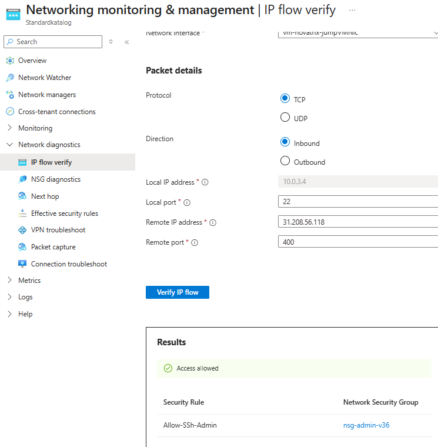

Priset är en extra maskin — regionens kvot är 4 kärnor och minsta VM är 2, så webben och hoppvärden fyller den precis. I en riktig miljö hade kostnaden vägts mot nyttan; här är hoppvärden det uppgiften efterfrågar.

### Vilka hot designen skyddar mot

Varje regel finns av en anledning. Här är vad de är till för.

| Lager | Hotet det möter |
|---|---|
| Hoppvärd i stället för öppen SSH | **Brute force och direkt åtkomst.** Webbserverns adress har ingen SSH-port alls längre — en angripare måste först ta sig förbi en maskin som inte kör något annat än vidarebefordran |
| `Deny-All-Inbound` på webben | **Portskanning och oavsiktliga öppningar.** Startar någon en tjänst på servern av misstag blir den ändå inte nåbar utifrån |
| Webb och lagring i skilda subnät | **Lateral rörelse.** Kapas webbservern står angriparen inte automatiskt vid lagringen, den måste förbi ännu en säkerhetsgrupp |
| `Allow-Web-To-Storage`, bara 443 | **Onödig angreppsyta.** Bara den port lagringen faktiskt använder, inget mer |
| `Deny-All-Inbound` på lagringen | **Hot inifrån.** Azures default släpper in all trafik från VNet:et. Min regel stänger det, så bara webbsubnätet kommer in och inte något jag bygger senare |
| `snet-db` utan väg ut | **Exfiltrering.** En kapad backend kan varken ringa hem eller skicka ut data på egen hand |

Ett enda av de här lagren hade inte räckt. Poängen är att de ligger på varandra.

### När min egen regel låste ute mig

Mitt i arbetet slutade SSH plötsligt fungera:

```
ssh azureuser-web@20.240.247.212
ssh: connect to host 20.240.247.212 port 22: Connection timed out
```

Första tanken var att servern låg nere, men webbsidan svarade `200 OK`. Det var regeln som gjorde sitt jobb. Min operatör hade bytt min publika adress, och regeln såg en okänd källa och slängde paketen. Precis som den ska.

Det säger två saker. Att begränsningen faktiskt fungerar, vilket är svårt att visa tydligare än så här. Och att **en IP-adress som skrivs in för hand blir fel förr eller senare** — den var rätt den dag jag skrev den och fel någon dagar senare.

Koden löser halva problemet. `$(curl -s -4 ifconfig.me)` gör att adressen aldrig hamnar i repot och ett nybygge alltid får rätt adress (`-4` tvingar IPv4, annars kan `ifconfig.me` svara med en IPv6-adress som gör regeln obrukbar för SSH).

Efter VG-delen lever risken bara kvar på `Allow-SSh-Admin` på hoppvärden — webbens `Allow-SSh` pekar nu på ett fast subnät i stället. Exakt samma lockout hände på den nya regeln under VG-bygget. Samma fix, nytt mål:

```
az network nsg rule update \
  --resource-group rg-novatrix-v34 \
  --nsg-name nsg-admin-v36 \
  --name Allow-SSh-Admin \
  --source-address-prefixes $(curl -s -4 ifconfig.me)
```

### Hur designen växer

| Behov | Vad man gör |
|---|---|
| Ny tjänst | Nytt subnät med egen NSG. Hoppvärden tog `10.0.3.0/24`, `10.0.4.0/24` och uppåt är ledigt |
| Fler regler | Prioritetsluckorna mellan 200 och 4095 räcker länge. Tydliga namn så listan går att läsa |
| Fler webbservrar | En ASG i stället för att räkna upp IP-adresser, då gäller regeln gruppen |
| Fler admin-adresser | Byt den enda adressen mot en lista: `ADMIN_IPS=("$(curl -s ifconfig.me)" "1.2.3.4")` och `--source-address-prefixes "${ADMIN_IPS[@]}"` |
| Bygga någon annanstans | `RG=annan-grupp bash natverk-novatrix.sh` |

Den fjärde raden är samma tanke som gruppmodellen i v35: behörighet läggs på en grupp, inte på en enskild. Här på nätverksnivå, där regeln pekar på en lista av betrodda källor i stället för på en adress.
