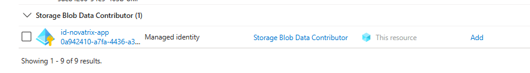
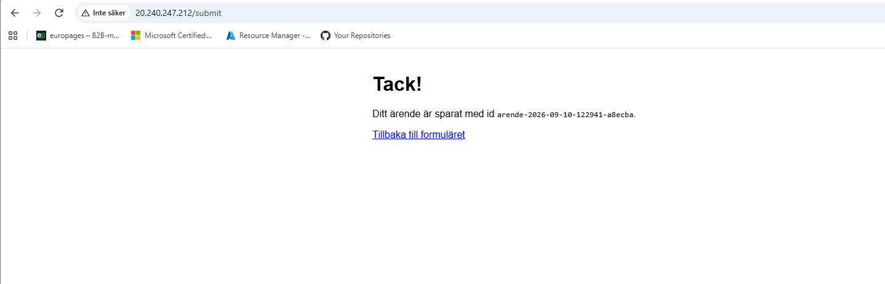
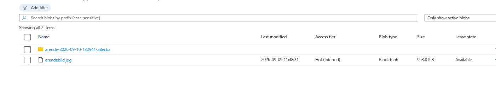
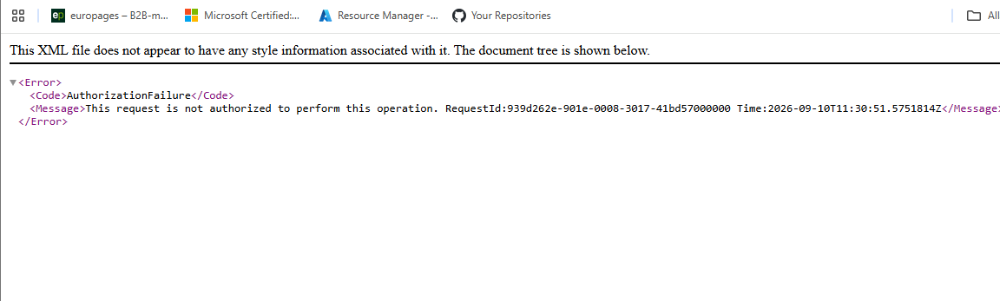

# Uppgift V37 - Storage

**Repo:** https://github.com/80idralt/azure/tree/master/v37

**Namn:** Idris Altun

**Klass:** MOV25

**Datum:** 2026-09-10

## Syfte

Novatrix kundtjänst tar emot ärenden via ett webbformulär, men hittills har det bara varit en sida. Inget som skickas in sparas någonstans. Den här veckan får lösningen ett lagringslager: ett ställe dit inskickade ärenden och bifogade filer hamnar, skilt från servern, så att data finns kvar även om servern byts ut. Åtkomsten ska vara säkrad, inget ska ligga öppet.

Lagringen och säkerheten runt den gjorde jag först för hand i portalen, sedan som kod.

## Utgångsläge

Jag bygger vidare på samma miljö som förut, `rg-novatrix-v34` i `swedencentral`, ingenting rivs:

- `vm-novatrix-web` från v34, nu i `snet-web` efter v36
- Behörighetsmodellen och den hanterade identiteten `id-novatrix-app` från v35
- Nätverket från v36. `snet-db` var tänkt att husera lagringen via en privat endpoint, och `nsg-db-v36` har regeln `Allow-Web-To-Storage` (443 från webbsubnätet). Jag landade i stället i en service endpoint på `snet-web`, se avsnitt 4.4.

`id-novatrix-app` skapade jag i v35 med kommentaren att den skulle kopplas ihop med lagringen först nu. Det är det som händer den här veckan.

## 1. Repo

La till mappen för v37 med `scripts/`, `images/`, `public/` och `app/`, och skrev den här README:n. La också en `.gitattributes` i repot som tvingar LF-radbrytningar på skalskript, YAML och serverkonfiguration, så att skript och cloud-init inte går sönder när de körs på Linux.

I `scripts/` ligger hela kedjan som bygger miljön från v34 och framåt, inte bara veckans lagringsskript, allt samlat på ett ställe. Mer om det i avsnitt 6.

## 2. Skapa lagringen

### Storage account

Jag skapade kontot i portalen under **Storage accounts → Create**, i `rg-novatrix-v34` och samma region som VM:en.

| Inställning | Värde | Varför |
|---|---|---|
| Namn | `stnovatrixv37idr` | Måste vara globalt unikt i hela Azure. `st` + företag + vecka + initialer |
| Region | `Sweden Central` | Samma som VM och nätverk, lägre fördröjning och ofta lägre kostnad |
| Prestanda | `Standard` | Enkla ärendefiler behöver ingen premium-SSD |
| Kontotyp | `StorageV2` | Den moderna kontotypen |
| Redundans | `LRS` | Tre kopior inom ett datacenter, billigast |
| Standardnivå | `Hot` | Ärenden läses aktivt när de kommer in |

**Blob, inte Files.** Files är en nätverksmapp (SMB) som flera servrar monterar som en enhet. Det jag behöver är att appen lägger objekt som nås via en adress, och det är precis vad Blob är byggt för. Novatrix ärenden och bilagor hör hemma i Blob.

### Val av lagringsnivå

Ett ärende är färskt när det kommer in. Supporten öppnar det, läser bilagan, svarar kunden, ofta flera gånger de första dagarna. Sedan blir det tyst. Lagringsnivån i Azure är en avvägning mellan vad det kostar att förvara data och vad det kostar att läsa den:

- **Hot:** dyrast per lagrad GB, men billigast per läsning och ingen avgift för att hämta data. För data som läses ofta.
- **Cool / Cold:** billigare lagring, dyrare läsning, datan ska ligga kvar en viss minsta tid. För sällanläst data.
- **Archive:** billigast av alla att förvara, men datan ligger offline och måste tinas i timmar innan den kan läsas. För rena arkiv.

Novatrix ärenden läses aktivt när de är aktuella, så Hot är rätt nivå: läsningarna blir billiga och svarstiden direkt. Att lägga aktiva ärenden på Cool hade sparat nästan ingenting på lagringen, eftersom datamängden är liten, men gjort varje läsning dyrare. Cool eller Archive hade blivit aktuellt först för ärenden som ska sparas långt efter att de stängts, vilket inte är fallet här. Hot + LRS är alltså ett medvetet val: Hot för att datan läses ofta, LRS för att en labbmiljö med testdata inte behöver kopior i en annan region.

Kryptering i vila är på automatiskt, Azure sköter det, inget att slå på.


### Blob-container

Under **Containers → + Container** skapade jag `arenden`, för inskickade ärenden och bilagor. Åtkomstnivån lämnade jag på **Private (no anonymous access)**, ingen ska kunna läsa innehållet utan att vara behörig.

Sen laddade jag upp en testfil, `arendebild.jpg`, för att ha något att verifiera mot. Filen fick blob-adressen:

```
https://stnovatrixv37idr.blob.core.windows.net/arenden/arendebild.jpg
```


### Kontot i text

`az storage account show` med de fält som är relevanta för uppgiften, kört innan nätverksregeln i avsnitt 4.4 slogs på:

```
az storage account show -g rg-novatrix-v34 -n stnovatrixv37idr \
  --query "{Namn:name, Niva:accessTier, Kontotyp:kind, Region:location, HttpsKrav:enableHttpsTrafficOnly, MinTls:minimumTlsVersion, AnonymBlob:allowBlobPublicAccess, Nyckelatkomst:allowSharedKeyAccess, PubliktNat:publicNetworkAccess}" -o table

Namn              Niva    Kontotyp    Region         HttpsKrav    MinTls    AnonymBlob    Nyckelatkomst    PubliktNat
----------------  ------  ----------  -------------  -----------  --------  ------------  ---------------  ------------
stnovatrixv37idr  Hot     StorageV2   swedencentral  True         TLS1_2    False         True             Enabled
```

`Niva Hot`, `Kontotyp StorageV2` och `MinTls TLS1_2` är valen från tabellen ovan. `HttpsKrav True` och `AnonymBlob False` är de stängda dörrarna från avsnitt 4.1. `Nyckelatkomst True` är shared key som står kvar i standardläge (avsnitt 4.2). Nätverksregeln som låser kontot beskrivs i avsnitt 4.4.

## 3. Koppla formuläret till lagringen

Formuläret på webbsidan är statiskt. En sida i webbläsaren har ingen identitet och kan inte logga in mot lagringen, så själva skrivningen måste ske på servern. Jag la därför till en liten mottagare på `vm-novatrix-web`.

### Så går ett ärende in

```
webbläsare  --POST /submit-->  nginx  --vidare-->  mottagaren (127.0.0.1:5000)  --skriver-->  containern arenden
```

- Formuläret (`public/index.html`) postar till `/submit` med `enctype="multipart/form-data"` så en bild följer med.
- nginx serverar sidan som förut och skickar `/submit` vidare till mottagaren. Port 5000 nås aldrig utifrån.
- Mottagaren (`app/app.py`, Flask) tar emot namn, e-post, meddelande och en eventuell bild. Den ger ärendet ett läsbart id, `arende-` plus datum, tid och en kort slumpdel, och skriver två blobar under `<id>/`: `arende.json` med texten, och bilden bredvid.
- Inloggningen mot lagringen görs med `id-novatrix-app` via `DefaultAzureCredential`. Ingen nyckel, inget lösenord i koden. Kontonamn och identitetens client-id sätts som miljövariabler på servern, inte i filen.

### Delarna på servern

| Del | Vad den gör |
|---|---|
| `/opt/novatrix/` med egen Python-miljö | mapp för appen, biblioteken hålls skilda från systemets |
| [`app/app.py`](app/app.py) | tar emot inskicket och skriver ärendet till containern |
| [`app/novatrix-form.service`](app/novatrix-form.service) | kör appen som en tjänst, startar den vid boot och om den kraschar |
| [`app/nginx-arende.conf`](app/nginx-arende.conf) | serverar sidan och skickar `/submit` vidare, höjer `client_max_body_size` så bilden får plats |

Kärnan i `app/app.py`:

```python
@app.post("/submit")
def submit():
    namn = request.form.get("name", "").strip()
    epost = request.form.get("email", "").strip()
    meddelande = request.form.get("message", "").strip()

    stampel = datetime.now(timezone.utc).strftime("%Y-%m-%d-%H%M%S")
    arende_id = f"arende-{stampel}-{uuid.uuid4().hex[:6]}"

    arende = {"id": arende_id, "namn": namn, "epost": epost,
              "meddelande": meddelande, "skapat": stampel}
    container.upload_blob(f"{arende_id}/arende.json",
                          json.dumps(arende, ensure_ascii=False).encode("utf-8"),
                          overwrite=True)

    bilaga = request.files.get("attachment")
    if bilaga and bilaga.filename:
        container.upload_blob(f"{arende_id}/{bilaga.filename}",
                              bilaga.stream, overwrite=True)
```

Att ett inskickat ärende faktiskt hamnar i containern verifieras i avsnitt 5.

## 4. Säkra åtkomsten

### 4.1 Stäng publik åtkomst

Två grundinställningar kontrollerade jag på kontot under **Settings → Configuration**:

| Inställning | Läge |
|---|---|
| Allow Blob anonymous access | Disabled |
| Secure transfer required (HTTPS) | Enabled |

Nyare konton har anonym åtkomst avstängd som standard, men jag bekräftade det. Ärenden är inte offentligt material, så ingenting ska gå att läsa utan inloggning. HTTPS-kravet gör att trafiken till och från lagringen är krypterad.


### 4.2 Appen når lagringen via hanterad identitet, inte nyckel

Jag hängde `id-novatrix-app` på webbservern under **vm-novatrix-web → Identity → User assigned**.


**User-assigned, inte VM:ens egen.** En VM kan ha en inbyggd (system-assigned) identitet som föds och dör med maskinen. `id-novatrix-app` är i stället fristående, den överlevde att VM:en raderades och byggdes om i v36, och den är den identitet jag förberedde för det här redan i v35.

**Rollen: Storage Blob Data Contributor på containern.** Först gav jag identiteten `Storage Blob Data Reader` på hela kontot. När formuläret skulle kopplas in räckte inte läsrätt, så jag bytte till `Storage Blob Data Contributor` med containern `arenden` som enda scope, och tog bort Reader. Nu kan appen läsa och skriva ärenden i den containern, inget annat på kontot. Det är least privilege på datanivå: minsta behörighet som räcker för jobbet.

Rollen är en dataroll, skild från rollerna på själva kontot. `Owner` och `Contributor` som ligger på mitt konto och grupperna styr resursen, alltså vem som får skapa, ändra och radera storage-kontot. De ger ingen åtkomst till filerna inuti. Mer om den skillnaden i avsnitt 5.



Kontroll med `az`:

```
az role assignment list --assignee <id-novatrix-app> --all -o table

Principal (appId)                     Role                           Scope
------------------------------------  -----------------------------  ------------------------------------------------------
0a942410-a7fa-4436-a32a-47ed9f215e03  Storage Blob Data Contributor  .../storageAccounts/stnovatrixv37idr/.../containers/arenden
```

#### Nyckelåtkomst kontra identitet

När ett storage account skapas får det två kontonycklar, långa strängar som låser upp allt på kontot: läsa, skriva, radera, ändra inställningar. De går inte att spåra till en person och de slutar aldrig gälla av sig själva. En SAS byggs dessutom ovanpå en av de här nycklarna.

Inställningen `AllowSharedKeyAccess` styr om nycklarna, och SAS:er som vilar på dem, fungerar över huvud taget. Den är påslagen som standard och jag lät den vara det. Skälet är att jag använder en kort läs-SAS för tillfällig delning (avsnitt 4.3). Stänger jag av nyckelåtkomsten helt, slutar den SAS:en att fungera.

Att kontot *har* nycklar är inte problemet. Problemet uppstår först om en nyckel läcker, till exempel genom att hamna i kod. Appen rör aldrig nycklarna, den går in via den hanterade identiteten och RBAC, och där finns ingen hemlighet som kan komma på avvägar. Bilden är ungefär: kontonyckeln är husets huvudnyckel som passar alla dörrar och ligger kvar i kassaskåpet, identiteten är ett personligt passerkort som loggar varje dörr det öppnar och kan spärras för sig. Jag gav appen ett passerkort i stället för en kopia av huvudnyckeln.

Att helt stänga av nyckelåtkomsten (`--allow-shared-key-access false`) är en rimlig skärpning som tvingar all åtkomst genom Entra ID. Det är ett extra steg som uppgiften inte kräver, och det skulle slå ut SAS-delen jag visar här.

### 4.3 SAS för tillfällig delning

Ska en bilaga delas tillfälligt med en tekniker vill jag inte lämna ut en nyckel. Då genererar jag i stället en SAS, en signerad länk med exakt de rättigheter och den tid jag väljer.

På `arendebild.jpg` → **Generate SAS** satte jag:

| Fält | Värde |
|---|---|
| Permissions | Read |
| Giltighetstid | 1 timme |
| Protokoll | HTTPS only |
| Omfång | Just den här blobben |

Snävast möjliga: bara läsa, bara den filen, kort tid. Går den ut slutar den fungera av sig själv.


### 4.4 Begränsa nätverksåtkomsten

Behörigheterna styr *vem* som får göra vad. Nätverksregeln styr *varifrån*. Jag la en brandvägg framför kontot, ungefär som NSG:n framför webbservern i v36: standardåtgärden är **Neka**, och bara två källor släpps in.

- **`snet-web`**, subnätet där webbservern står, via en service endpoint för `Microsoft.Storage`. När VM:en pratar med lagringen känner Azure igen att trafiken kommer från det subnätet och släpper in den.
- **Mitt eget IP-intervall**, för att kunna administrera kontot och bläddra i containern från portalen. Jag använder ett litet intervall (ett /23) från min internetleverantör i stället för en enskild adress, eftersom min publika IP är dynamisk och byter ibland. Intervallet är fortfarande begränsat, och det som faktiskt skyddar datan är RBAC-lagret och att anonym åtkomst är av.

```
az network vnet subnet update -g rg-novatrix-v34 --vnet-name vnet-novatrix-v36 \
    -n snet-web --service-endpoints Microsoft.Storage

az storage account network-rule add -g rg-novatrix-v34 --account-name stnovatrixv37idr \
    --vnet-name vnet-novatrix-v36 --subnet snet-web

az storage account network-rule add -g rg-novatrix-v34 --account-name stnovatrixv37idr \
    --ip-address <mitt IP-intervall>

az storage account update -g rg-novatrix-v34 -n stnovatrixv37idr --default-action Deny
```

```
az storage account network-rule list -g rg-novatrix-v34 --account-name stnovatrixv37idr

defaultAction   Deny
virtualNetworkRules   .../virtualNetworks/vnet-novatrix-v36/subnets/snet-web   (Allow, Succeeded)
ipRules   <mitt IP-intervall>
```

**Service endpoint på `snet-web`, inte privat endpoint i `snet-db`.** I v36 förberedde jag `snet-db` med regeln `Allow-Web-To-Storage` för en privat endpoint. Men webbservern står i `snet-web`, och det är därifrån trafiken kommer, så en service endpoint på just det subnätet är den kortare vägen och räcker för uppgiften. En privat endpoint i `snet-db` hade också fungerat men krävt en extra resurs och en privat DNS-zon.

`publicNetworkAccess` står kvar som `Enabled`. Det betyder att den publika adressen finns, men den styrs nu av nätverksreglerna: bara `snet-web` och mitt IP-intervall kommer förbi.

### Åtkomsten i översikt

| Container / konto | Åtkomstmetod | Vem når vad |
|---|---|---|
| `arenden` | RBAC via hanterad identitet | `id-novatrix-app` läser och skriver ärenden och bilagor (roll Storage Blob Data Contributor, scope: containern). Inget anonymt. |
| `arenden`, enskild blob | Kort läs-SAS | Tillfällig delning: bara läsa, bara den filen, HTTPS, tidsbegränsat |
| Kontot | Nätverksregel, standard Neka | Bara `snet-web` (service endpoint) och mitt admin-IP-intervall. Allt annat nekas på nätverksnivå. |

## 5. Verifiera

Att inställningarna syns i portalen bevisar bara att jag gjort dem. Så jag testade både att inskicket fungerar och att åtkomsten är stängd:

| Test | Vad jag gjorde | Resultat |
|---|---|---|
| Inskickat ärende med bilaga | Fyllde i formuläret på webben, bifogade en bild, tryckte Skicka (efter att nätverksregeln var på) | **Sparas.** Mappen `arende-2026-09-10-122941-a8ecba/` med `arende.json` och bilden i `arenden`. Serverns logg: `POST /submit ... 200` |
| Naken blob-URL, anonymt | Öppnade blob-adressen utan SAS i inkognitofönster | **Nekad.** `PublicAccessNotPermitted` (anonym åtkomst är av) |
| Blob-URL från IP utanför nätverksregeln | Öppnade samma adress från min laptop efter att brandväggen slagits på | **Nekad.** `AuthorizationFailure`, "This request is not authorized to perform this operation" (nätverkslagret) |
| Giltig SAS | Öppnade blobben med `?sp=r&...&sig=...` (innan nätverksregeln) | **Bilden visas** |
| Utgången SAS | Skapade en SAS med kort giltighet, öppnade efter att tiden gått ut | **Nekad.** `AuthenticationFailed`, "Signature not valid in the specified time frame" |
| Eget konto mot blob-data | Bytte till "Microsoft Entra user account" i containern | **Nekad.** "You do not have permissions to list the data" |

Inskicket gick från webbläsaren över internet, in genom nginx, vidare till mottagaren, som skrev till lagringen via `id-novatrix-app`. Att formuläret fungerar *efter* att nätverksregeln slagits på visar att webbservern i `snet-web` fortfarande når kontot, medan min egen laptop nekas. Det är flera lager: anonym åtkomst av, brandvägg framför kontot, och RBAC på datan.







Testet med mitt eget konto är det intressanta. Jag är Owner på prenumerationen, men Owner styr *kontot*, alltså vem som får skapa, ändra och radera själva resursen. Det säger ingenting om *datan* inuti. För att läsa blobar krävs en egen dataroll (`Storage Blob Data Reader` eller `Contributor`), och den har mitt konto inte. Samma least privilege-tanke som förut, nu på datanivå.

## 6. VG: Lagringen som kod och robust åtkomst

### 6.1 Lagringen som kod

Lagringen finns som kod i [`scripts/storage-novatrix.sh`](scripts/storage-novatrix.sh). Skriptet skapar kontot med rätt nivå och redundans, skapar containern privat, kopplar `id-novatrix-app` till webbservern, ger den skrivbehörighet på containern och låser till sist kontot till webb-subnätet, i den ordningen, eftersom varje steg bygger på det föregående. Kör man filen byggs lagringen upp på nytt utan ett enda portalklick.

Filen har inga hemligheter i sig. Den loggar in med `--auth-mode login` och slår upp identitetens objekt-id vid körning i stället för att spara en nyckel. Värden som kan behöva ändras, som kontonamn och resursgrupp, ligger överst som variabler med `${VAR:-standardvärde}`, så samma fil kan köras mot en testmiljö utan att ändras.

Mottagaren som kopplar formuläret till lagringen ligger också som kod: [`app/app.py`](app/app.py), tjänstefilen [`app/novatrix-form.service`](app/novatrix-form.service) och [`app/nginx-arende.conf`](app/nginx-arende.conf). Avsnitt 3 beskriver hur de sätts upp på servern. Kontonamn och identitetens client-id sätts som miljövariabler av tjänsten, inte i koden.

### 6.2 Hela miljön som en kedja

`scripts/` samlar skripten från alla veckor på ett ställe:

| Skript | Bygger | Från vecka |
|---|---|---|
| `deploy.ps1` + `cloud-init.yaml` | Resursgrupp och webbserver | v34 |
| `rbac-novatrix.sh` | Rolltilldelningar på grupperna | v35 |
| `natverk-novatrix.sh` | VNet, subnät och säkerhetsgrupper | v36 |
| `hoppvard-novatrix.sh` | Hoppvärden | v36 (VG) |
| `storage-novatrix.sh` | Lagringen | v37 |

Lagringen hänger ihop med resten på två punkter. **Identiteten:** `id-novatrix-app` skapades i v35 och kopplas till `vm-novatrix-web`, så att appen på servern kan nå blob-data utan lösenord. **Nätverket:** kontot är låst till `snet-web` via en service endpoint (avsnitt 4.4), samma VNet som byggdes i v36. Webbservern, identiteten och lagringen sitter alltså ihop i samma miljö, och trafiken mellan dem lämnar aldrig Azure.

Alla skript använder samma namngivning och samma resursgrupp. Det pekar mot nästa kurssteg, där miljön samlas i en ARM-mall.

### 6.3 Val som går utöver grundlösningen

Den enklaste vägen till en fungerande mottagare gör tre saker enklare än nödvändigt. Jag gjorde annorlunda på varje punkt, och varje avsteg är ett medvetet val.

| Enklaste vägen | Min lösning | Varför |
|---|---|---|
| Kontonamnet hårdkodat i `app.py` | `STORAGE_ACCOUNT` som miljövariabel, satt av systemd-tjänsten och läst med `os.environ` | Samma kod kan köras mot vilken miljö som helst utan att ändras. Det är en av VG-utmaningarna. |
| VM:ens system-tilldelade identitet, hela servern får åtkomst till kontot | User-assigned `id-novatrix-app` från v35, och `AZURE_CLIENT_ID` pekar ut just den i `DefaultAzureCredential`. Rollen är scopad till containern | Identiteten är fristående och överlever att servern byts ut. Behörigheten är dessutom avgränsad till en container, inte hela kontot. Least privilege. |
| Python-paketen installeras systemvitt | Egen virtuell miljö i `/opt/novatrix/venv` | Appens beroenden (Flask, `azure-storage-blob`) krockar inte med systemets Python. Så kör man Linux-tjänster. |

### 6.4 Svar på uppgiftens frågor

VG-delen ställer några frågor. Här är svaren samlade.

**Vilken lagringsnivå passar data som läses ofta, och varför?**
Hot. Den har högst pris per lagrad GB men lägst pris per läsning och ingen hämtningsavgift. Novatrix ärenden läses aktivt de första dagarna, så Hot blir billigast totalt och svarstiden är direkt. Hela avvägningen står i avsnitt 2.

**Vilken nivå passar sällanläst eller ren arkivdata, och varför?**
Cool eller Cold för sällanläst: billigare lagring, dyrare läsning, en minsta lagringstid. Archive för rena arkiv: billigast av alla, men datan måste tinas i timmar innan den går att läsa. Det passar data som ska sparas långt efter att den slutat användas, inte aktiva ärenden.

**Vilket åtkomstsätt är mest spårbart och lättast att återkalla, och varför?**
RBAC via en identitet. Varje anrop görs av en namngiven identitet och syns i loggarna, och behörigheten tas bort med ett kommando utan att något annat påverkas. En kontonyckel är inte kopplad till någon och måste roteras, vilket slår mot allt som använder den. En SAS går inte att dra tillbaka i förväg, den lever tills den går ut.

**Varför är least privilege ett VG-krav?**
För att det begränsar skadan när något går fel. Får en identitet bara den behörighet uppgiften kräver, och den kapas, blir det en liten incident i stället för en stor. Angriparen kommer inte åt mer än den lilla yta identiteten hade.

**Varför är den här metoden robustare än en delad nyckel?**
Appen når lagringen via den hanterade identiteten och RBAC:

- **Ingen hemlighet finns.** Azure sköter inloggningen, inget lösenord i koden som kan läcka.
- **Det är spårbart.** Anropen loggas mot en identitet.
- **Det är lätt att återkalla.** En rolltilldelning bort med ett kommando.
- **Det överlever driften.** Identiteten är fristående och påverkades inte av att servern byggdes om i v36.

En kontonyckel ger i stället full åtkomst till hela kontot, har ingen utgångstid och går inte att spåra till en person.

**Kan en kollega återskapa lagringen från koden?**
Ja. `scripts/storage-novatrix.sh` har alla kommandon i rätt ordning, inga hemligheter, och de värden som kan variera ligger som variabler överst. Kör filen och samma lagring byggs upp.

## Städning

Resursgruppen `rg-novatrix-v34` står kvar, hela miljön byggs vidare på den. VM:en stoppar jag när jag inte jobbar, den kostar medan den kör. Lagringen ligger kvar. Testinnehållet är någon enstaka fil och kostar i praktiken ingenting.
