# Uppgift V37 - Storage

**Repo:** https://github.com/80idralt/azure/tree/master/v37

**Namn:** Idris Altun

**Klass:** MOV25

**Datum:** 2026-09-09

## Syfte

Novatrix kundtjänst tar emot ärenden via ett webbformulär, men hittills har det bara varit en sida — inget som skickas in sparas någonstans. Den här veckan får lösningen ett lagringslager: ett ställe dit inskickade ärenden och bifogade filer hamnar, skilt från servern, så att data finns kvar även om servern byts ut. Åtkomsten ska vara säkrad, inget ska ligga öppet.

Grunddelen gjorde jag för hand i portalen. Att provisionera samma sak som kod, och att koppla in formuläret, kommer i nästa steg (avsnitt 3 och VG).

## Utgångsläge

Jag bygger vidare på samma miljö som förut, `rg-novatrix-v34` i `swedencentral`, ingenting rivs:

- `vm-novatrix-web` från v34, nu i `snet-web` efter v36
- Behörighetsmodellen och den hanterade identiteten `id-novatrix-app` från v35
- `snet-db` från v36 — ett privat subnät utan väg ut till internet, förberett för just lagringen. `nsg-db-v36` har redan regeln `Allow-Web-To-Storage` (443 från webbsubnätet)

`id-novatrix-app` skapade jag i v35 med kommentaren att den skulle kopplas ihop med lagringen först nu. Det är det som händer den här veckan.

## 1. Repo

La till mappen för v37 med `scripts/`, `images/` och `public/`, och skrev den här README:n. La också en `.gitattributes` i repot som tvingar LF-radbrytningar på skalskript och YAML, så att skript och cloud-init inte går sönder när de körs på Linux.

## 2. Skapa lagringen

### Storage account

Jag skapade kontot i portalen under **Storage accounts → Create**, i `rg-novatrix-v34` och samma region som VM:en.

| Inställning | Värde | Varför |
|---|---|---|
| Namn | `stnovatrixv37idr` | Måste vara globalt unikt i hela Azure. `st` + företag + vecka + initialer |
| Region | `Sweden Central` | Samma som VM och nätverk — lägre fördröjning, ofta lägre kostnad |
| Prestanda | `Standard` | Enkla ärendefiler behöver ingen premium-SSD |
| Kontotyp | `StorageV2` | Den moderna kontotypen |
| Redundans | `LRS` | Tre kopior inom ett datacenter, billigast |
| Standardnivå | `Hot` | Ärenden läses aktivt när de kommer in |

**Blob, inte Files.** Files är en nätverksmapp (SMB) som flera servrar monterar som en enhet. Det jag behöver är att appen lägger objekt som nås via en adress — det är precis vad Blob är byggt för. Novatrix ärenden och bilagor hör hemma i Blob.

**Nivå Hot.** Ett ärende läses av supporten när det kommer in. Cool och Archive har lägre lagringskostnad men högre åtkomstkostnad — det blir dyrare, inte billigare, för data som rörs ofta. Hot matchar användningen.

**Redundans LRS.** Tre kopior inom ett datacenter skyddar mot vanliga hårdvarufel och är billigast. GRS sprider kopior till en annan region och kostar mer — det är för affärskritisk data man inte har råd att förlora. Det här är en labbmiljö med testdata, LRS räcker. Hot + LRS är alltså ett medvetet val: Hot för prestanda, LRS för kostnad.

Kryptering i vila är på automatiskt, Azure sköter det, inget att slå på.

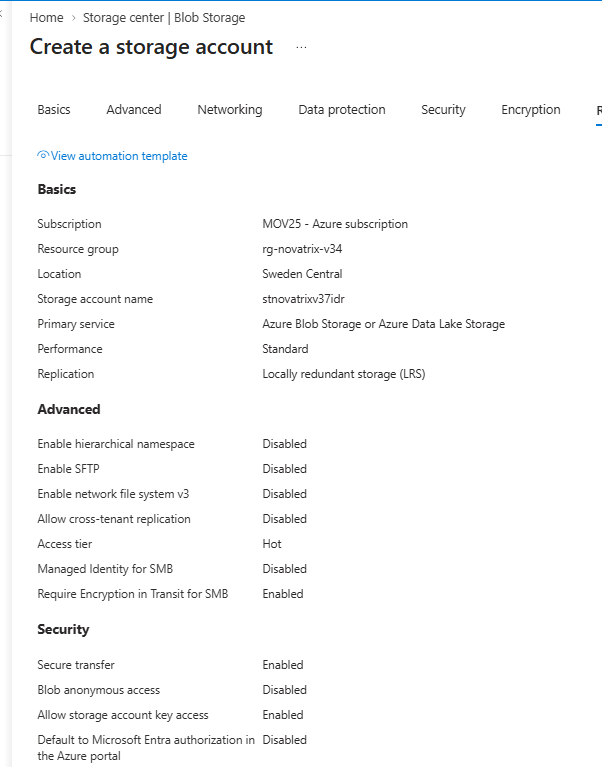
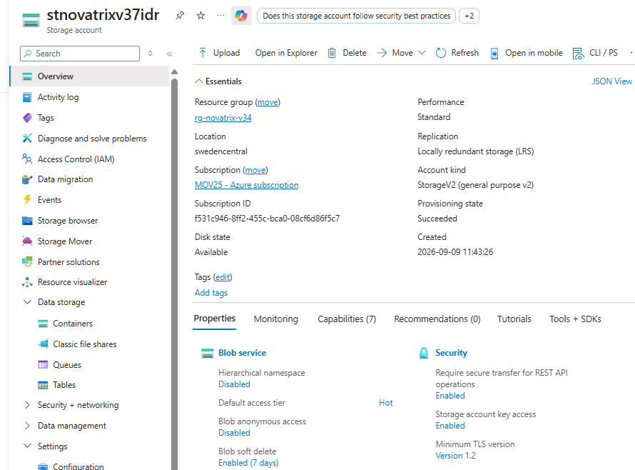

### Blob-container

Under **Containers → + Container** skapade jag `arenden`, för inskickade ärenden och bilagor. Åtkomstnivån lämnade jag på **Private (no anonymous access)** — ingen ska kunna läsa innehållet utan att vara behörig.

Sen laddade jag upp en testfil, `arendebild.jpg`, för att ha något att verifiera mot. Filen fick blob-adressen:

```
https://stnovatrixv37idr.blob.core.windows.net/arenden/arendebild.jpg
```

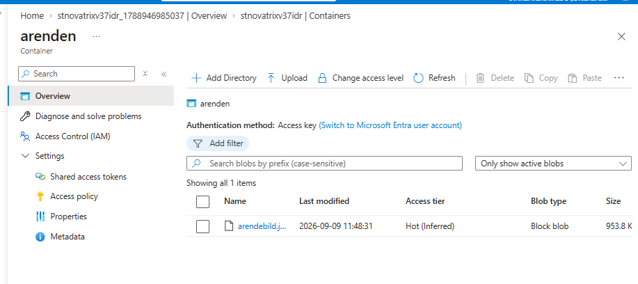
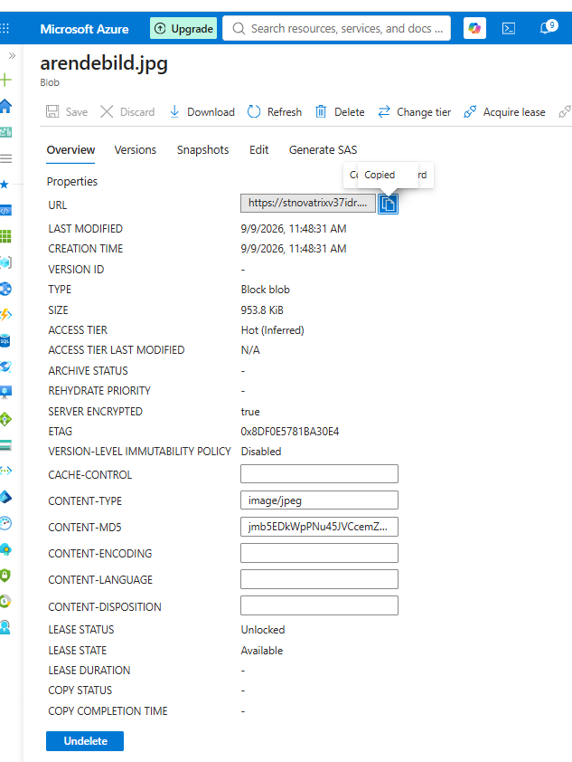

## 3. Koppla formuläret till lagringen

Görs på torsdagens labb. Ett inskickat ärende och en eventuell bilaga ska hamna i containern `arenden`, och appen ska skriva via sin hanterade identitet — ingen nyckel i koden.

## 4. Säkra åtkomsten

### Ingen öppen dörr

Två grundinställningar kontrollerade jag på kontot under **Settings → Configuration**:

| Inställning | Läge |
|---|---|
| Allow Blob anonymous access | Disabled |
| Secure transfer required (HTTPS) | Enabled |

Nyare konton har anonym åtkomst avstängd som standard, men jag bekräftade det. Ärenden är inte offentligt material, så ingenting ska gå att läsa utan inloggning. HTTPS-kravet gör att trafiken till och från lagringen är krypterad.

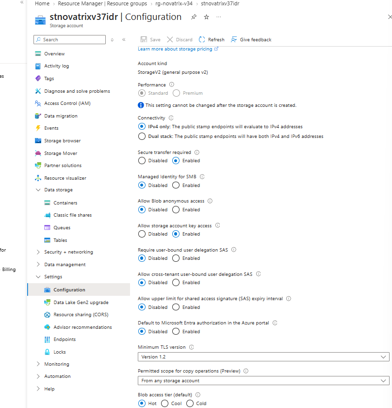

### Appen når lagringen via hanterad identitet, inte nyckel

En åtkomstnyckel ger full åtkomst till hela kontot, har ingen tidsgräns och går inte att spåra till en person. Hamnar den i kod är kontot i praktiken öppet. Därför använder appen en hanterad identitet i stället — Azure sköter inloggningen och det finns inget lösenord som kan läcka.

Jag hängde `id-novatrix-app` på webbservern under **vm-novatrix-web → Identity → User assigned**, och gav den sedan rollen **Storage Blob Data Reader** på storage-kontot under **Access control (IAM)**.

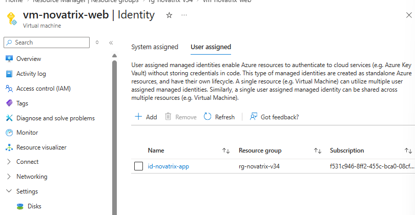
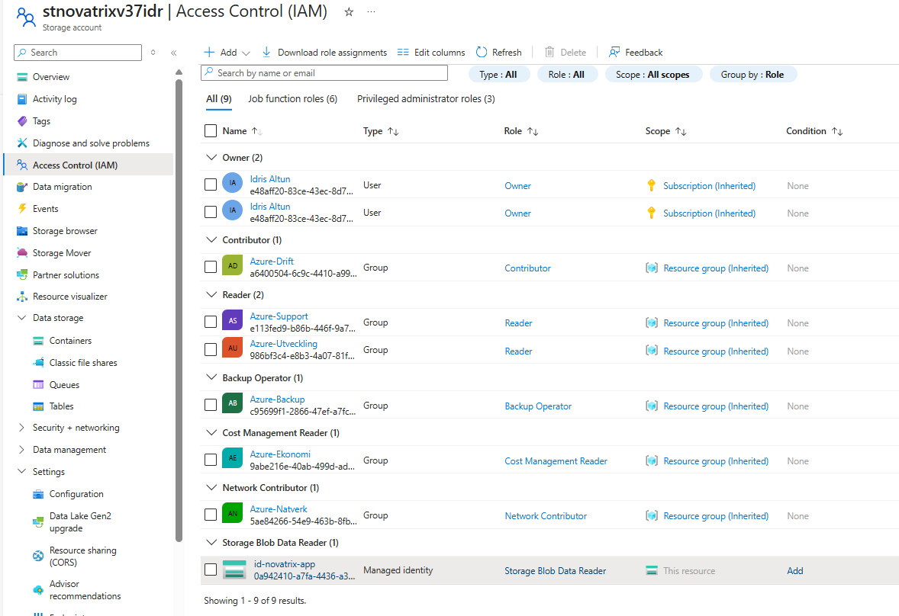

**User-assigned, inte VM:ens egen.** En VM kan ha en inbyggd (system-assigned) identitet som föds och dör med maskinen. `id-novatrix-app` är i stället fristående — den överlevde att VM:en raderades och byggdes om i v36, och den är den identitet jag förberedde för det här redan i v35.

Rollen är **Storage Blob Data Reader** — läsa och lista blobar, inget mer. Att appen även ska kunna skriva in ärenden hör ihop med att formuläret kopplas in, avsnitt 3.

Nyckelåtkomsten (shared key) är kvar i kontots standardläge, påslagen — jag stängde inte av den. RBAC via den hanterade identiteten är den robusta metoden, och att helt stänga av nycklarna är ett extra steg som inte krävs här.

### SAS för tillfällig delning

Ska en bilaga delas tillfälligt med en tekniker vill jag inte lämna ut en nyckel. Då genererar jag i stället en SAS — en signerad länk med exakt de rättigheter och den tid jag väljer.

På `arendebild.jpg` → **Generate SAS** satte jag:

| Fält | Värde |
|---|---|
| Permissions | Read |
| Giltighetstid | 1 timme |
| Protokoll | HTTPS only |
| Omfång | Just den här blobben |

Snävast möjliga: bara läsa, bara den filen, kort tid. Går den ut slutar den fungera av sig själv.

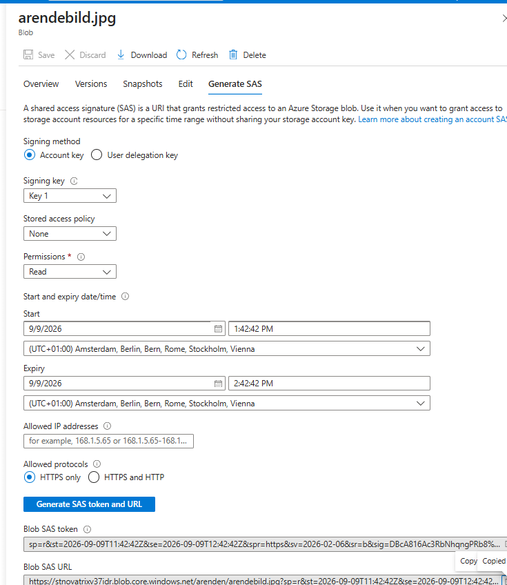

## 5. Verifiera

Att inställningarna syns i portalen bevisar bara att jag gjort dem. Så jag testade åtkomsten på fyra sätt:

| Test | Vad jag gjorde | Resultat |
|---|---|---|
| Naken blob-URL | Öppnade blob-adressen utan SAS i ett inkognitofönster | **Nekad** — `PublicAccessNotPermitted` |
| Giltig SAS | Öppnade samma blob med `?sp=r&...&sig=...` | **Bilden visas** |
| Utgången SAS | Skapade en SAS med kort giltighet, öppnade efter att tiden gått ut | **Nekad** — `AuthenticationFailed`, "Signature not valid in the specified time frame" |
| Eget konto mot blob-data | Bytte till "Microsoft Entra user account" i containern | **Nekad** — "You do not have permissions to list the data" |

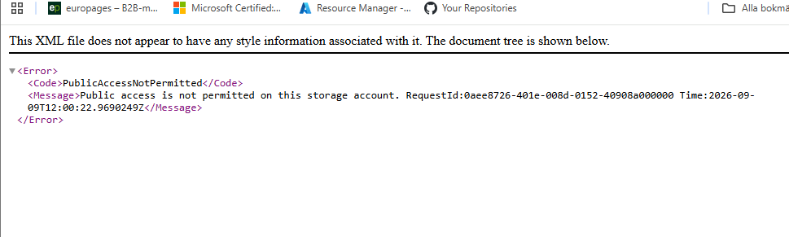

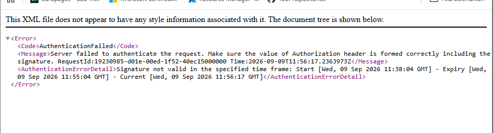
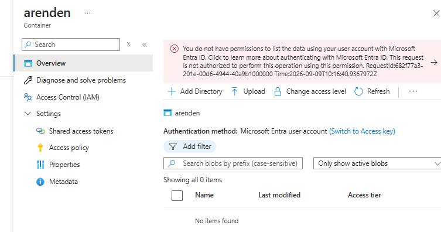

Det fjärde testet är det intressanta. Jag är Owner på prenumerationen, men Owner styr *kontot* — vem som får skapa, ändra och radera själva resursen. Det säger ingenting om *datan* inuti. För att läsa blobar krävs en egen dataroll (`Storage Blob Data Reader` eller `Contributor`), och den har mitt konto inte. Samma least privilege-tanke som förut, nu på datanivå.

Att appen själv kan skriva ett ärende till lagringen verifieras från VM:en när formuläret är inkopplat (avsnitt 3).

## Kvar att göra

- Koppla formuläret så att ett inskickat ärende och en bilaga hamnar i `arenden` (avsnitt 3)
- Provisionera lagringen som kod och integrera den i IaC-uppsättningen (VG)
- Privat endpoint för kontot i `snet-db`, så att lagringen bara nås inifrån VNet:et
