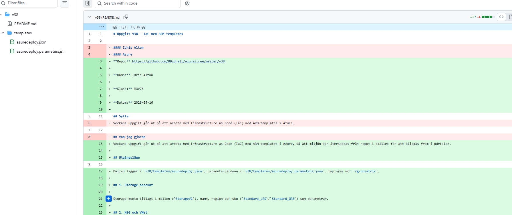
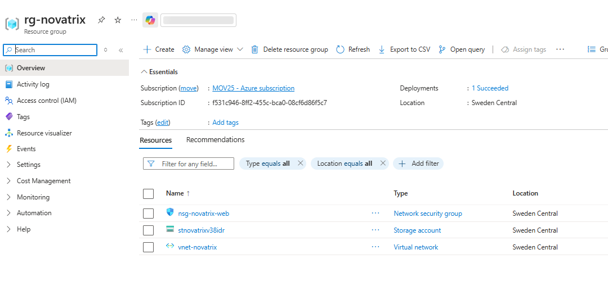
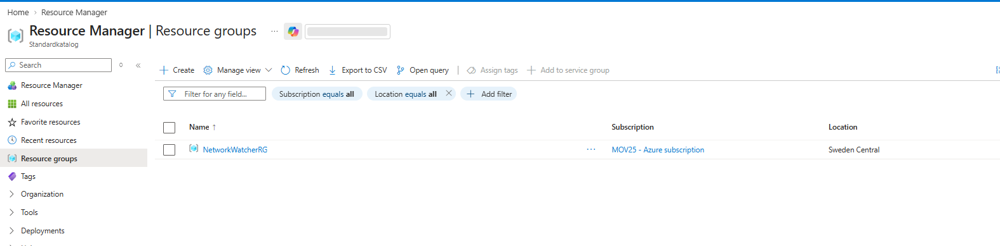
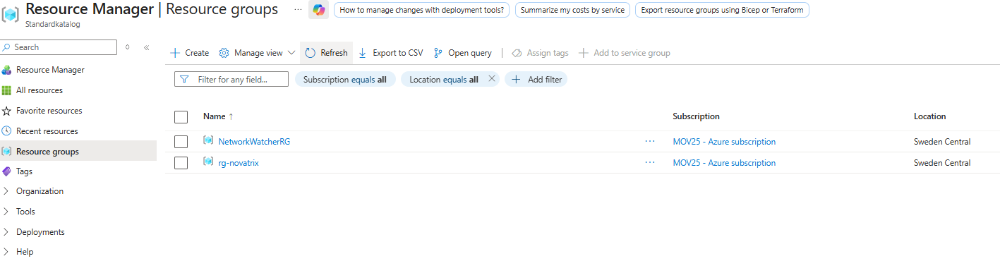
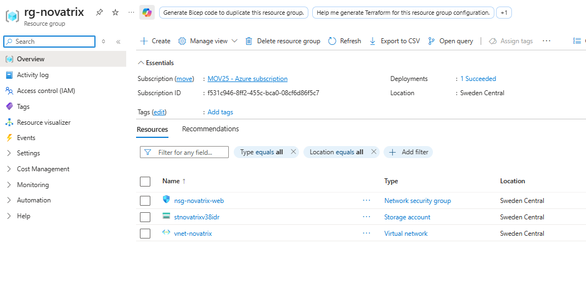

# Uppgift V38 - IaC med ARM-templates

**Repo:** https://github.com/80idralt/azure/tree/master/v38

**Namn:** Idris Altun

**Klass:** MOV25

**Datum:** 2026-09-17

## Syfte

Veckans uppgift går ut på att arbeta med Infrastructure as Code (IaC) med ARM-templates i Azure, så att miljön kan återskapas från repot i stället för att klickas fram i portalen.

## Struktur

En enda mall, `v38/templates/azuredeploy.json`, med värdena i en separat parameterfil, `v38/templates/azuredeploy.parameters.json`. Deployas mot resursgruppen `rg-novatrix`.

Valde en fil i stället för flera länkade mallar: miljön är fortfarande liten och sammanhållen för ett företag, en fil ger ett enda deploy-kommando utan beroenden mellan flera filer att hålla reda på.

Ärendemottagaren (Flask-appen och formulärsidan som webbservern kör) ligger i `v38/app/` och `v38/public/`, och klonas in på servern av cloud-init vid deploy, se avsnitt 7.

## 1. Storage account

Storage-konto (`StorageV2`), namn, region och sku (`Standard_LRS`/`Standard_GRS`) som parametrar, eftersom de skiljer sig mellan miljöer och namnet dessutom måste vara globalt unikt.

Det riktiga kontonamnet byggs i mallen som `storageName` plus sex tecken från `uniqueString(resourceGroup().id)`, så namnet blir garanterat unikt även om samma `storageName` används i en annan prenumeration, utan att man behöver hitta på ett nytt namn för hand varje gång.

## 2. Nätverk

VNet med tre subnät (`snet-web`, `snet-db`, `snet-admin`), varsin NSG. Webbregeln (80, 443) är öppen för alla, databasregeln bara från webb-subnätet, admin-regeln bara från en given IP-parameter. Resursnamnen byggs från ett gemensamt prefix (`namePrefix`) via variabler, så allt hänger ihop och kan bytas på ett ställe.

## 3. Storage-container

En privat blob-container (`arenden`) för inskickade ärenden, `publicAccess: None`. Namnet är hårdkodat, det är applikationslogik snarare än något som varierar mellan miljöer.

## 4. Hoppvärd

En VM (`vm-novatrix-jump`) i `snet-admin`, med publikt IP och nätverkskort, samma mönster som webbservern. SSH tillåts bara från `adminIp` via `nsg-novatrix-admin`.

VM-storleken (`vmSize`) är `Standard_B2ats_v2`, samma som i den riktiga miljön.

## 5. Webbserver

En VM (`vm-novatrix-web`) i `snet-web`, med publikt IP och nätverkskort, nås via HTTP/HTTPS enligt `nsg-novatrix-web`.

## 6. Identitet och behörighet

En hanterad identitet (`id-novatrix-app`) kopplad till webbservern, med rollen `Storage Blob Data Contributor` scopad till just `arenden`-containern, inte hela kontot. Det är så webbservern ska kunna skriva ärenden till lagringen utan lösenord i koden.

De mänskliga RBAC-grupperna från v35 (Azure-Drift, Azure-Utveckling m.fl.) är medvetet utelämnade, v38 kräver VM, nätverk, säkerhet och storage, inte IAM.

## 7. Ärendemottagare på webbservern

Webbservern konfigureras helt av `customData` (cloud-init) i mallen: den klonar `v38/app/` och `v38/public/` från repot, installerar Flask-appen (`app.py`) bakom gunicorn som en systemd-tjänst, sätter upp nginx med ett självsignerat certifikat för HTTPS, och kopplar `/submit` till appen. Appen skriver ärenden till `arenden`-containern med webbserverns hanterade identitet, ingen nyckel i koden.

`STORAGE_ACCOUNT` och identitetens `clientId` (känt först vid deploy) skickas in i `customData` via `format()` och `reference()` i mallen, så samma cloud-init fungerar oavsett vilken identitet som skapas.

## 8. Nätverksskydd för lagringen

En privat endpoint (`pe-novatrix-storage`) i `snet-db` kopplar storage-kontots blob-tjänst direkt till nätverket, med en privat DNS-zon (`privatelink.blob.core.windows.net`) länkad till `vnet-novatrix` så att kontots vanliga namn löser om till den privata adressen inifrån nätverket, ingen ändring behövs i appkoden.

Kontot har `networkAcls` med `defaultAction: Deny` och en `ipRules`-post för `adminIp`, samma parameter som redan styr SSH-åtkomsten. Allt är stängt som standard, admin kommer ändå åt portalen för verifiering, och webbservern når lagringen via den privata endpointen oavsett. Containerns `publicAccess: None` (avsnitt 3) är ett separat lager som stänger anonym läsning helt, oberoende av nätverksreglerna.

## Parametrar att fylla i

- `storageName` - basnamnet för storage-kontot, görs automatiskt globalt unikt i mallen (se avsnitt 1), behöver inte bytas
- `adminIp` - den egna publika IP-adressen. Parameterfilen har platshållarvärdet `BYT_UT_MOT_DIN_EGEN_IP`, deployen stoppas med ett tydligt fel om det inte byts ut. Ändra i den lokala kopian av `azuredeploy.parameters.json`, committa aldrig den riktiga IP:n
- `sshPublicKey` - publik SSH-nyckel för inloggning på VM:arna. Samma sak, platshållaren `BYT_UT_MOT_DIN_EGEN_SSH_NYCKEL` måste bytas ut i den lokala kopian
- `namePrefix`, `location`, `sku`, `adminUsername`, `vmSize` - har rimliga standardvärden, behöver oftast inte ändras

## Kommandon

```
az deployment group validate --resource-group rg-novatrix --template-file azuredeploy.json --parameters "@azuredeploy.parameters.json"
az deployment group what-if --resource-group rg-novatrix --template-file azuredeploy.json --parameters "@azuredeploy.parameters.json"
az deployment group create --resource-group rg-novatrix --template-file azuredeploy.json --parameters "@azuredeploy.parameters.json"
```

## Resultat

Validering och `what-if`: `provisioningState: Succeeded`, inget oväntat. Deploy: `provisioningState: Succeeded`, alla 18 resurser skapade i `rg-novatrix`, beroendena bekräftade i svaret. Mallens `outputs` gav tillbaka rätt resurs-id:n.

Verifierade rolltilldelningen separat: `az role assignment list --scope <container-id>` visar `Storage Blob Data Contributor` på identitetens principal, scopad exakt till `arenden`.

Loggade in på hoppvärden med SSH för att bevisa att den faktiskt fungerar: `ssh -i novatrix_key azureuser-web@<publikt IP>`, kom in på Ubuntu 24.04.4, privat IP `10.0.3.4` i `snet-admin`, precis som avsett.

Verifierade även med `az resource list`: samtliga 18 resurser finns i `rg-novatrix`, alla med `Succeeded`.

Testade ärendemottagaren skarpt: skickade in ett testärende via formuläret på `https://<webPublicIp>/`, fick en tacksida med id `arende-2026-09-17-153315-8008a6`, och bekräftade i portalen att `arenden`-containern innehåller en mapp med samma namn. Mallens `outputs` ger `webPublicIp` och `jumpPublicIp` direkt efter deploy, så adresserna inte behöver hämtas separat.

Verifierade nätverksskyddet i tre steg: `curl` mot blob-URL:en utifrån gav `AuthorizationFailure` innan `adminIp` lades till, och `PublicAccessNotPermitted` för anonym åtkomst även efter (containerns `publicAccess: None` håller oberoende av nätverksreglerna). `az storage account show` bekräftade `defaultAction: Deny` med `adminIp` som enda `ipRules`-post. Skickade ännu ett testärende (`arende-2026-09-17-155101-9281b8`) efter låsningen, det sparades utan problem via den privata endpointen, så webbserverns väg till lagringen påverkas inte av att allt annat är stängt.

## Versionshantering

Mallen och README:t är committade och pushade till GitHub.



## Så återskapas miljön

1. Klona repot och gå till `v38/templates`.
2. `az group create --name rg-novatrix --location swedencentral` (om gruppen inte redan finns).
3. Kör kommandona under Kommandon i ordning: validate, what-if, create.

Ingen manuell klick i portalen behövs, allt styrs av `azuredeploy.json` och `azuredeploy.parameters.json`.

Testat i praktiken på en tidigare, mindre version av mallen (storage, en NSG och VNet, tre resurser): rev hela `rg-novatrix`, klonade repot till en ren mapp, och körde stegen ovan. Alla tre resurser kom tillbaka med samma namn och samma beroende, `provisioningState: Succeeded`. Dagens fullständiga mall (18 resurser) är validerad och deployad, se Resultat ovan.






