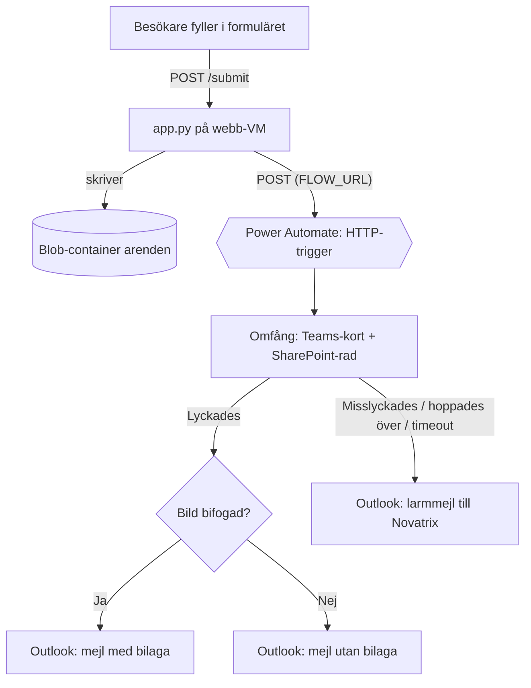
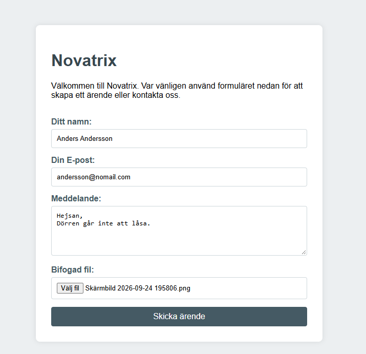
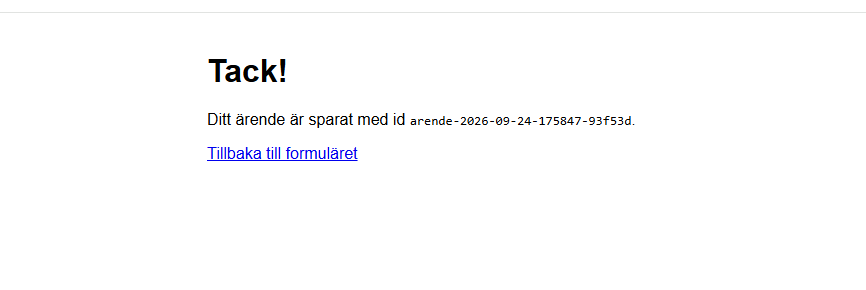
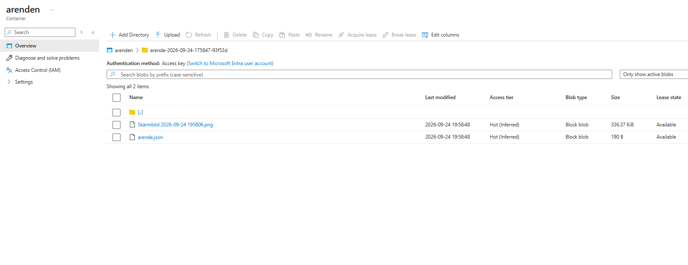
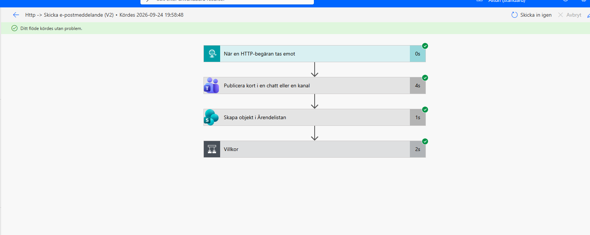
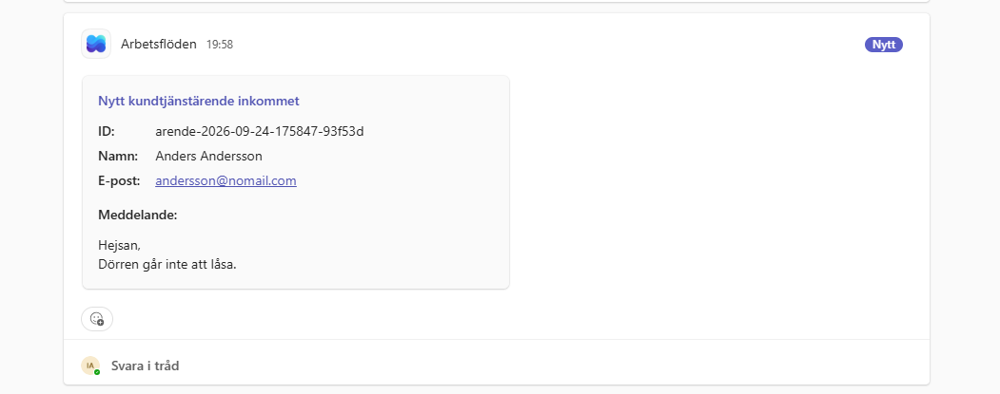
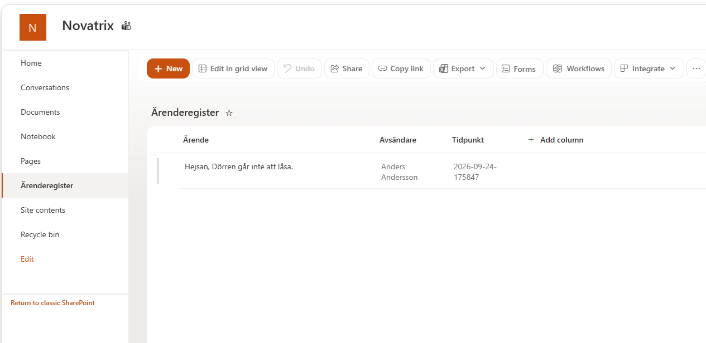
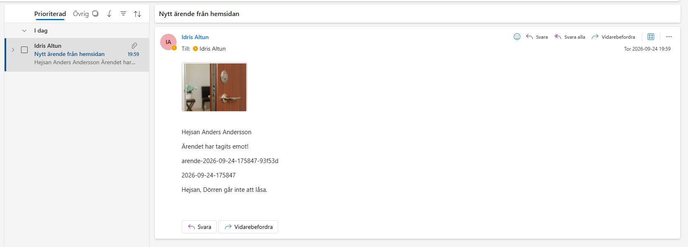
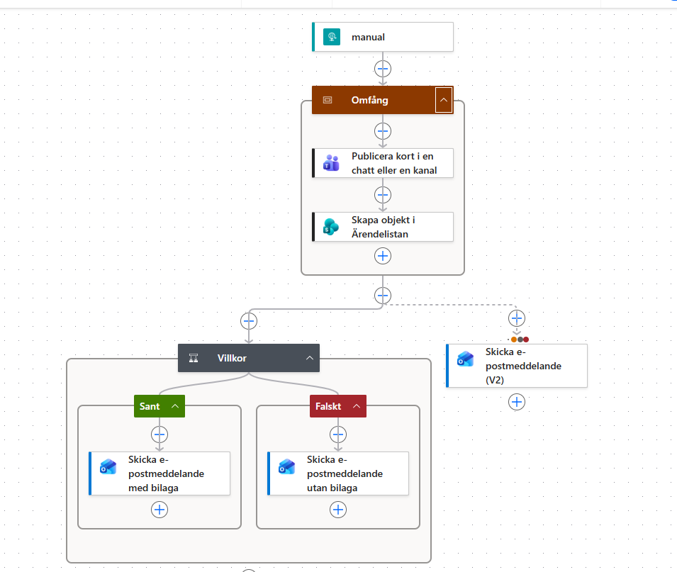

# Uppgift V39 - Automation och integration

**Repo:** https://github.com/80idralt/azure/tree/master/v39

**Namn:** Idris Altun

**Klass:** MOV25

**Datum:** 2026-09-24

## Syfte

Novatrix kundtjänst har hittills bara sparat inskickade ärenden i en lagringscontainer (v37-v38) - någon måste ändå gå in och leta i containern för att upptäcka att ett ärende kommit in. Veckans uppgift knyter ihop Azure-miljön med Microsoft 365, så att ett inskickat ärende automatiskt sätter kundtjänsten i rörelse: en post i SharePoints ärenderegister, en notis i Teams, och ett bekräftelsemejl i Outlook - allt utan att någon behöver leta manuellt. Kopplingen sköts av ett enda Power Automate-flöde.

## Arkitektur



Blob-skrivningen och POST:en till flödet sker parallellt i appen, direkt efter varandra i samma funktion. Teams och SharePoint ligger i ett gemensamt **Omfång** (Scope) - lyckas båda går flödet vidare till kundmejlet, brister något av dem går flödet istället till ett larmmejl. Se avsnitt "Om ett steg brister" för hur och varför.

## 1. HTTP-trigger istället för blob-trigger

Power Automates blob-trigger bevakar ett specifikt lagringskonto. Vårt kontonamn byggs med `uniqueString(resourceGroup().id)` i ARM-mallen (se v38), så det blir ett nytt namn vid varje omdeploy - en blob-trigger hade behövt kopplas om för hand varje gång miljön rivs och byggs upp igen, vilket händer ofta under utveckling.

HTTP-triggern löser det: den får en fast URL när flödet skapas en gång, och appen anropar den URL:en direkt efter varje sparat ärende. Kopplingen överlever hur många omdeployer som helst, så länge URL:en är känd av den som deployar.

**Request Body JSON Schema** (fylls i i triggerns konfiguration, matchar exakt vad appen skickar):

```json
{
  "type": "object",
  "properties": {
    "id": { "type": "string" },
    "namn": { "type": "string" },
    "epost": { "type": "string" },
    "meddelande": { "type": "string" },
    "skapat": { "type": "string" },
    "bildNamn": { "type": "string" },
    "bildData": { "type": "string" }
  }
}
```

"Vem kan utlösa flödet?" är satt till **Vem som helst** - annars kräver Microsoft Entra-autentisering för varje anrop, och appen har ingen inloggad användare att skicka en token för. Säkerheten ligger istället i att URL:en har en inbyggd signatur (`sig=`) som fungerar som ett lösenord.

## 2. Säker hantering av flow-URL:en

URL:en fungerar som en hemlighet - signaturen i frågesträngen är själva säkerheten, vem som helst med URL:en kan utlösa flödet. Den ligger därför aldrig hårdkodad i koden. Den skickas in som ARM-parametern `flowUrl` och sätts som miljövariabeln `FLOW_URL` på webb-VM:en via cloud-init. I det committade repot är parametern tom (`""`) - den som kör om miljön bygger sitt eget flöde och sätter sin egen URL lokalt, den committas aldrig.

**Bugg på vägen:** URL:en innehåller `%`-tecken (`%2Ftriggers%2F...`), och systemd tolkar `%` som en specialkaraktär (specifier-expansion) i tjänstefiler. Första försöket tystade systemd ner hela `Environment=FLOW_URL=...`-raden helt utan felmeddelande - `systemctl show novatrix-form -p Environment` visade tre av fyra miljövariabler, `FLOW_URL` saknades spårlöst trots att rätt värde stod i själva tjänstefilen. Löst med `replace(parameters('flowUrl'), '%', '%%')` i mallen, så `%` dubbleras innan det skrivs in i unit-filen - systemd avkodar `%%` tillbaka till ett enda `%` när tjänsten faktiskt startar.

Utdrag ur `azuredeploy.json`:

```json
"flowUrl": {
  "type": "string",
  "defaultValue": "",
  "metadata": { "description": "Power Automate HTTP-triggerns URL. Tom = ingen notifiering skickas." }
}
```

```
Environment=FLOW_URL={2}
```
`{2}` är mallens `format()`-platshållare för `replace(parameters('flowUrl'), '%', '%%')` - fixen från stycket ovan.

## 3. Appen skickar vidare: notifiera_flode()

```python
def notifiera_flode(arende):
    if not FLOW_URL:
        return
    try:
        data = json.dumps(arende, ensure_ascii=False).encode("utf-8")
        req = urllib.request.Request(
            FLOW_URL,
            data=data,
            headers={"Content-Type": "application/json"},
            method="POST",
        )
        urllib.request.urlopen(req, timeout=10)
    except Exception:
        pass
```

Inslaget i `try/except` med flit: ett nere flöde eller en trasig URL ska aldrig hindra ärendet från att sparas. Formuläret måste fungera även om M365-sidan strular - kunden ska aldrig se ett fel bara för att en notis inte gick fram.

## 4. Teams - kort i "Kundtjänst"

Ett team `Novatrix` med kanalen `Kundtjänst`. Flödets steg **"Publicera kort i en chatt eller en kanal"** postar direkt från triggerns dynamiska innehåll, ovillkorligt för varje ärende:

```
Rubrik:      Nytt kundtjänstärende inkommet
ID:          triggerBody()?['id']
Namn:        triggerBody()?['namn']
E-post:      triggerBody()?['epost']
Meddelande:  triggerBody()?['meddelande']
```

## 5. SharePoint - "Ärenderegister"

En lista på Novatrix webbplats. Flödets steg **"Skapa objekt"** mappar:

```
Title       <- triggerBody()?['meddelande']
Avsändare   <- triggerBody()?['namn']
Tidpunkt    <- concat(substring(triggerBody()?['skapat'], 0, 10), ' kl. ', substring(triggerBody()?['skapat'], 11, 2), ':', substring(triggerBody()?['skapat'], 13, 2))
```

Tidpunkt formateras om till `2026-09-24 kl. 17:58` istället för det råa `skapat`-värdet (`2026-09-24-175847`) - samma uttryck används i båda mejl-varianterna i avsnitt 6, för läsbarhetens skull. Det råa formatet lever kvar orört i ärende-id:t och blob-namnen, bara visningen är omgjord.

`Tidpunkt` är satt till **En rad med text**, inte ett riktigt datumfält. Ett första försök med SharePoints inbyggda datumtyp gav ett körfel (`Input parameter 'item/Tidpunkt' is invalid`), eftersom vårt tidsstämpelformat (`2026-09-24-121500`) inte är ett giltigt SharePoint-datum. Text löser det utan att appen behöver formatera om något - avvägningen är att kolumnen inte går att sortera kronologiskt som ett riktigt datum, vilket är okej för ett ärenderegister i den här skalan.

## 6. Villkorsstyrd e-post med bildbilaga

Lagringskontot är nätverkslåst (bara `adminIp`/privat endpoint kommer in, se v38 avsnitt 8), så Power Automate kan aldrig hämta bilden via en blob-länk - Microsofts molntjänst har helt enkelt ingen väg in. Istället skickas bildens bytes base64-kodade i samma POST som resten av ärendet (`bildData`), och sparas separat till blob av appen som vanligt för arkivering.

Ett villkor kollar `bildNamn` **är inte lika med** tomt:
- **Sant:** Outlook "Skicka e-postmeddelande (V2)" med bilaga.
- **Falskt:** samma mejl, utan bilaga.

**Bugg på vägen:** att bara mappa bilagefältet **Innehåll** direkt mot `bildData` gav en trasig bild i mejlet - Outlooks bilaga-fält vill ha binärdata, inte en rå base64-textsträng. Löst genom att byta fältet till uttrycket:

```
base64ToBinary(triggerBody()?['bildData'])
```

som avkodar texten till en riktig bildfil innan mejlet skickas.

## Varför just dessa tjänster

**Teams** ger kundtjänst ögonblicklig synlighet - någon ser ärendet inom sekunder, utan att aktivt leta. **SharePoint** är arkivet: till skillnad från en Teams-kanal, som rullar iväg i flödet av andra meddelanden, ligger ärenderegistret kvar sökbart och strukturerat så länge listan finns. **Outlook** är den enda av de tre som går till kunden, inte till Novatrix internt - en bekräftelse i kundens egen inkorg, oavsett om kunden själv använder Teams eller SharePoint.

## Varför den här ordningen

Teams och SharePoint ligger före villkoret eftersom de inte bryr sig om bilden - att köra dem ovillkorligt håller flödet enkelt och undviker att duplicera två identiska SharePoint- och Teams-steg inne i varje gren. Mejlet kommer sist eftersom det är den enda åtgärden som behöver veta om en bild finns, för att välja rätt variant. Ordningen speglar också hur brådskande informationen är för kundtjänst: en snabb Teams-notis och en sökbar SharePoint-post är värdefulla direkt, medan mejlet till kunden är en bekräftelse som kan vänta någon sekund extra.

## Om ett steg brister

Teams-steget och SharePoint-steget ligger i ett gemensamt **Omfång** ("Scope"). Lyckas båda går flödet vidare till kundmejlet som vanligt. Brister något av dem larmar flödet istället: ett separat mejl går till Novatrix ("Larm: Fel i Novatrix"), konfigurerat att köra efter Omfånget med **"Har misslyckats", "Hoppades över"** och **"Tidsgränsen har uppnåtts"** ibockade - men **"Har lyckats" avbockad**, så larmet bara går vid faktiska problem.

Inuti Omfånget kör SharePoint bara efter att Teams **lyckats** (inte vid alla utfall). Det är medvetet: om SharePoint ändå kört och lyckats trots att Teams brustit, hade Omfångets egen status kunnat visa "Lyckades" ändå (sista steget avgör), och larmet hade aldrig gått iväg. Genom att låta SharePoint stanna vid ett Teams-fel garanteras att Omfånget verkligen rapporterar "Misslyckades" så fort något internt går snett - pålitlig larmning prioriteras framför att pressa igenom så mycket som möjligt. Konsekvensen: vid ett internt fel uteblir både kundmejlet och ärenderegistret just den gången, bara larmet skickas. Ett medvetet, enklare val: antingen går allt igenom, eller så larmar vi - ingen halvfärdig mellanväg.

Samma grundtanke som `try/except` runt `notifiera_flode()` i appen (avsnitt 3): ett trasigt steg ska aldrig tystas ner utan att någon får veta.

## Hur kedjan kan utökas

Fler mottagare i Teams-kanalen beroende på ärendetyp, en regel som flaggar brådskande ärenden på nyckelord i meddelandet och postar till en egen prioriterad kanal, eller ett extra villkor som sorterar ärenden till olika SharePoint-listor beroende på kategori.

## Flödesdefinitionen i repot

Flödet är exporterat via Lösningar (ohanterad zip) och `Workflows`-mappens JSON ligger committad som [`v39/flow/novatrix-arende-till-flode.json`](flow/novatrix-arende-till-flode.json), så flödeslogiken versionshanteras som text precis som resten av lösningen - inte bara byggd i portalen.

## Parametrar att fylla i

- `flowUrl` - din egen flödes HTTP-trigger-URL. Byggs enligt avsnitt 1-6 ovan i ditt eget M365-konto. Tom = ingen notifiering skickas, men formuläret fungerar ändå.
- `adminIp`, `sshPublicKey`, `namePrefix`, `storageName`, `sku`, `adminUsername`, `vmSize` - samma som v38, se den README:n för detaljer.

## Kommandon

```
az group create --name rg-novatrix --location swedencentral
az deployment group validate --resource-group rg-novatrix --template-file azuredeploy.json --parameters "@azuredeploy.parameters.json"
az deployment group create --resource-group rg-novatrix --template-file azuredeploy.json --parameters "@azuredeploy.parameters.json"
```

## Resultat

Sista testet kördes skarpt genom hela kedjan med `Standard_B2ats_v2` (mallens riktiga standard - ingen genväg behövdes den här gången, kvoten var godkänd). Ett nytt ärende skickades in via formuläret:





Ärendet fick id `arende-2026-09-24-175847-93f53d`. Blob-containern bekräftar att appen sparade både ärendet och bilden:



Flödets körhistorik visar status **"Lyckades"** för den här körningen, inte "Testet lyckades" - det bevisar att det var en äkta HTTP-trigger från VM:en, inte en manuell omkörning i designern. Alla fyra steg lyckades i en enda exekvering:



Resultatet i respektive M365-tjänst, alla kopplade till samma ärende-id:







Bilaga-mappningen som fick bilden att faktiskt visas (den fixade versionen från avsnitt 6):

```json
"emailMessage/Attachments": [
  {
    "Name": "@triggerBody()?['bildNamn']",
    "ContentBytes": "@base64ToBinary(triggerBody()?['bildData'])"
  }
]
```

Flödets fullständiga struktur:



## Så återskapas miljön

1. Klona repot, gå till `v39/templates`.
2. Bygg ett eget Power Automate-flöde enligt avsnitt 1-6 (HTTP-trigger med schemat ovan, Teams-kort, SharePoint-rad, villkorsstyrt mejl med `base64ToBinary`).
3. Fyll i `azuredeploy.parameters.json` med egna värden, inklusive din egen `flowUrl`.
4. Kör kommandona under Kommandon.

Azure-delen är fullt reproducerbar som kod. M365-flödet är kontobundet och måste byggas för hand i mottagarens eget konto - det går inte att committa ett Power Automate-flöde på samma sätt som en ARM-mall.
