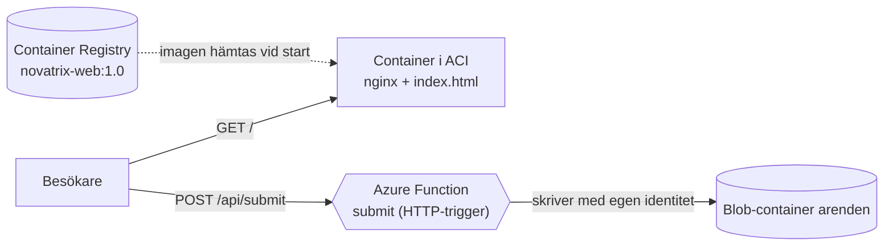
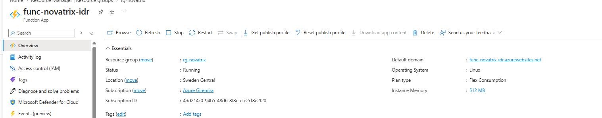
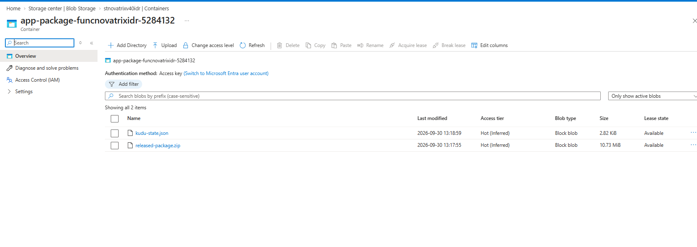
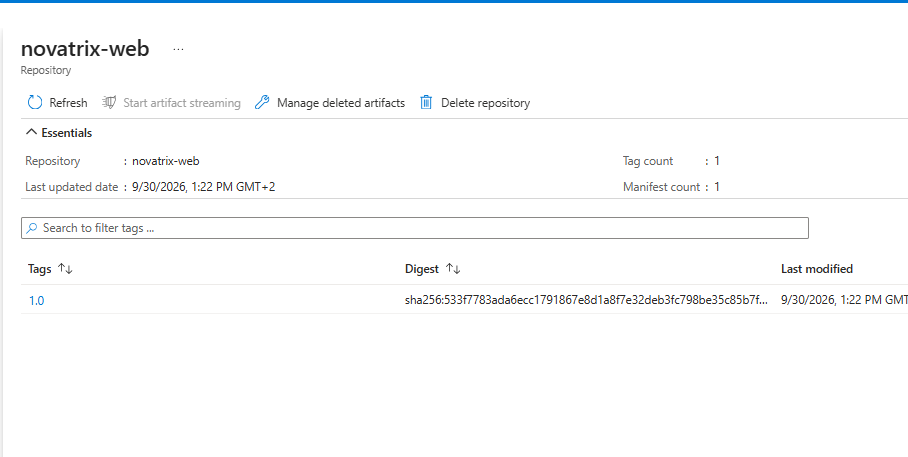
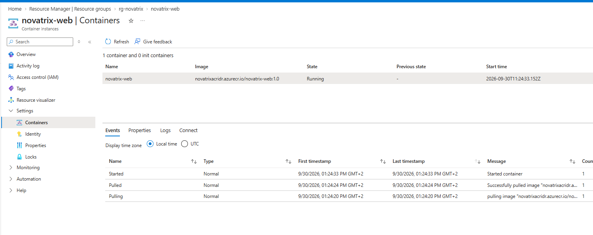
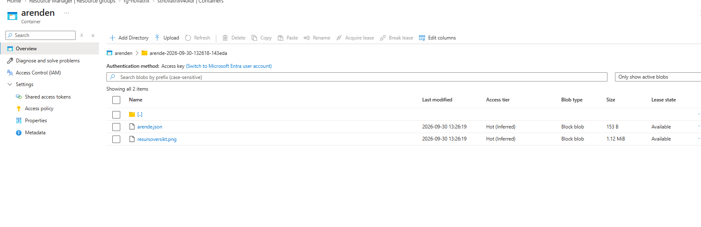
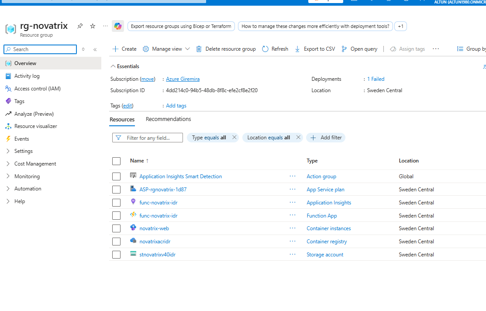

# Uppgift V40 - Virtualiseringsnivåer

**Repo:** https://github.com/80idralt/azure/tree/master/v40

**Namn:** Idris Altun

**Klass:** MOV25

**Datum:** 2026-09-30

## Syfte

Novatrix kundtjänst har hela kursen körts på en enda virtuell maskin. Samma VM visade formuläret, tog emot ärendet och sparade det i lagringen (v34-v39). En VM är bara ett av flera sätt att köra en applikation. Den här veckan körs kundtjänsten i stället på de två andra virtualiseringsnivåerna: **webbsidan som container** och **ärendemottagningen som serverless**. Målet är att förstå och kunna förklara skillnaden mellan nivåerna, och att motivera vilken nivå som passar vilken del av Novatrix lösning.

## 1. De tre nivåerna

### Grundidén: virtualisering

Virtualisering betyder att en fysisk dator delas upp i flera mindre, isolerade miljöer. Den fysiska datorn kallas **värd**, miljöerna som körs ovanpå kallas **gäster**. Varje gäst tror att den har en egen dator. Hela Azure bygger på det här, när vi skapar en VM, en container eller en funktion får vi en bit av någon av Microsofts fysiska servrar.

Nivåerna skiljer sig i **hur mycket gästen delar med värden**. Ju mer som delas, desto lättare blir gästen, och desto mindre har vi själva att sköta. Men vi har också mindre kontroll.

En liknelse som gör det konkret:

- **VM är ett eget hus.** Full frihet, men vi sköter allt själva, från taket till avloppet.
- **Container är en lägenhet.** Vår egen, men den delar husets grund, stomme och ledningar med grannarna.
- **Serverless är ett hotellrum.** Allt sköts åt oss och vi betalar per natt. Men vi kan inte bygga om.

### Nivå 1: Virtuell maskin

En VM är en hel virtuell dator med **ett eget komplett operativsystem**. Det är nivån Novatrix kört på sedan v34. I v39 var det vi som:

- valde Ubuntu-avbilden och storleken (`Standard_B2ats_v2`),
- installerade nginx, Python och alla paket via cloud-init,
- skrev en systemd-tjänst som höll `app.py` igång,
- öppnade portar i nätverkssäkerhetsgruppen och låste SSH till vår IP,
- och i praktiken ansvarade för att uppdatera och patcha operativsystemet.

Det ger **maximal kontroll**, vi kan installera vad som helst. Men vi äger också **allt ansvar**, och VM:en kostar **dygnet runt**, även när ingen skickar in ett ärende.

### Nivå 2: Container

En container packar appen tillsammans med allt den behöver (bibliotek, konfiguration, filer) i ett paket. Skillnaden mot en VM är att containern **inte har ett eget operativsystem**. Den delar värdens operativsystemskärna och har bara sin egen isolerade miljö runt appen. Därför är den liten och startar på sekunder i stället för minuter.

Två ord som måste hållas isär:

- **Image** är den färdiga, frysta mallen. Receptet, bakat en gång.
- **Container** är en körande instans av imagen. Maten, lagad och serverad.

Från en image kan man starta hur många likadana containrar som helst, på en laptop, i test eller i Azure. Det är containerns stora styrka, **portabilitet**: samma image kör likadant överallt.

Receptet skrivs i en **Dockerfile**. Imagen lagras i ett privat **register** (Azure Container Registry) och körs i en körtjänst, här **Azure Container Instances** (ACI).

### Nivå 3: Serverless

Med serverless finns det ingen server alls för oss att sköta. Vi lämnar bara **koden**. Azure Functions väcker koden när en **trigger** inträffar, här ett HTTP-anrop från formuläret, kör den, och stänger ner den igen när det är tyst. Vi betalar **per körning**, noll trafik ger noll kostnad.

Priset är **minst kontroll** och **cold start**: om funktionen legat still måste Azure först starta miljön, och det första anropet tar då någon sekund extra.

### Spektrumet

Nivåerna är inte tre separata lådor utan en skala:

```
mest kontroll                                              mest abstraktion
mest drift                                                     minst drift
    VM  ─────────────────────  Container  ─────────────────────  Serverless
```

Åt vänster får vi mer makt, åt höger mindre jobb. Det finns inget bästa läge på skalan, bara bäst för en viss uppgift.

## 2. Vad jag byggde: samma kundtjänst, två nivåer

I stället för att flytta hela appen till en ny nivå delade jag upp den efter vad varje del gör:



1. Besökaren öppnar `http://novatrix-idr.swedencentral.azurecontainer.io`. **Containern** svarar med formuläret.
2. Besökaren trycker "Skicka ärende". Formuläret postar direkt till **funktionen** på `https://func-novatrix-idr.azurewebsites.net/api/submit`.
3. Funktionen sparar ärendet (och eventuell bild) i blob-containern `arenden` och visar en tack-sida.

Jämfört med v39, där allt hände på en och samma VM:

| Del | v39 (VM) | v40 |
|---|---|---|
| Visar formuläret | nginx installerat på VM:en via cloud-init | container med nginx, byggd från en Dockerfile |
| Tar emot ärendet | `submit()` i `app.py`, Flask på port 5000 bakom nginx | `submit()` i `function_app.py`, Azure Function |
| Håller appen igång | systemd-tjänst på VM:en | Azure (containern), ingenting alls (funktionen) |
| Inloggning mot lagringen | `id-novatrix-app` (user-assigned) på VM:en | funktionens egen identitet (system-assigned) |
| Kostnad | VM:en dygnet runt | containern per sekund den kör, funktionen per anrop |

Det här är exakt vad "blanda nivåer i samma lösning" betyder: varje del hamnar på den nivå som passar just den. Se avsnitt 6 för motiveringen.

## 3. Serverless: ärendemottagningen som Azure Function

Koden ligger i [`v40/function/`](function/). Logiken är nästan identisk med `submit()` i v39, det är runtomkring som allt har försvunnit.

```python
app = func.FunctionApp(http_auth_level=func.AuthLevel.ANONYMOUS)


@app.route(route="submit", methods=["POST"])
def submit(req: func.HttpRequest) -> func.HttpResponse:
    """Tar emot ett inskickat ärende och sparar det i containern."""

    # 1. Läs fälten. Namnen måste matcha index.html.
    namn = req.form.get("name", "").strip()
    epost = req.form.get("email", "").strip()
    meddelande = req.form.get("message", "").strip()
```

Jämfört med v39:s `app.py` är det här borta:

- `app.run(host="127.0.0.1", port=5000)`, ingen process vi själva startar.
- nginx-regeln som skickade `/submit` vidare till port 5000.
- systemd-tjänsten och miljövariablerna i cloud-init.
- `/health`-endpointen, Azure övervakar funktionen själv (Application Insights).

`@app.route(route="submit")` **är** triggern. Den ger funktionen adressen `/api/submit`, och varje POST dit väcker funktionen.

**Varför `ANONYMOUS`:** en Azure Function skyddas normalt av en funktionsnyckel som ska skickas med i anropet. Men formuläret är en publik webbsida, och allt som står i en publik sida kan vem som helst läsa i källkoden. En nyckel där vore ingen hemlighet. Funktionen är därför öppen för anrop, precis som `/submit` på VM:en var öppen för alla som nådde webbsidan.

**Ingen nyckel i koden:** funktionen loggar in mot lagringen med sin egen hanterade identitet, samma princip som `id-novatrix-app` i v35-v39:

```python
credential = DefaultAzureCredential()
```

Identiteten fick rollen **Storage Blob Data Contributor** på lagringskontot, inget mer.

**Eget lagringskonto:** i v37-v39 var lagringskontot nätverkslåst, bara vår IP och VM:ens privata endpoint släpptes in. En funktion på förbrukningsplan har ingen fast adress och kommer inte in genom ett sådant lås utan extra nätverkskonfiguration. v40 har därför ett eget konto, `stnovatrixv40idr`, där inloggning fortfarande krävs (identitet eller nyckel) men nätverket inte är låst. Det är ett konkret exempel på vad serverless kostar i kontroll, se avsnitt 7 för hur det kan stängas igen.

**Planen:** Function Appen kör på **Flex Consumption**, Azures förbrukningsplan där man betalar per körning och där appen skalar ner till noll när ingen använder den. Minnet per instans är satt till lägsta nivån, 512 MB, eftersom funktionen bara flyttar lite text och en bild.

## 4. Container: webbsidan i Azure Container Instances

Receptet, [`v40/container/Dockerfile`](container/Dockerfile):

```dockerfile
# Liten basimage med webbservern nginx färdiginstallerad
FROM nginx:1.27-alpine

# Lägg formuläret där nginx letar efter startsidan
COPY index.html /usr/share/nginx/html/index.html

# Containern lyssnar på port 80
EXPOSE 80

# Starta nginx i förgrunden, annars avslutas containern direkt
CMD ["nginx", "-g", "daemon off;"]
```

Fyra instruktioner ersätter det som i v39 krävde en hel cloud-init-sektion (installera nginx, skriva konfiguration, starta tjänsten).

- `FROM` väljer basimagen. `nginx:1.27-alpine` är en liten variant (Alpine Linux) med nginx redan installerat. En liten image byggs, laddas upp och startar snabbare, och har färre paket som kan innehålla säkerhetshål.
- `COPY` lägger in vårt formulär. Det är det enda lagret som är vårt eget, resten lånas från basimagen.
- `EXPOSE 80` dokumenterar vilken port appen lyssnar på.
- `CMD` anger vad som körs när containern startar.

[`index.html`](container/index.html) är samma sida som i v39. Den enda ändringen är vart formuläret skickas:

```html
<form action="https://func-novatrix-idr.azurewebsites.net/api/submit" method="POST" enctype="multipart/form-data">
```

I den optimerade versionen (avsnitt 8) är adressen ersatt av en platshållare, så att imagen inte är låst till en viss funktion.

**Bygget** sker i molnet med `az acr build`, som läser Dockerfilen, bygger imagen och laddar upp den till registret i ett och samma steg. Ingen Docker behöver vara installerad lokalt. Hela bygget tog 13-14 sekunder.

Imagen fick taggen `novatrix-web:1.0` i stället för `latest`. Med `latest` går det inte att se vilken version som faktiskt kör, med ett versionsnummer går det att peka ut exakt vilken image containern startades från, och att backa till en tidigare.

**Registret** `novatrixacridr` (Azure Container Registry, Basic) är privat. För att ACI ska få hämta imagen används registrets administratörskonto. Lösenordet hämtas direkt till en variabel i terminalen och skrivs aldrig ut, klistras aldrig in och hamnar aldrig i repot:

```powershell
$acrPass = az acr credential show --name novatrixacridr --query "passwords[0].value" -o tsv
```

I den optimerade versionen (avsnitt 8) är administratörskontot avstängt helt och containern hämtar imagen med en egen identitet i stället.

**ACI** startar containern från imagen och ger den en publik adress via `--dns-name-label`. Containerns händelselogg visar de tre stegen: imagen hämtas (Pulling), hämtningen är klar (Pulled), containern startar (Started), totalt cirka 13 sekunder. En ny VM med cloud-init tog i v39 flera minuter innan formuläret svarade.

## 5. Jämförelse av nivåerna

| | VM | Container | Serverless |
|---|---|---|---|
| **Kontroll** | Allt: operativsystem, paket, nätverk, portar | Allt inuti imagen, men inte operativsystemets kärna | Bara koden, Azure bestämmer resten |
| **Drift** | Vi patchar OS:et, sköter tjänster, brandvägg och skalning | Vi sköter imagen och bygger om den vid uppdateringar | Nästan ingen, Azure sköter körmiljön |
| **Kostnad** | Fast, dygnet runt, oavsett trafik | Per sekund containern kör | Per anrop och körtid, noll trafik ger noll |
| **Skalbarhet** | Manuell: fler VM:ar och en lastbalanserare | Snabb: fler instanser av samma image | Automatisk: upp vid rusning, ner till noll |
| **Starttid** | Minuter (v39: flera minuter till formuläret svarade) | Sekunder (ACI: cirka 13 s) | Direkt när varm, cold start annars (cirka 2 s här) |
| **Portabilitet** | Låg, VM:en är bunden till sin avbild och sitt moln | Hög, samma image kör var som helst | Låg, koden är skriven för Azure Functions |

Skillnaderna kommer alla ur samma sak: **hur mycket gästen delar med värden**. VM:en delar nästan ingenting och bär därför med sig ett helt operativsystem, med allt arbete och all kostnad det innebär. Containern delar kärnan och blir därför lätt. Funktionen delar allt utom själva koden.

Samma app förpackas också helt olika:

- **VM:** vi installerar operativsystem, paket och app på servern (cloud-init i v38-v39).
- **Container:** vi bakar app och miljö i en image, en gång (Dockerfilen ovan).
- **Serverless:** vi lämnar bara koden. Den syns bokstavligen som en zip-fil, `released-package.zip`, i lagringskontots container `app-package-funcnovatrixidr-…`, det är allt Azure behöver för att köra funktionen.

## 6. Varför ärendemottagningen passar serverless, och webbsidan passar container

### Ärendemottagningen: serverless

Tänk på hur ärenden faktiskt kommer in till Novatrix kundtjänst: några om dagen, ojämnt, kanske en skur efter en driftstörning och sedan ingenting på timmar. Varje ärende är ett kort jobb, läs fälten, spara två filer, svara. Det tar under en sekund.

**Fördelar för just den här funktionen:**

- **Kostnaden följer trafiken.** Application Insights visar exakt två anrop under testtimmen och noll däremellan. Med serverless betalar Novatrix för de två anropen, med VM:en betalades varje timme.
- **Skalningen sköts av sig själv.** Om en driftstörning ger hundra ärenden på tio minuter startar Azure fler instanser. På VM:en hade vi behövt en större VM eller fler VM:ar bakom en lastbalanserare, uppsatta i förväg.
- **Ingen drift.** Inget operativsystem att patcha, ingen systemd-tjänst som kan krascha, ingen SSH-port att skydda. Kundtjänsten är inget IT-bolag, varje timme som inte går till serverdrift är en vinst.
- **Ett fel isoleras.** Om funktionen skulle krascha på ett konstigt ärende påverkar det bara det anropet, nästa ärende får en ny körning.

**Nackdelar, och varför de är acceptabla här:**

- **Cold start.** Snittet för svarstiden låg på 1,89 sekunder, eftersom funktionen startades kall. För en kund som just tryckt "Skicka ärende" och väntar på en tack-sida är två sekunder okej. För en tjänst som måste svara på millisekunder, till exempel ett betalflöde, hade det inte varit det.
- **Mindre nätverkskontroll.** Lagringskontot kunde inte vara lika hårt låst som i v37-v39 utan extra konfiguration (avsnitt 3 och 7).
- **Bunden till Azure.** `function_app.py` är skriven för Azure Functions och kan inte flyttas rakt av till ett annat moln, till skillnad från en image.

### Webbsidan: container

Formuläret är en statisk sida som ska finnas där **hela tiden**, varje gång någon öppnar adressen, och helst utan fördröjning. Det är inget kort jobb som startar på en händelse, det är något som ska vara tillgängligt. Där passar container:

- **Snabb start och svar direkt**, ingen cold start när sidan väl kör.
- **Portabel.** Samma image kan köras lokalt för att testa en ändring i formuläret, och exakt samma image körs sedan i Azure.
- **Mindre drift än VM:en.** Inget operativsystem att patcha, bara imagen att bygga om när sidan ändras.
- **Kontroll finns kvar.** Vill vi byta webbserver, lägga till en egen nginx-konfiguration eller flytta till ett annat moln ändrar vi bara Dockerfilen.

### Och VM:en?

VM:en har gjort sitt jobb i kursen, men ingen del av Novatrix kundtjänst behöver längre full kontroll över operativsystemet. Det finns inga ovanliga krav, ingen gammal programvara som inte går att containerisera och ingen jämn, tung last dygnet runt. En VM är rätt när kontroll och förutsägbarhet väger tyngre än bekvämlighet, och för ett formulär och några ärenden om dagen gör de inte det.

## 7. VG: Motiverat val för Novatrix

### Behovet

| Fråga | Novatrix svar |
|---|---|
| Hur ser trafiken ut? | Låg och ojämn. Några ärenden om dagen, skurar vid störningar. |
| Hur ser teamet ut? | Ett kundtjänstteam, ingen egen driftavdelning som vill patcha servrar. |
| Hur ser budgeten ut? | Liten. Pengar ska inte gå till servrar som står still. |
| Hur viktig är svarstiden? | Sidan ska laddas snabbt, men ett par sekunder på tack-sidan är okej. |

### Valet

**Webbsidan körs som container, ärendemottagningen som serverless.** Ingen VM.

- **Kostnad:** VM:en kostade dygnet runt oavsett trafik. Funktionen kostar per anrop och Novatrix volymer ligger långt under den månatliga gratiskvoten för förbrukningsplanen, i praktiken noll. Containern kostar per sekund den kör. Registrets Basic-nivå kostar en liten fast summa per dag.
- **Skalbarhet:** den del som faktiskt kan få rusning, mottagningen, skalar automatiskt. Webbsidan är statisk och en instans räcker långt.
- **Drift:** inget operativsystem att sköta någonstans. Kvar att underhålla är en Dockerfile med fem instruktioner, en kort nginx-konfiguration och en funktion på cirka 80 rader.

Det här är ett **medvetet blandat** val, inte att flytta allt till den "modernaste" nivån. Om Novatrix senare skulle få jämn, tung trafik dygnet runt kan det bli billigare att låta mottagningen gå på en alltid påslagen instans, det viktiga är att valet omprövas när behovet ändras.

### Optimering

Den första versionen byggdes för att fungera. När den väl gjorde det gick jag igenom den en gång till och letade efter det som var onödigt dyrt, osäkert eller svårt att underhålla.

**Genomfört i den optimerade versionen (avsnitt 8):**

1. **Funktionens adress är en inställning, inte inbakad i imagen.** I första versionen stod adressen hårdkodad i `index.html`. Byter funktionen namn, eller ska samma sida köras mot en testfunktion, måste imagen byggas om. Nu fylls adressen i när containern startar, och samma image fungerar mot vilken funktion som helst.
2. **Inget lösenord till registret.** Administratörskontot är avstängt. Containern har en egen hanterad identitet med rollen `AcrPull`, som bara får hämta images, inget annat. Samma princip som funktionens inloggning mot lagringen.
3. **Funktionens driftlagring är skild från ärendena.** I första versionen låg funktionens egna filer (`azure-webjobs-*`, `app-package-*`) och kundernas ärenden (`arenden`) i samma konto. Nu är det två konton, så ärendekontot kan låsas hårdare utan att påverka funktionens drift.
4. **Rätt storlek.** Containern fick 0,5 GB minne i stället för 1 GB, det räcker gott för att visa en statisk sida. Funktionen kör på lägsta minnesnivån, 512 MB.
5. **Hela miljön byggs och rivs med ett kommando var**, `deploy.ps1` och `destroy.ps1`, med ARM-mallen i botten. Inget ligger kvar och kostar av misstag.

**Nästa steg, inte genomfört:**

6. **Flytta containern från ACI till Azure Container Apps.** ACI kör en instans hela tiden och kostar även när ingen besöker sidan. Container Apps kan skala ner till noll och upp vid trafik, ger automatiskt HTTPS med certifikat (ACI serverar bara HTTP, därav "Inte säker" i webbläsaren) och hanterar versioner av imagen. Samma image kan användas rakt av. Inte gjort här eftersom kursen använder ACI och Container Apps kräver en egen miljö runt appen.
7. **Låsa ärendekontot för allmänt nätverk igen.** Flex Consumption stöder VNet-integration. Med funktionen i ett virtuellt nätverk och en privat endpoint till ärendekontot kan kontot stängas helt, samma nivå som v37-v39. Inte gjort här eftersom det kräver virtuellt nätverk, subnät, privata endpoints och DNS-zoner, alltså betydligt mer infrastruktur än själva uppgiften.

### Nivån som kod

Hela den optimerade lösningen ligger som text i repot och byggs med en ARM-mall, se avsnitt 8.

## 8. Den optimerade versionen, hela miljön som kod

Den första versionen (avsnitt 3-4) byggdes kommando för kommando. Det fungerade, men den som vill bygga samma sak igen måste köra ett tjugotal kommandon i rätt ordning och byta namn på allt. Den optimerade versionen beskriver i stället hela miljön i en ARM-mall i ren JSON, samma format som i v38: [`v40/templates/azuredeploy.json`](templates/azuredeploy.json).

### Från kommandon till mall

Varje kommando från första versionen har en motsvarighet i mallen:

| Första versionen, kommando | Mallen, resurs |
|---|---|
| `az storage account create` + `az storage container-rm create` | `Microsoft.Storage/storageAccounts` + `…/blobServices/containers`, nu två konton |
| `az functionapp create` | `Microsoft.Web/serverfarms` (FC1, Flex Consumption) + `Microsoft.Web/sites` |
| skapades automatiskt av `az functionapp create` | `Microsoft.OperationalInsights/workspaces` + `Microsoft.Insights/components` |
| `az functionapp config appsettings set` | `siteConfig.appSettings` i funktionen |
| `az functionapp identity assign` + `az role assignment create` | `"identity": { "type": "SystemAssigned" }` + `Microsoft.Authorization/roleAssignments` |
| `az acr create` + `az acr update --admin-enabled true` | `Microsoft.ContainerRegistry/registries` med `"adminUserEnabled": false` |
| `az container create` | `Microsoft.ContainerInstance/containerGroups` |
| fanns inte | `Microsoft.ManagedIdentity/userAssignedIdentities` + rollen `AcrPull` |

Alla namn byggs med ett suffix som räknas fram ur resursgruppens id:

```json
"suffix": "[uniqueString(resourceGroup().id)]",
"funcName": "[concat('func-novatrix-', variables('suffix'))]",
"acrName": "[concat('acrnovatrix', variables('suffix'))]",
```

I mitt bygge blev suffixet `nqoqjeswfh5g2`, alltså `func-novatrix-nqoqjeswfh5g2` och så vidare. Samma resursgrupp ger alltid samma suffix, en annan prenumeration ger ett annat. Problemet med lärarens exempelnamn som bara en person kan använda (se Buggar på vägen) försvinner, den som klonar repot behöver inte byta ett enda namn.

### Två varv genom samma mall

Mallen har ett hönan-och-ägget-problem. Containern kan inte skapas förrän imagen finns i registret, men registret skapas av mallen. Lösningen är en växel, parametern `deployContainer`:

```json
"condition": "[parameters('deployContainer')]",
"type": "Microsoft.ContainerInstance/containerGroups",
```

1. **Första varvet**, `deployContainer=false`: allt byggs utom containern.
2. **Koden laddas upp**: funktionen publiceras och imagen byggs in i registret.
3. **Andra varvet**, `deployContainer=true`: samma mall körs igen. Det som redan finns lämnas orört, bara containern läggs till.

ARM beskriver vilka resurser som ska finnas, inte vilken kod som ska köra i dem. Därför ligger `func azure functionapp publish` och `az acr build` utanför mallen, precis som VM:en i v38-v39 byggdes av mallen men hämtade appen med `git clone`.

### Optimering 1: adressen fylls i när containern startar

Tre små delar samarbetar. Först har formuläret en platshållare i stället för en adress, [`index.html`](container/index.html):

```html
<form action="__FUNC_URL__" method="POST" enctype="multipart/form-data">
```

Mallen ger containern funktionens riktiga adress som miljövariabel:

```json
"environmentVariables": [
  { "name": "FUNC_URL", "value": "[concat('https://', reference(variables('funcId'), '2024-04-01').defaultHostName, '/api/submit')]" }
]
```

Och nginx byter ut platshållaren varje gång sidan skickas till en besökare, [`default.conf.template`](container/default.conf.template):

```nginx
server {
    listen 80;
    root /usr/share/nginx/html;

    location / {
        index index.html;
        sub_filter '__FUNC_URL__' '${FUNC_URL}';
        sub_filter_once off;
    }
}
```

nginx-imagen har en inbyggd funktion för just det här: när containern startar läser den alla filer i `/etc/nginx/templates`, fyller i `${FUNC_URL}` med miljövariabelns värde och sparar resultatet som den riktiga konfigurationen. Dockerfilen fick därför en rad till:

```dockerfile
COPY default.conf.template /etc/nginx/templates/default.conf.template
```

Resultatet är att imagen `novatrix-web:1.2` inte vet något om någon viss funktion. Samma image kan köras mot en testfunktion och en skarp funktion, det är bara miljövariabeln som skiljer.

### Optimering 2: inget lösenord till registret

Registret skapas med administratörskontot avstängt:

```json
"properties": { "adminUserEnabled": false }
```

I stället får containern en egen identitet, `id-novatrix-web`, och identiteten får rollen `AcrPull` på registret. Containern hämtar imagen med identiteten:

```json
"imageRegistryCredentials": [
  {
    "server": "[reference(variables('acrId'), '2023-07-01').loginServer]",
    "identity": "[variables('identityId')]"
  }
]
```

Det finns inget lösenord att hämta, gömma eller råka visa i en skärmdump. `AcrPull` får bara hämta images, inte ladda upp eller radera. Det är samma princip som `id-novatrix-app` i v35-v39 och funktionens inloggning mot lagringen: identiteter och minsta möjliga behörighet i stället för nycklar.

### Optimering 3: två lagringskonton

| Konto | Innehåll | Vem får göra vad |
|---|---|---|
| `stfunc…` | funktionens egna filer: koden (`app-package`), köer och tabeller för drift | funktionen: Blob Data Owner, Queue Data Contributor, Table Data Contributor |
| `starende…` | kundernas ärenden (`arenden`) | funktionen: bara Blob Data Contributor |

Jämför med ett kontor. Där finns ett **förråd** med det personalen behöver för att allt ska fungera, och ett **kundarkiv** med kundernas brev och adresser. Man lägger inte kundarkivet i förrådet, inte för att förrådet är farligt, utan för att de två har olika värde och ska skyddas på olika sätt. `stfunc…` är förrådet: allt där kan återskapas från repot på några minuter. `starende…` är kundarkivet: namn, e-postadresser, meddelanden och bilder, alltså personuppgifter som aldrig kan återskapas om de försvinner.

Tre skäl till uppdelningen:

- **Funktionen får mindre makt över kunddatan.** För att Azure Functions ska kunna köra måste funktionen ha nästan full kontroll över sitt driftkonto (ägare över blobarna, köer, tabeller). Med ett enda konto hade den haft samma fulla kontroll över kundernas ärenden. Nu får den bara spara filer i ärendekontot. Minsta möjliga behörighet, samma tanke som identiteten `id-novatrix-app` i v35.
- **Kundarkivet kan låsas utan att förrådet påverkas.** Om ärendekontot ska stängas för allmänt nätverk igen, som i v37-v39 (optimering 7), riskerar det inte att funktionen slutar starta för att den inte når sina egna filer.
- **Olika livslängd.** Funktionen, containern och driftkontot rivs och byggs om ofta. Ärendena ska finnas kvar. Om Novatrix en dag flyttar mottagningen till en annan nivå kan driftkontot slängas medan ärendekontot står orört.

Priset är en resurs till att hålla reda på. Kostnaden är i praktiken densamma, ett lagringskonto kostar för det som lagras och inte för att det finns. För ett testprojekt utan riktig kunddata hade ett konto räckt, och den första versionen fungerade också med ett. Men Novatrix hanterar kunders personuppgifter, och då väger säkerhetsskälen tyngre.

### Optimering 4: rätt storlek

```json
"resources": {
  "requests": { "cpu": 1, "memoryInGB": 0.5 }
}
```

nginx som visar en statisk sida använder en bråkdel av det. Funktionen kör på `"instanceMemoryMB": 512`, den lägsta nivån i Flex Consumption.

### Optimering 5: ett kommando för att bygga, ett för att riva

Mallen löser det mesta, men att bygga hela miljön krävde ändå tolv kommandon: skapa gruppen, första varvet, hämta namnen, ladda upp funktionen, bygga imagen, andra varvet och flera byten av mapp däremellan. Samma mönster som [`v37/scripts/deploy.ps1`](../v37/scripts/deploy.ps1) samlar dem nu i två skript:

- [`deploy.ps1`](deploy.ps1) bygger allt och skriver till sist ut formulärets adress.
- [`destroy.ps1`](destroy.ps1) river allt.

Skriptet följer samma tre steg som i "Två varv genom samma mall", med en rad för varje:

```powershell
# --- 1. Bygga huset: allt utom containern
az deployment group create --resource-group $rgName --template-file $mall --parameters "@$parametrar" --output none

# --- 2. Flytta in möblerna: funktionens kod och containerns image
func azure functionapp publish $out.funcName.value --python
az acr build --registry $out.acrName.value --image "novatrix-web:$imageTag" $container

# --- 3. Öppna dörren: samma mall igen, nu med containern
az deployment group create ... deployContainer=true imageTag=$imageTag --output none
```

Tre saker gör skriptet smidigare än att skriva kommandona för hand:

- **Inga mappbyten.** `$PSScriptRoot` är mappen där skriptet ligger, så skriptet hittar `templates`, `function` och `container` själv oavsett var det startas.
- **Väntan på rollerna sköts automatiskt.** Rolltilldelningar i Azure tar ofta en eller ett par minuter att slå igenom. Direkt efter första varvet kan `func publish` därför få ett behörighetsfel. Skriptet försöker då igen, upp till fem gånger med en minut emellan:

  ```powershell
  for ($forsok = 1; $forsok -le 5; $forsok++) {
      try {
          func azure functionapp publish $out.funcName.value --python
          break
      }
      catch {
          if ($forsok -eq 5) { throw }
          Write-Host "Rollerna har inte slagit igenom än, väntar 60 sekunder (försök $forsok av 5)..."
          Start-Sleep -Seconds 60
      }
  }
  ```

- **Det stannar vid första felet.** Två rader högst upp gör att skriptet avbryts direkt om ett `az`-kommando misslyckas, i stället för att fortsätta bygga på något som inte finns:

  ```powershell
  $ErrorActionPreference = "Stop"
  $PSNativeCommandUseErrorActionPreference = $true
  ```

Mallen, funktionskoden och Dockerfilen är desamma. Skriptet är bara de tolv kommandona sparade i rätt ordning, fortfarande text i repot och fortfarande infrastruktur som kod.

## Buggar på vägen

- **`func azure functionapp publish` avbröt med "Can't determine project language from files".** Core Tools läser språket ur `local.settings.json`, som skapas av `func init`. Filerna här skapades för hand, så den filen fanns inte. Löst med flaggan `--python`. `local.settings.json` behövs bara för att köra funktionen lokalt och kan innehålla hemligheter, så den hålls utanför repot.
- **"Deployments: 1 Failed" i resursgruppen.** När funktionen skapades försökte Azure automatiskt lägga till en larmregel (Failure Anomalies) för Application Insights, men prenumerationen hade inte registrerat `Microsoft.AlertsManagement`. Påverkar inte funktionen. Åtgärdas med `az provider register --namespace Microsoft.AlertsManagement`.
- **Tom tillbaka-länk vid test med curl.** Tack-sidans länk byggs från webbläsarens `Referer`, alltså sidan besökaren kom ifrån. curl skickar ingen sådan, så länken blev tom i terminaltestet. Via formuläret i webbläsaren pekar den rätt tillbaka till containern.
- **Platshållaren byttes bara ut i en kommentar.** Första bygget av den optimerade imagen (`1.1`) visade fortfarande `action="__FUNC_URL__"` i formuläret, trots att miljövariabeln fanns i containern och containerloggen visade att nginx fyllt i konfigurationen (`Running envsubst on /etc/nginx/templates/default.conf.template`). Orsaken: platshållaren stod även i HTML-kommentaren ovanför formuläret, och med `sub_filter_once on` byter nginx bara den första förekomsten, alltså kommentaren. Löst genom att ta bort platshållaren ur kommentaren och sätta `sub_filter_once off`. Imagen byggdes om som `1.2`, en ny tagg i stället för att skriva över `1.1`, så att det går att se vilken version som kör.
- **Lärarens exempelnamn `novatrixacr` och `novatrix-app`** är globalt unika i Azure och kan bara användas av en person. Namnen fick suffixet `idr`. `Microsoft.ContainerRegistry` behövde också registreras, den saknades i listan över resursleverantörer.

## Kommandon

### Optimerade versionen, med skripten

Bygg hela miljön:

```powershell
.\v40\deploy.ps1
```

Riv hela miljön:

```powershell
.\v40\destroy.ps1
```

### Optimerade versionen, samma steg för hand

Det här är exakt vad `deploy.ps1` gör, uppdelat så att varje steg går att köra och kontrollera ett i taget. Står i `v40/templates`. Första varvet, allt utom containern:

```powershell
az group create --name rg-novatrix --location swedencentral
az deployment group create --resource-group rg-novatrix --template-file azuredeploy.json --parameters "@azuredeploy.parameters.json"
```

Hämta namnen mallen räknade fram:

```powershell
$out = az deployment group show --resource-group rg-novatrix --name azuredeploy --query properties.outputs -o json | ConvertFrom-Json
$out
```

Ladda upp koden, funktionen och imagen:

```powershell
cd ..\function
func azure functionapp publish $out.funcName.value --python
cd ..\container
az acr build --registry $out.acrName.value --image novatrix-web:1.2 .
```

Om `func azure functionapp publish` stoppar med ett behörighetsfel har rolltilldelningarna inte hunnit slå igenom. Vänta ett par minuter och kör raden igen.

Andra varvet, nu med containern:

```powershell
cd ..\templates
az deployment group create --resource-group rg-novatrix --template-file azuredeploy.json --parameters "@azuredeploy.parameters.json" deployContainer=true
```

Verifiera:

```powershell
$out.webUrl.value
curl.exe -s $out.webUrl.value | Select-String "form action"
az storage blob list --account-name $out.dataStorageName.value --container-name arenden --auth-mode key --query "[].name" -o table
```

### Första versionen, steg för steg

Förberedelser (resursgruppen `rg-novatrix` skapad i förväg):

```powershell
az provider register --namespace Microsoft.ContainerInstance
az provider register --namespace Microsoft.ContainerRegistry
az storage account create --name stnovatrixv40idr --resource-group rg-novatrix --location swedencentral --sku Standard_LRS --kind StorageV2 --min-tls-version TLS1_2 --allow-blob-public-access false
az storage container-rm create --storage-account stnovatrixv40idr --resource-group rg-novatrix --name arenden
```

Serverless, funktionen:

```powershell
az functionapp create --resource-group rg-novatrix --name func-novatrix-idr --storage-account stnovatrixv40idr --flexconsumption-location swedencentral --runtime python --runtime-version 3.12 --instance-memory 512
az functionapp config appsettings set --resource-group rg-novatrix --name func-novatrix-idr --settings STORAGE_ACCOUNT=stnovatrixv40idr CONTAINER=arenden
$principal = az functionapp identity assign --resource-group rg-novatrix --name func-novatrix-idr --query principalId -o tsv
$stId = az storage account show --name stnovatrixv40idr --resource-group rg-novatrix --query id -o tsv
az role assignment create --assignee-object-id $principal --assignee-principal-type ServicePrincipal --role "Storage Blob Data Contributor" --scope $stId
cd v40\function
func azure functionapp publish func-novatrix-idr --python
```

Container, webbsidan:

```powershell
az acr create --resource-group rg-novatrix --name novatrixacridr --sku Basic
cd v40\container
az acr build --registry novatrixacridr --image novatrix-web:1.0 .
az acr update --name novatrixacridr --admin-enabled true
$acrPass = az acr credential show --name novatrixacridr --query "passwords[0].value" -o tsv
az container create --resource-group rg-novatrix --name novatrix-web --image novatrixacridr.azurecr.io/novatrix-web:1.0 --os-type Linux --cpu 1 --memory 1 --ports 80 --dns-name-label novatrix-idr --registry-login-server novatrixacridr.azurecr.io --registry-username novatrixacridr --registry-password $acrPass
```

Verifiering:

```powershell
curl.exe -i -X POST -F "name=Test" -F "email=test@example.com" -F "message=Hej fran curl" "https://func-novatrix-idr.azurewebsites.net/api/submit"
az storage blob list --account-name stnovatrixv40idr --container-name arenden --auth-mode key --query "[].name" -o table
az acr repository list --name novatrixacridr -o table
az container show --resource-group rg-novatrix --name novatrix-web --query "{adress:ipAddress.fqdn,status:instanceView.state}" -o table
az container logs --resource-group rg-novatrix --name novatrix-web
```

Riv miljön när testet är klart:

```powershell
az group delete --name rg-novatrix --yes --no-wait
```

## Resultat

Resultaten nedan är från första versionen, byggd steg för steg. Den optimerade versionen, byggd från mallen, redovisas sist i avsnittet.

### Serverless på egen hand

Funktionen testades först helt fristående, innan containern fanns. Svaret `200 OK` med tack-sidan och ärendet i blob-listan visar att mottagningen fungerar oberoende av webbsidan:

```
PS> curl.exe -i -X POST -F "name=Test" -F "email=test@example.com" -F "message=Hej fran curl" "https://func-novatrix-idr.azurewebsites.net/api/submit"
HTTP/1.1 200 OK
Content-Type: text/html; charset=utf-8
Date: Wed, 30 Sep 2026 11:20:31 GMT
Server: Kestrel

<!DOCTYPE html><html lang='sv'>...<h1>Tack!</h1><p>Ditt ärende är sparat med id <code>arende-2026-09-30-132030-238a8a</code>.</p>...

PS> az storage blob list --account-name stnovatrixv40idr --container-name arenden --auth-mode key --query "[].name" -o table
Result
-------------------------------------------
arende-2026-09-30-132030-238a8a/arende.json
```

Svaret skickades 11:20 UTC och ärendet stämplades 13:20, alltså svensk tid, samma tidszonsfix som i v39.

Function Appen kör på förbrukningsplanen **Flex Consumption**, 512 MB per instans:



Koden funktionen kör finns som en zip-fil i lagringskontot, det är allt Azure behöver:



### Containern

Imagen byggd i molnet på 13 sekunder och lagrad i registret med taggen `1.0`:




Containern hämtade imagen och startade:



```
PS> az container show --resource-group rg-novatrix --name novatrix-web --query "{adress:ipAddress.fqdn,status:instanceView.state}" -o table
Adress                                        Status
--------------------------------------------  --------
novatrix-idr.swedencentral.azurecontainer.io  Running
```

### Hela kedjan

Formuläret visas från containern (adressen `…azurecontainer.io`):


Efter "Skicka ärende" svarar funktionen (adressen `…azurewebsites.net`). Två olika nivåer har samarbetat om ett och samma ärende:


Ärendet `arende-2026-09-30-132618-143eda` sparades med både `arende.json` och den bifogade bilden:



Funktionens körhistorik visar båda körningarna, curl-testet 13:20 och formuläret 13:26, båda med status `200`:


Båda tog knappt två sekunder (1956 och 1816 ms), trots att koden bara sparar ett par filer. Den största delen av tiden är sannolikt cold start: funktionen hade legat still innan båda anropen, så Azure fick först starta miljön och funktionen fick hämta en ny inloggningstoken till lagringen. Anrop som kommer tätt efter varandra träffar en varm miljö och går betydligt snabbare. Samma sak syns i Application Insights, två anrop, noll misslyckade och noll anrop däremellan:


Alla resurser i `rg-novatrix`:



### Den optimerade versionen, från mallen

Efter testerna ovan revs hela `rg-novatrix` och byggdes upp igen från mallen. Första varvet skapade alla resurser utom containern på under en minut:

```
PS> az deployment group create --resource-group rg-novatrix --template-file azuredeploy.json --parameters "@azuredeploy.parameters.json"
    "duration": "PT57.8357388S",
    "provisioningState": "Succeeded",

PS> $out
acrName         : @{type=String; value=acrnovatrixnqoqjeswfh5g2}
dataStorageName : @{type=String; value=starendenqoqjeswfh5g2}
funcName        : @{type=String; value=func-novatrix-nqoqjeswfh5g2}
funcUrl         : @{type=String; value=https://func-novatrix-nqoqjeswfh5g2.azurewebsites.net/api/submit}
webUrl          : @{type=String; value=http://novatrix-nqoqjeswfh5g2.swedencentral.azurecontainer.io}
```

Två lagringskonton, funktionen med plan och Application Insights, registret utan administratörskonto, identiteten `id-novatrix-web` och alla fem rolltilldelningarna skapades i samma körning.

Efter andra varvet (`deployContainer=true`) hämtade containern imagen `novatrix-web:1.2` med bara sin identitet, utan lösenord. Formuläret som containern skickar ut har fått funktionens riktiga adress, inte platshållaren:

```
PS> curl.exe -s $out.webUrl.value | Select-String "form action"
        <form action="https://func-novatrix-nqoqjeswfh5g2.azurewebsites.net/api/submit" method="POST" enctype="multipart/form-data">
```

Ett ärende med bild skickades in via formuläret i webbläsaren och hamnade i det nya ärendekontot:

```
PS> az storage blob list --account-name $out.dataStorageName.value --container-name arenden --auth-mode key --query "[].name" -o table
Result
--------------------------------------------
arende-2026-09-30-170552-42c846/arende.json
arende-2026-09-30-170552-42c846/nätversk.jpg
```

Till sist revs gruppen en gång till och byggdes upp med bara `deploy.ps1`. Skriptet gick igenom alla tre stegen utan handpåläggning, skapade samma nio resurser och ett nytt testärende (`arende-2026-09-30-203330-81ac60`) hamnade i ärendekontot. Miljön revs sedan med `destroy.ps1`.

## Så återskapas miljön

**Det här behövs på datorn:**

- Azure CLI, inloggad med `az login`
- Azure Functions Core Tools v4 (`func`)
- PowerShell 7.4 eller senare
- Rollen **Owner** på prenumerationen (eller Contributor + User Access Administrator). Mallen skapar rolltilldelningar, och med bara Contributor stoppar deployen på just dem.

Inga namn, parametrar eller hemligheter behöver fyllas i. Mallen räknar fram unika namn själv, och resursleverantörerna registreras automatiskt när mallen körs.

**Så här:**

1. Klona repot:
   ```powershell
   git clone https://github.com/80idralt/azure.git
   cd azure
   ```
2. Bygg miljön. Efter några minuter skrivs formulärets adress ut:
   ```powershell
   .\v40\deploy.ps1
   ```
   Om Windows svarar att skript inte får köras ("running scripts is disabled"), tillåt det en gång för din användare och kör skriptet igen:
   ```powershell
   Set-ExecutionPolicy -Scope CurrentUser RemoteSigned
   ```
3. Öppna adressen, skicka in ett testärende med en bild.
4. Riv miljön när testet är klart:
   ```powershell
   .\v40\destroy.ps1
   ```

Den som vill se varje steg för sig kan i stället köra kommandona under "Optimerade versionen, samma steg för hand".
