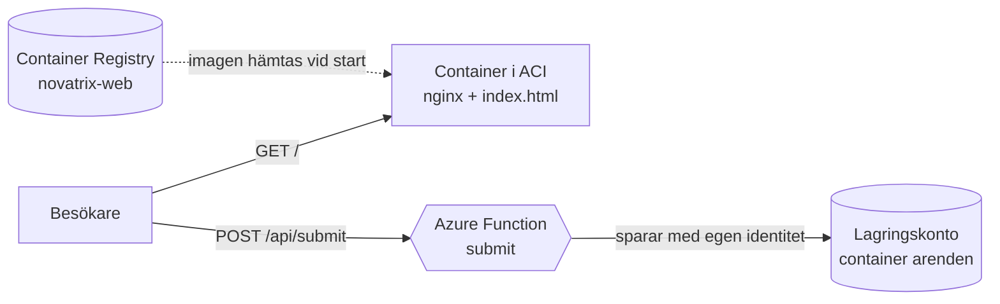
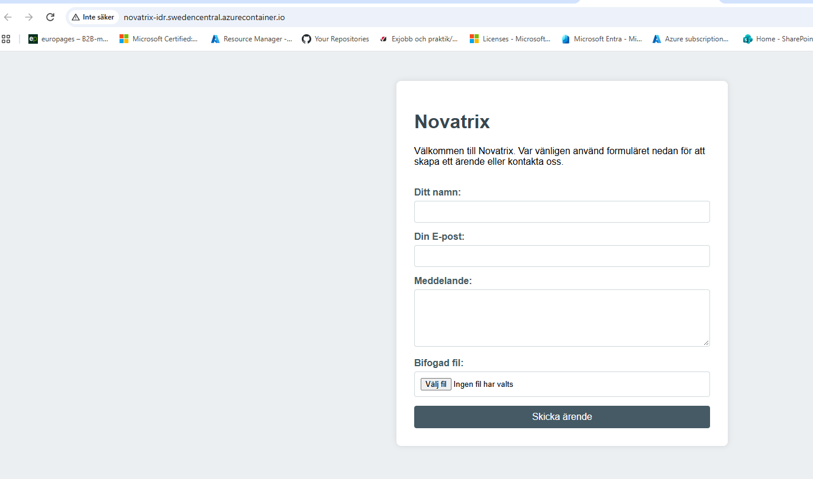
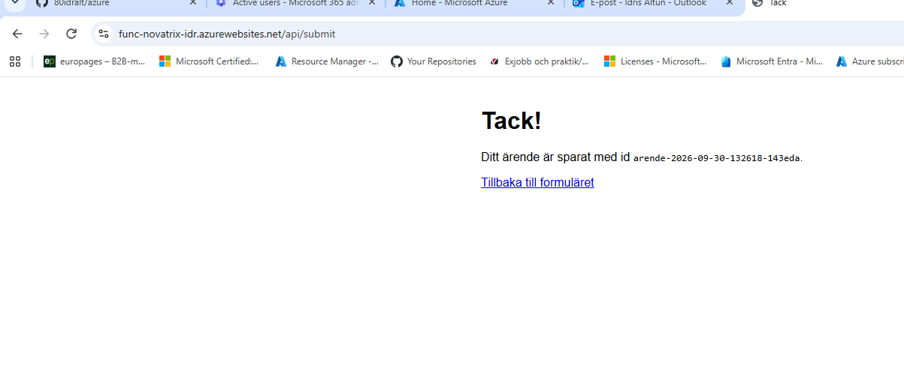
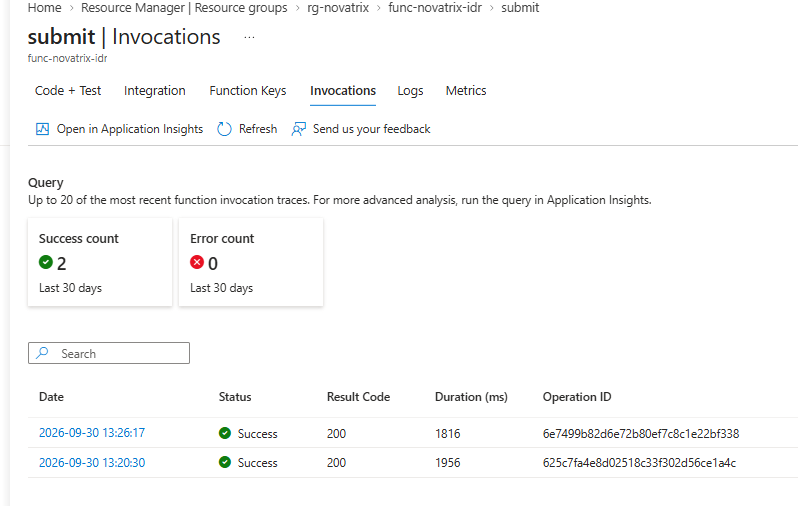
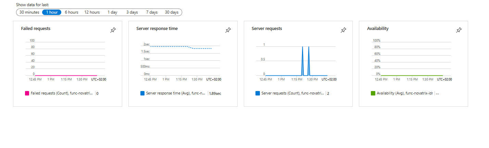

# Uppgift V40: Virtualiseringsnivåer

**Repo:** https://github.com/80idralt/azure/tree/master/v40

**Namn:** Idris Altun

**Klass:** MOV25

**Datum:** 2026-10-02

## Syfte

Hela kursen har Novatrix kundtjänst körts på en enda virtuell maskin. Samma VM visade formuläret, tog emot ärendet och sparade det i lagringen (v34 till v39). Men en VM är bara ett av flera sätt att köra en applikation. Den här veckan flyttar jag kundtjänsten till de två andra virtualiseringsnivåerna. Webbsidan körs som container och ärendemottagningen som serverless med en Azure Function. Sedan jämför jag de tre nivåerna och motiverar varför varje del hamnade där den gjorde.

## Delmoment 1: Repo

Allt för veckan ligger i mappen `v40`:

```
v40/
├── README.md                        den här dokumentationen
├── deploy.ps1                       bygger hela miljön med ett kommando
├── destroy.ps1                      river hela miljön
├── function/                        SERVERLESS, tar emot ärendet
│   ├── function_app.py              funktionen som sparar ärendet
│   ├── host.json                    inställningar för Azure Functions
│   └── requirements.txt             Python-paketen funktionen behöver
├── container/                       CONTAINER, visar formuläret
│   ├── Dockerfile                   receptet för imagen
│   ├── index.html                   formuläret, samma sida som i v39
│   └── default.conf.template        inställning för nginx, fyller i funktionens adress
├── templates/                       INFRASTRUKTUR SOM KOD
│   ├── azuredeploy.json             ARM-mallen som beskriver alla resurser
│   └── azuredeploy.parameters.json  parametrarna till mallen
└── images/                          skärmbilder till dokumentationen
```

De flesta filerna har en motsvarighet i v39. `function_app.py` gör samma jobb som `app.py`, `index.html` är samma formulär och ARM-mallen fyller samma roll som mallen i v39. Det nya är uppdelningen. Det som låg samlat på en VM ligger nu i två mappar, en för varje nivå.

## Delmoment 2: Kör på en alternativ nivå

### Lösningen

Jag delade upp kundtjänsten efter vad varje del gör och körde varje del på en egen nivå:



1. Besökaren öppnar adressen. Containern svarar med formuläret.
2. När besökaren trycker "Skicka ärende" postar formuläret direkt till funktionen.
3. Funktionen sparar ärendet och en eventuell bild i containern `arenden` och visar en tacksida.

| Del | v39 (VM) | v40 |
|---|---|---|
| Visar formuläret | nginx på VM:en, installerat via cloud-init | container med nginx, byggd från en Dockerfile |
| Tar emot ärendet | `submit()` i `app.py`, Flask bakom nginx | `submit()` i `function_app.py`, Azure Function |
| Håller igång appen | systemd på VM:en | Azure |
| Loggar in mot lagringen | identiteten `id-novatrix-app` | funktionens egen identitet |
| Kostar | dygnet runt | containern per sekund, funktionen per anrop |

Jag byggde först allt kommando för kommando för att se att det fungerade. När det gjorde det beskrev jag hela miljön som kod i en ARM-mall och samlade stegen i ett skript. Det är den versionen som beskrivs här. Förbättringarna jag gjorde på vägen står under VG: Optimering.

### Serverless: ärendemottagningen som Azure Function

Koden ligger i [`function/function_app.py`](function/function_app.py). Själva jobbet är nästan detsamma som `submit()` i v39: läsa fälten i formuläret, skapa ett id, spara ärendet och svara med en tacksida. Det som har försvunnit är allt runtomkring. Det finns ingen `app.run(port=5000)`, ingen regel i nginx som skickar vidare till appen, ingen systemd-tjänst och ingen `/health`. Det sköter Azure nu.

```python
app = func.FunctionApp(http_auth_level=func.AuthLevel.ANONYMOUS)


@app.route(route="submit", methods=["POST"])
def submit(req: func.HttpRequest) -> func.HttpResponse:
    namn = req.form.get("name", "").strip()
    epost = req.form.get("email", "").strip()
    meddelande = req.form.get("message", "").strip()
```

`@app.route` är triggern, alltså det som väcker funktionen. Den ger funktionen adressen `/api/submit`. Varje gång formuläret postar dit startar Azure funktionen, kör den och stänger ner den igen när det blir tyst.

Funktionen är `ANONYMOUS`, vilket betyder att den kan anropas utan nyckel. Formuläret är en publik sida och allt som står i den syns i källkoden. En nyckel där hade alltså inte varit hemlig. Det är samma läge som `/submit` på VM:en, som också var öppen för alla som nådde sidan.

Mot lagringen loggar funktionen in med sin egen identitet:

```python
credential = DefaultAzureCredential()
```

Det finns inga lösenord eller nycklar i koden. I ärendekontot har funktionen bara rätt att läsa och skriva filer, inget mer. Det är samma tanke som identiteten `id-novatrix-app` hade på VM:en i v35 till v39.

Funktionen kör på planen **Flex Consumption**, där jag betalar per körning och där funktionen stängs ner helt när ingen använder den. Minnet är satt till 512 MB, den minsta storleken, eftersom funktionen bara flyttar lite text och en bild.

### Container: webbsidan i Azure Container Instances

Receptet för imagen, [`container/Dockerfile`](container/Dockerfile):

```dockerfile
FROM nginx:1.27-alpine
COPY index.html /usr/share/nginx/html/index.html
COPY default.conf.template /etc/nginx/templates/default.conf.template
EXPOSE 80
CMD ["nginx", "-g", "daemon off;"]
```

- `FROM` utgår från en färdig image där nginx redan finns. Jag valde Alpine-varianten eftersom den är liten. En liten image byggs och startar snabbare och innehåller färre paket som kan ha säkerhetshål.
- Den första `COPY` lägger in formuläret där nginx letar efter startsidan.
- Den andra `COPY` lägger in en inställning som fyller i funktionens adress när containern startar. Den förklaras under VG: Optimering.
- `EXPOSE 80` talar om att containern lyssnar på port 80.
- `CMD` startar nginx. `daemon off` gör att nginx körs i förgrunden, annars avslutas containern direkt.

Fem rader ersätter den del av cloud-init som i v39 installerade nginx, skrev konfigurationen och startade tjänsten. Formuläret [`index.html`](container/index.html) är samma sida som i v39.

Imagen byggs i molnet med `az acr build`. Kommandot läser Dockerfilen, bygger imagen och lägger den i registret i ett och samma steg, så Docker behöver inte finnas på datorn. Hela bygget tog 13 sekunder.

Imagen får ett versionsnummer, `novatrix-web:1.2`, i stället för `latest`. Med `latest` går det inte att veta vilken version som faktiskt kör. Med ett nummer går det att se exakt vilken image containern startade från och att gå tillbaka till en tidigare om något blir fel.

Registret är privat (Azure Container Registry). Containern körs i Azure Container Instances (ACI), som hämtar imagen från registret, startar den och ger den en publik adress.

## Delmoment 3: Jämför nivåerna

### Virtualisering

Virtualisering betyder att en fysisk dator delas upp i flera isolerade miljöer. Den fysiska datorn kallas värd och miljöerna som körs ovanpå kallas gäster. Varje gäst tror att den har datorn för sig själv. Allt i Azure bygger på det. När jag skapar en VM, en container eller en funktion får jag en bit av en av Microsofts servrar.

Det som skiljer nivåerna åt är hur mycket gästen delar med värden. Ju mer den delar, desto lättare blir den och desto mindre har jag att sköta själv. Men jag bestämmer också över mindre.

Kursens liknelse beskriver det bra:

- **VM är ett eget hus.** Full frihet, men jag sköter allt från taket till avloppet.
- **Container är en lägenhet.** Min egen, men den delar grund och ledningar med grannarna.
- **Serverless är ett hotellrum.** Allt sköts åt mig och jag betalar per natt, men jag får inte bygga om.

### VM

En VM är en hel virtuell dator med eget operativsystem. Det är nivån Novatrix kört på hela kursen. I v39 valde jag Ubuntu och storlek på maskinen, installerade nginx och Python via cloud-init, skrev en systemd-tjänst som höll `app.py` igång, öppnade portar i brandväggen och låste SSH till min IP-adress.

Jag kunde installera vad som helst och ställa in allt precis som jag ville. Men jag var också den som fick uppdatera och patcha operativsystemet. VM:en kostade dessutom pengar dygnet runt, även när ingen skickade något. Skulle trafiken öka var det jag som fick lägga till fler maskiner och en lastbalanserare.

### Container

En container packar appen och allt den behöver i ett paket, men utan eget operativsystem. Den delar värdens kärna och har bara en egen isolerad miljö runt appen. Containrar på samma värd ser inte in i varandra. Eftersom containern inte bär med sig ett helt operativsystem är den liten och startar på sekunder.

Två ord som är lätta att blanda ihop:

- **Image** är den färdiga mallen, byggd en gång från ett recept (Dockerfilen). Den ändras inte när den körs.
- **Container** är en image som körs. Från samma image kan man starta hur många containrar som helst.

Samma image går att köra på en laptop, i en testmiljö eller i Azure. Den beter sig likadant överallt eftersom allt appen behöver finns inbakat. Det är containerns största styrka. Jag sköter fortfarande imagen själv och måste bygga om den när något ändras, men operativsystemet under den är inte längre mitt ansvar.

### Serverless

Med serverless har jag ingen server alls att sköta. Jag lämnar bara koden. Azure Functions väcker koden när något händer, i mitt fall att formuläret skickas. När det blir tyst stängs den ner igen. Jag betalar per körning, så ingen trafik betyder ingen kostnad. Kommer det många anrop samtidigt startar Azure fler kopior av funktionen.

Priset är att jag har minst kontroll av alla nivåerna. Jag kan inte välja operativsystem eller installera vad jag vill. Det finns också något som kallas cold start. Har funktionen legat still måste Azure först starta miljön. Då tar det första anropet någon sekund extra.

### Jämförelse

| | VM | Container | Serverless |
|---|---|---|---|
| **Kontroll** | Allt, från operativsystem till portar | Allt i imagen, men inte operativsystemet | Bara koden |
| **Drift** | Jag patchar, sköter tjänster, brandvägg och skalning | Jag bygger om imagen vid ändringar | Nästan ingen |
| **Kostnad** | Fast, dygnet runt | Per sekund containern kör | Per anrop, noll vid ingen trafik |
| **Skalning** | Manuellt, fler VM:ar och en lastbalanserare | Snabbt, fler kopior av samma image | Automatiskt, upp vid rusning och ner till noll |
| **Start** | Minuter (v39) | Cirka 13 sekunder (ACI) | Direkt när den är varm, cirka 2 sekunder kall |
| **Flyttbarhet** | Låg | Hög, samma image överallt | Låg, koden är skriven för Azure Functions |

Alla skillnaderna kommer ur samma sak, hur mycket gästen delar med värden. VM:en bär med sig ett helt operativsystem, med allt arbete och all kostnad det innebär. Containern delar kärnan och blir därför lätt. Funktionen delar allt utom koden.

Det syns också i hur appen packas på de tre nivåerna:

- **VM:** operativsystem, paket och app installeras på servern. I v39 gjorde cloud-init det vid varje ny maskin.
- **Container:** app och miljö bakas in i en image en gång. Sedan körs samma image var som helst.
- **Serverless:** bara koden lämnas in. Den ligger bokstavligen som en zipfil, `released-package.zip`, i ett lagringskonto. Det är allt Azure behöver för att köra funktionen.

### Ärendemottagningen på de tre nivåerna

Uppgiften frågar särskilt efter för- och nackdelar för en funktion som ärendemottagningen. Så här ser den ut på varje nivå:

| | VM (som i v39) | Container | Serverless (valt) |
|---|---|---|---|
| **Fördelar** | Full kontroll. Kan köra vad som helst. Ingen fördröjning, servern är alltid igång. | `app.py` fungerar nästan oförändrad. Samma image överallt. Ingen fördröjning när den kör. | Kostar bara när ett ärende kommer in. Skalar själv vid rusning. Inget att sköta förutom koden. |
| **Nackdelar** | Kostar dygnet runt. Operativsystemet måste patchas. Skalar inte själv. | Kostar så länge den kör, även utan ärenden. En container i ACI skalar inte själv. Imagen måste byggas om vid ändringar. | Cold start, första anropet efter en paus tar knappt två sekunder. Minst kontroll. Koden är bunden till Azure Functions. |
| **Några ärenden om dagen** | Betalar för 24 timmar | Betalar för 24 timmar | Betalar för några sekunder |
| **Hundra ärenden på tio minuter** | Klarar det bara om maskinen är tillräckligt stor från början | Klarar det bara om den är tillräckligt stor från början | Azure startar fler kopior automatiskt |
| **Arbete för Novatrix** | Mest | Mellan | Minst |

Ärendemottagningen gör ett kort jobb som tar under en sekund. Ärendena kommer ojämnt, några om dagen och ibland en skur efter en driftstörning. Mellan ärendena händer ingenting. Med en VM eller en container står en server och väntar och kostar hela den tiden. Med serverless finns den bara när den behövs. Den enda verkliga nackdelen är cold start. Den drabbar kunden först efter att ärendet redan är skickat, på väg till tacksidan. Det är därför serverless passar just den här delen bäst.

## Delmoment 4: Verifiera och dokumentera

Lösningen är testad tre gånger. Först när jag byggde den kommando för kommando, sedan när hela miljön byggdes från ARM-mallen och till sist med bara `deploy.ps1`.

### Funktionen på egen hand

Innan containern fanns testade jag funktionen direkt med curl, för att se att mottagningen fungerade oberoende av webbsidan:

```
PS> curl.exe -i -X POST -F "name=Test" -F "email=test@example.com" -F "message=Hej fran curl" "https://func-novatrix-idr.azurewebsites.net/api/submit"
HTTP/1.1 200 OK
Content-Type: text/html; charset=utf-8
Date: Wed, 30 Sep 2026 11:20:31 GMT

<!DOCTYPE html><html lang='sv'>...<h1>Tack!</h1><p>Ditt ärende är sparat med id <code>arende-2026-09-30-132030-238a8a</code>.</p>...

PS> az storage blob list --account-name stnovatrixv40idr --container-name arenden --auth-mode key --query "[].name" -o table
Result
-------------------------------------------
arende-2026-09-30-132030-238a8a/arende.json
```

Svaret `200 OK` och filen i lagringen visar att funktionen tog emot och sparade ärendet. Svaret skickades 11:20 UTC och ärendet stämplades 13:20, alltså i svensk tid.

Utskrifterna nedan är från en ny körning med `deploy.ps1` den 2026-10-02, därför har resurserna namn från mallen.

Funktionen kör på Flex Consumption med Python 3.12, 512 MB minne och högst 40 kopior:

```
PS> az functionapp plan show --resource-group rg-novatrix --name plan-novatrix-nqoqjeswfh5g2 --query "{Plan:name, Sku:sku.name, Niva:sku.tier}" -o table
Plan                         Sku    Niva
---------------------------  -----  ---------------
plan-novatrix-nqoqjeswfh5g2  FC1    FlexConsumption

PS> az resource show --resource-group rg-novatrix --name func-novatrix-nqoqjeswfh5g2 --resource-type Microsoft.Web/sites --query "{Namn:name, Status:properties.state, Runtime:properties.functionAppConfig.runtime.name, Version:properties.functionAppConfig.runtime.version, MinneMB:properties.functionAppConfig.scaleAndConcurrency.instanceMemoryMB, MaxInstanser:properties.functionAppConfig.scaleAndConcurrency.maximumInstanceCount}" -o table
Namn                         Status    Runtime    Version    MinneMB    MaxInstanser
---------------------------  --------  ---------  ---------  ---------  --------------
func-novatrix-nqoqjeswfh5g2  Running   python     3.12       512        40
```

Koden som Azure kör ligger som en zipfil i lagringen. Det är allt som lämnas in på serverless-nivån:

```
PS> az storage blob list --account-name stfuncnqoqjeswfh5g2 --container-name app-package --auth-mode key --query "[].{Fil:name, Byte:properties.contentLength}" -o table
Fil                   Byte
--------------------  --------
kudu-state.json       2897
released-package.zip  11326052
```

### Containern

Imagen byggdes i molnet på 13 sekunder och lades i registret med ett versionsnummer. Administratörskontot är avstängt, containern hämtar imagen med sin egen identitet:

```
PS> az acr build --registry $out.acrName.value --image novatrix-web:1.2 .
Run ID: dt2 was successful after 13s

PS> az acr show --name acrnovatrixnqoqjeswfh5g2 --query "{Register:name, Niva:sku.name, Adminkonto:adminUserEnabled}" -o table
Register                  Niva    Adminkonto
------------------------  ------  ------------
acrnovatrixnqoqjeswfh5g2  Basic   False

PS> az acr repository show-tags --name acrnovatrixnqoqjeswfh5g2 --repository novatrix-web -o table
Result
--------
1.2
```

ACI hämtade imagen och startade containern med 1 CPU och 0,5 GB minne. Händelseloggen visar tre steg: imagen hämtas, hämtningen blir klar och containern startar. Allt tog cirka 16 sekunder:

```
PS> az container show --resource-group rg-novatrix --name novatrix-web --query "{Status:instanceView.state, Adress:ipAddress.fqdn, CPU:containers[0].resources.requests.cpu, MinneGB:containers[0].resources.requests.memoryInGb}" -o table
Status    Adress                                                  CPU    MinneGB
--------  ------------------------------------------------------  -----  ---------
Running   novatrix-nqoqjeswfh5g2.swedencentral.azurecontainer.io  1.0    0.5

PS> az container show --resource-group rg-novatrix --name novatrix-web --query "containers[0].instanceView.events[].{Tid:firstTimestamp, Handelse:message}" -o table
Tid                        Handelse
-------------------------  -------------------------------------------------------------------------------------
2026-10-02T10:32:48+00:00  pulling image "acrnovatrixnqoqjeswfh5g2.azurecr.io/novatrix-web@sha256:eca1441e43..."
2026-10-02T10:32:53+00:00  Successfully pulled image "acrnovatrixnqoqjeswfh5g2.azurecr.io/novatrix-web@sha256:eca1441e43..."
2026-10-02T10:33:04+00:00  Started container
```

### Hela kedjan i webbläsaren

Formuläret visas från containern. Adressen slutar på `azurecontainer.io`:



Efter "Skicka ärende" svarar funktionen. Adressen slutar nu på `azurewebsites.net`. Två olika nivåer har alltså hanterat samma ärende:



Ärendet sparades med både `arende.json` och den bifogade bilden:

```
PS> az storage blob list --account-name starendenqoqjeswfh5g2 --container-name arenden --auth-mode key --query "[].name" -o table
Result
-------------------------------------------
arende-2026-10-02-123747-c1b88c/arende.json
arende-2026-10-02-123747-c1b88c/color.png
```

Funktionens körhistorik visar båda anropen, curl-testet och formuläret, båda med status `200`:



Båda körningarna tog knappt två sekunder (1956 och 1816 ms), fast koden bara sparar ett par filer. Det mesta av tiden är troligen cold start. Funktionen hade legat still innan båda anropen. Application Insights visar samma bild, två anrop, inga fel och inga anrop däremellan:



Alla nio resurser i resursgruppen:

```
PS> az resource list --resource-group rg-novatrix --query "[].{Namn:name, Typ:type}" -o table
Namn                         Typ
---------------------------  ------------------------------------------------
id-novatrix-web              Microsoft.ManagedIdentity/userAssignedIdentities
acrnovatrixnqoqjeswfh5g2     Microsoft.ContainerRegistry/registries
stfuncnqoqjeswfh5g2          Microsoft.Storage/storageAccounts
starendenqoqjeswfh5g2        Microsoft.Storage/storageAccounts
plan-novatrix-nqoqjeswfh5g2  Microsoft.Web/serverFarms
log-novatrix-nqoqjeswfh5g2   Microsoft.OperationalInsights/workspaces
appi-novatrix-nqoqjeswfh5g2  Microsoft.Insights/components
func-novatrix-nqoqjeswfh5g2  Microsoft.Web/sites
novatrix-web                 Microsoft.ContainerInstance/containerGroups
```

### Byggd från ARM-mallen

Efter testerna revs resursgruppen och byggdes upp igen från mallen. Första varvet skapade allt utom containern på under en minut:

```
PS> az deployment group create --resource-group rg-novatrix --template-file azuredeploy.json --parameters "@azuredeploy.parameters.json"
    "duration": "PT57.8357388S",
    "provisioningState": "Succeeded",

PS> $out
acrName         : @{type=String; value=acrnovatrixnqoqjeswfh5g2}
dataStorageName : @{type=String; value=starendenqoqjeswfh5g2}
funcName        : @{type=String; value=func-novatrix-nqoqjeswfh5g2}
funcUrl         : @{type=String; value=https://func-novatrix-nqoqjeswfh5g2.azurewebsites.net/api/submit}
webUrl          : @{type=String; value=http://novatrix-nqoqjeswfh5g2.swedencentral.azurecontainer.io}
```

Efter andra varvet hämtade containern imagen med sin egen identitet, utan lösenord. Formuläret hade fått funktionens riktiga adress i stället för platshållaren:

```
PS> curl.exe -s $out.webUrl.value | Select-String "form action"
        <form action="https://func-novatrix-nqoqjeswfh5g2.azurewebsites.net/api/submit" method="POST" enctype="multipart/form-data">
```

Ett ärende med bild skickades via webbläsaren och hamnade i ärendekontot:

```
PS> az storage blob list --account-name $out.dataStorageName.value --container-name arenden --auth-mode key --query "[].name" -o table
Result
--------------------------------------------
arende-2026-09-30-170552-42c846/arende.json
arende-2026-09-30-170552-42c846/nätversk.jpg
```

### Byggd med skriptet

Till sist revs allt en gång till och byggdes med bara `deploy.ps1`. Skriptet gick igenom alla steg utan att jag behövde göra något. Samma nio resurser skapades och ett nytt testärende (`arende-2026-09-30-203330-81ac60`) kom fram. Sedan revs miljön med `destroy.ps1`.

## VG: Motiverat val för Novatrix

### Novatrix behov

| Fråga | Svar |
|---|---|
| Hur ser trafiken ut? | Låg och ojämn. Några ärenden om dagen, ibland en skur efter en driftstörning. |
| Hur ser teamet ut? | Ett kundtjänstteam utan egen driftavdelning. |
| Hur ser budgeten ut? | Liten. Pengar ska inte gå till servrar som står still. |
| Hur snabbt måste det gå? | Sidan ska visas direkt. Ett par sekunder på tacksidan gör inget. |

### Kursens beslutsguide

Jag ställde kursens fem frågor mot de två delarna var för sig:

| Fråga | Webbsidan | Ärendemottagningen |
|---|---|---|
| Behövs full kontroll eller speciella krav? | Nej | Nej |
| Ska den köra hela tiden och vara flyttbar? | **Ja**, sidan ska alltid finnas | Nej, den behövs bara när någon skickar |
| Är jobbet kort och händelsestyrt med ojämn last? | Nej, sidan ska bara finnas | **Ja**, under en sekund per ärende, några om dagen |
| Är lasten jämn och tung dygnet runt? | Nej | Nej |
| Vill vi slippa drift och betala per körning? | Ja, men sidan får inte ha cold start | **Ja** |

Ingen fråga pekar mot en VM. Webbsidan landar i container och mottagningen i serverless.

### Valet

**Webbsidan körs som container och ärendemottagningen som serverless.**

- **Kostnad:** Funktionen kostar per anrop. Med Novatrix volymer hamnar det i praktiken på noll. Containern kostar per sekund den kör. VM:en kostade dygnet runt oavsett om någon skrev in eller inte.
- **Skalbarhet:** Mottagningen är den del som kan få en rusning. Den skalar själv utan att jag behöver göra något. Webbsidan är statisk och en kopia räcker långt.
- **Drift:** Det finns inget operativsystem att sköta någonstans. Kvar att underhålla är en Dockerfile på fem rader, en kort inställning för nginx och en funktion på cirka 80 rader.

### Varför inte tvärtom, eller allt på ett ställe?

Båda delarna hade tekniskt kunnat köras på båda nivåerna. Därför gick jag igenom alternativen.

**Webbsidan som funktion?** En funktion kan skicka ut HTML. Men webbsidan är det första kunden ser. Mätningen visar knappt två sekunder när funktionen är kall. Då hade varje besökare efter en lugn stund fått titta på en tom sida innan formuläret ens kom fram. Två sekunder på tacksidan är okej, två sekunder innan man ser var man ska skriva är det inte. En sida som bara ska finnas är heller inget jobb som startar av en händelse.

**Mottagningen som container?** Det hade varit enklast, eftersom `app.py` från v39 fungerar nästan som den är. Men då står en server och väntar och kostar dygnet runt för några ärenden om dagen. En container i ACI skalar dessutom inte själv vid en rusning.

**Allt i en container?** Formuläret och `app.py` tillsammans hade varit en rimlig första flytt från VM:en. Det blir en sak att bygga och en adress. Men då skalar och kostar allt tillsammans. Ett fel i mottagningen kan också ta ner sidan. Uppdelat får varje del det dess nivå är bäst på.

**Behålla VM:en?** Ingen av frågorna i guiden pekar mot en VM. Novatrix behöver inte full kontroll över operativsystemet och lasten är varken jämn eller tung. Då finns det ingen anledning att betala för en server dygnet runt och sköta patchningen själv.

### Varför Azure Container Instances?

Kursen visar två sätt att köra containrar, Azure Container Instances (ACI) och Container Apps. Uppgiften pekar ut ACI som alternativet för container. Det räcker också för Novatrix webbsida som den ser ut i dag:

- Sidan är en enda statisk sida med lite trafik. En container räcker gott.
- ACI är en enda resurs. Jag pekar på imagen och får en adress.
- Jag betalar per sekund containern kör.

Container Apps kräver en hel miljö runt appen och är gjord för appar som ska skala och leva i produktion. Det blir intressant först om Novatrix behov växer. Om sidan till exempel ska ha HTTPS, eller om trafiken ökar så mycket att sidan behöver skala, är Container Apps nästa steg. Det kräver ingen ändring av appen. Samma image kan köras där som den är. Det är en av anledningarna till att webbsidan blev en container.

### Varför Flex Consumption?

Azure Functions finns på flera planer. Det är nästan samma skala som veckans tre nivåer, fast inom en tjänst:

| Plan | Hur den fungerar | För Novatrix |
|---|---|---|
| Dedikerad | en server som alltid kör, fast pris | Nej, då betalar man för en server som står still igen |
| Premium | alltid minst en varm kopia, ingen cold start, fast grundkostnad | Nej, för dyrt för att slippa två sekunder på en tacksida |
| Förbrukning (äldre) | per körning, ner till noll | Nästan, men Microsoft rekommenderar Flex för nya appar |
| **Flex Consumption** | per körning, ner till noll, valbart minne, kan kopplas till ett virtuellt nätverk | **Ja** |

Flex ger noll kostnad vid noll trafik. Den kan dessutom växa utan att planen behöver bytas. Den kan kopplas till ett virtuellt nätverk, vilket behövs om ärendekontot ska låsas igen. Om cold start någon gång blir ett problem kan man hålla en kopia varm i samma plan.

### Sammanfattat

Webbsidan ska alltid finnas och svara direkt, därför container. Mottagningen behövs några gånger om dagen, därför serverless. Ingen del behöver den kontroll som en VM ger. Allt byggs som kod så att det går att upprepa.

## VG: Optimering

När den första versionen fungerade gick jag igenom den igen och letade efter sådant som var onödigt dyrt, osäkert eller svårt att underhålla. Fem saker blev ändrade.

### 1. Funktionens adress fylls i när containern startar

**Förut:** Funktionens adress stod inskriven i `index.html`. Om funktionen bytte namn, eller om sidan skulle köras mot en testfunktion, måste imagen byggas om.

**Nu:** Formuläret har en platshållare:

```html
<form action="__FUNC_URL__" method="POST" enctype="multipart/form-data">
```

Mallen ger containern den riktiga adressen som miljövariabeln `FUNC_URL`. nginx byter sedan ut platshållaren varje gång sidan skickas till en besökare ([`default.conf.template`](container/default.conf.template)):

```nginx
location / {
    index index.html;
    sub_filter '__FUNC_URL__' '${FUNC_URL}';
    sub_filter_once off;
}
```

Imagen för nginx fyller själv i `${FUNC_URL}` när containern startar. Samma image fungerar alltså mot vilken funktion som helst.

### 2. Inget lösenord till registret

**Förut:** Containern hämtade imagen med registrets administratörslösenord.

**Nu:** Administratörskontot är avstängt. Containern har en egen identitet, `id-novatrix-web`, med rollen `AcrPull`. Den får bara hämta images, inget annat:

```json
"imageRegistryCredentials": [
  {
    "server": "[reference(variables('acrId'), '2023-07-01').loginServer]",
    "identity": "[variables('identityId')]"
  }
]
```

Det finns inget lösenord som kan läcka. Samma tanke som `id-novatrix-app` i v35 till v39.

### 3. Två lagringskonton

**Förut:** Funktionens egna filer och kundernas ärenden låg i samma lagringskonto.

**Nu:** De ligger i två:

| Konto | Innehåll | Funktionens behörighet |
|---|---|---|
| `stfunc…` | funktionens egna filer, koden och det Azure Functions behöver för att köra | bred, eftersom Azure Functions kräver det |
| `starende…` | kundernas ärenden | bara läsa och skriva filer |

Tänk på ett kontor med ett förråd och ett kundarkiv. Man lägger inte kundarkivet i förrådet. De har olika värde och ska skyddas olika. Förrådet går att återskapa från repot på några minuter. Kundarkivet innehåller namn, e-post och bilder, personuppgifter som inte går att få tillbaka om de försvinner.

Uppdelningen ger tre saker. Funktionen har mindre makt över kunddatan. Ärendekontot kan låsas hårdare utan att funktionens egen drift påverkas. Funktionen kan också rivas och byggas om medan ärendena ligger kvar. Det kostar i princip inget extra, eftersom ett lagringskonto kostar för det som lagras.

### 4. Rätt storlek

**Förut:** Containern hade 1 GB minne.

**Nu:** 0,5 GB, vilket räcker gott för en statisk sida. Funktionen kör på minsta nivån, 512 MB.

### 5. Ett kommando för att bygga och ett för att riva

**Förut:** Ett tjugotal kommandon som måste köras i rätt ordning.

**Nu:** `deploy.ps1` och `destroy.ps1`. Se VG: Provisionering som kod.

### Nästa steg

- **Container Apps i stället för ACI** om sidan behöver HTTPS eller börjar få så mycket trafik att den behöver skala.
- **Låsa ärendekontot för allmänt nätverk** som i v37 till v39. Det kräver virtuellt nätverk, subnät, privata endpoints och DNS-zoner, mycket mer än veckans uppgift.

## VG: Provisionering som kod

### ARM-mallen

Hela miljön beskrivs i [`templates/azuredeploy.json`](templates/azuredeploy.json), i ren JSON som i v38. Varje kommando jag först körde för hand har en motsvarighet i mallen:

| Kommando | I mallen |
|---|---|
| `az storage account create` | `Microsoft.Storage/storageAccounts`, två konton |
| `az functionapp create` | `Microsoft.Web/serverfarms` (Flex) + `Microsoft.Web/sites` |
| `az functionapp identity assign` + `az role assignment create` | identitet på funktionen + `Microsoft.Authorization/roleAssignments` |
| `az acr create` | `Microsoft.ContainerRegistry/registries` med administratörskontot avstängt |
| `az container create` | `Microsoft.ContainerInstance/containerGroups` |
| fanns inte | `Microsoft.ManagedIdentity/userAssignedIdentities` + rollen `AcrPull` |

Namnen räknas fram ur resursgruppens id:

```json
"suffix": "[uniqueString(resourceGroup().id)]",
"funcName": "[concat('func-novatrix-', variables('suffix'))]",
```

Hos mig blev det `func-novatrix-nqoqjeswfh5g2`. En annan prenumeration får andra namn, så den som klonar repot behöver inte ändra något.

### Två varv genom mallen

Containern kan inte skapas förrän imagen finns i registret. Registret skapas i sin tur av mallen. Därför körs mallen två gånger med en växel:

```json
"condition": "[parameters('deployContainer')]",
"type": "Microsoft.ContainerInstance/containerGroups",
```

1. Första varvet bygger allt utom containern.
2. Funktionens kod laddas upp och imagen byggs.
3. Andra varvet lägger till containern.

Mallen beskriver vilka resurser som ska finnas, inte vilken kod som ska köras i dem. Därför ligger uppladdningen utanför mallen, på samma sätt som VM:en i v38 och v39 hämtade appen med `git clone`.

### Skripten

Det blev ändå tolv kommandon för att bygga allt. Därför samlade jag dem i två skript, på samma sätt som [`v37/scripts/deploy.ps1`](../v37/scripts/deploy.ps1):

- [`deploy.ps1`](deploy.ps1) bygger allt och skriver ut formulärets adress.
- [`destroy.ps1`](destroy.ps1) river allt.

Skriptet hittar mallen och koden själv oavsett vilken mapp det startas från. Det stannar direkt om något går fel och väntar in rollerna. Rolltilldelningar i Azure kan ta en minut eller två innan de gäller. Om uppladdningen av funktionen får behörighetsfel försöker skriptet därför igen:

```powershell
for ($forsok = 1; $forsok -le 5; $forsok++) {
    try {
        func azure functionapp publish $out.funcName.value --python
        break
    }
    catch {
        if ($forsok -eq 5) { throw }
        Write-Host "Rollerna har inte slagit igenom än, väntar 60 sekunder (försök $forsok av 5)..."
        Start-Sleep -Seconds 60
    }
}
```

Att kunna riva lika lätt som att bygga betyder något på ett konto där allt kostar. Det som byggs på fem minuter behöver inte stå kvar.

## Buggar på vägen

- **`func azure functionapp publish` hittade inte språket.** Core Tools läser det från `local.settings.json`, som skapas av `func init`. Jag skapade filerna för hand, så den fanns inte. Löst med flaggan `--python`.
- **Platshållaren byttes bara ut i en kommentar.** Första versionen av den förbättrade imagen (`1.1`) visade fortfarande `__FUNC_URL__` i formuläret. Platshållaren stod även i en HTML-kommentar ovanför formuläret. Med `sub_filter_once on` byter nginx bara den första förekomsten. Löst med `sub_filter_once off` och en kommentar utan platshållaren, byggd som `1.2`.
- **"Deployments: 1 Failed" i resursgruppen.** Azure försökte skapa en larmregel för Application Insights, men prenumerationen hade inte registrerat `Microsoft.AlertsManagement`. Det påverkade ingenting.
- **Tom tillbakalänk vid test med curl.** Länken byggs från webbläsarens `Referer`. curl skickar ingen sådan. I webbläsaren fungerar den.
- **Lärarens exempelnamn** `novatrixacr` och `novatrix-app` är unika i hela Azure och kan bara användas av en person. När jag byggde för hand lade jag till `idr` i namnen. I mallen löser `uniqueString` det.

## Kommandon

Bygg och riv med skripten:

```powershell
.\v40\deploy.ps1
.\v40\destroy.ps1
```

Samma steg som `deploy.ps1` gör, för hand, från `v40/templates`:

```powershell
az group create --name rg-novatrix --location swedencentral
az deployment group create --resource-group rg-novatrix --template-file azuredeploy.json --parameters "@azuredeploy.parameters.json"
$out = az deployment group show --resource-group rg-novatrix --name azuredeploy --query properties.outputs -o json | ConvertFrom-Json
cd ..\function
func azure functionapp publish $out.funcName.value --python
cd ..\container
az acr build --registry $out.acrName.value --image novatrix-web:1.2 .
cd ..\templates
az deployment group create --resource-group rg-novatrix --template-file azuredeploy.json --parameters "@azuredeploy.parameters.json" deployContainer=true
```

Kontrollera:

```powershell
$out.webUrl.value
curl.exe -s $out.webUrl.value | Select-String "form action"
az storage blob list --account-name $out.dataStorageName.value --container-name arenden --auth-mode key --query "[].name" -o table
```

## Så återskapas miljön

Det här behövs:

- Azure CLI, inloggad med `az login`
- Azure Functions Core Tools v4 (`func`)
- PowerShell 7.4 eller senare
- Rollen Owner på prenumerationen, eller Contributor + User Access Administrator. Mallen skapar rolltilldelningar och med bara Contributor stoppar den där.

Inga namn eller hemligheter behöver fyllas i.

1. Klona repot:
   ```powershell
   git clone https://github.com/80idralt/azure.git
   cd azure
   ```
2. Bygg miljön. Efter några minuter skrivs formulärets adress ut:
   ```powershell
   .\v40\deploy.ps1
   ```
   Säger Windows att skript inte får köras, tillåt det en gång och kör igen:
   ```powershell
   Set-ExecutionPolicy -Scope CurrentUser RemoteSigned
   ```
3. Öppna adressen och skicka ett ärende med en bild.
4. Riv miljön:
   ```powershell
   .\v40\destroy.ps1
   ```
