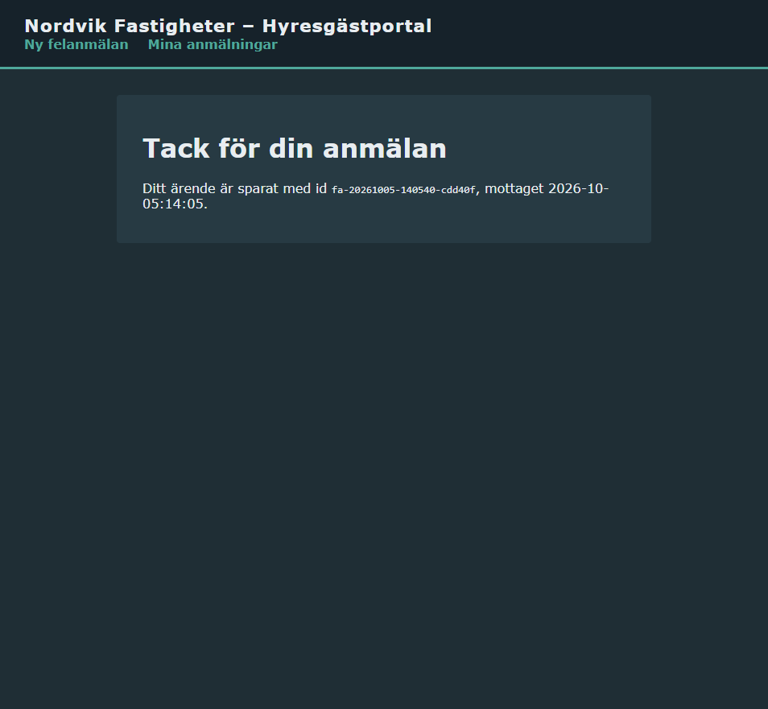
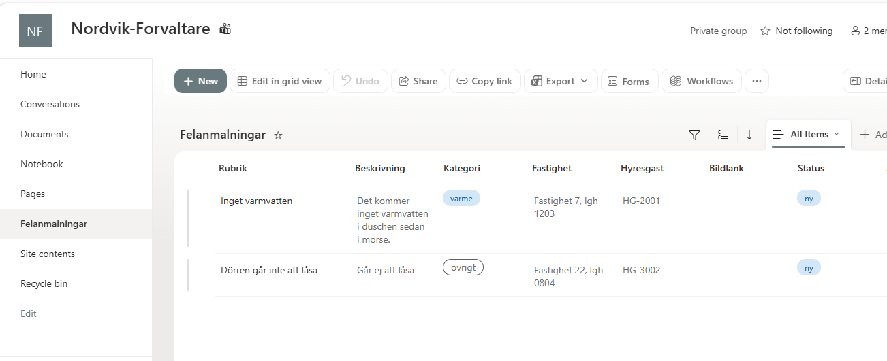
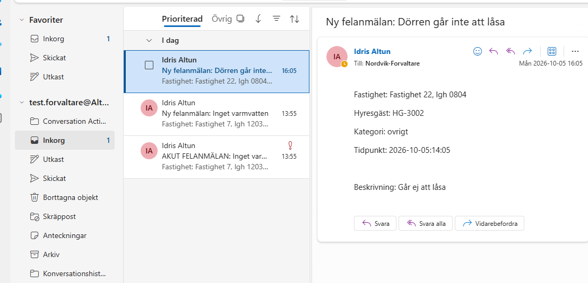

# Uppgift V41: Nordvik Fastigheter - Hyresgästportal (Examination)

**Repo:** https://github.com/80idralt/azure/tree/master/v41

**Namn:** Idris Altun

**Klass:** MOV25

**Datum:** 2026-10-05

## Syfte

Nordvik Fastigheter AB förvaltar bostäder och lokaler och vill lansera en hyresgästportal i molnet. Kärnan i portalen är en felanmälan: en hyresgäst fyller i rubrik, beskrivning och en bild på felet och skickar in den. Förvaltare tar emot och hanterar anmälningarna, ekonomi har läsande insyn. Portalen ska driftsättas säkert och med kontrollerad åtkomst, med lagring för dokument och bilder provisionerad som kod, och med ett automatiserat arbetsflöde mot Nordviks Microsoft 365.

Samma Azure-tekniker som använts genom kursen återanvänds som mönster, men datamodellen, rollerna och lösningen är medvetet designade utifrån Nordviks egna behov.

## Innehåll

Allt för examinationen ligger i mappen `v41`. Strukturen byggs upp delmoment för delmoment:

- [x] Del A: Dokumentation av centrala tjänster och virtualiseringsnivåer
- [x] Delmoment 1: Compute - värdmiljö och felanmälningsformulär
- [x] Delmoment 2: IAM - roller för hyresgäst, förvaltare, ekonomi
- [x] Delmoment 3: Nätverk och säkerhet - defense in depth
- [x] Delmoment 4: Storage - säker lagring för anmälningar och bilder
- [x] Delmoment 5: IaC - ARM-templates, versionshanterat
- [x] Delmoment 6: Automation och integration - Power Automate mot SharePoint/Outlook
- [ ] Delmoment 7: Dokumentation - hur lösningen planerats, implementerats och kan återskapas

## Del A: Centrala tjänster och virtualiseringsnivåer

### Tjänsterna i lösningen

| Område | Tjänst | Vad den gör hos Nordvik |
|---|---|---|
| Compute | **Azure Functions** (Flex Consumption) | Kör portalen och mottagningen av anmälningar. Startar vid behov och stängs när ingen använder den. |
| Nätverk | **Virtual Network** med subnät | Ett eget, privat nätverk där funktionerna och lagringen pratar med varandra. |
| Nätverk | **Network Security Group (NSG)** | Brandväggsregler per subnät, bestämmer vilken trafik som släpps in. |
| Nätverk | **Private Endpoint** + **Private DNS** | Ger lagringskontot en privat adress inne i nätverket, så det aldrig behöver vara åtkomligt från internet. |
| Storage | **Blob Storage** med **lifecycle-policy** | Sparar anmälningar och bilder, flyttar gamla dokument till billigare lagring automatiskt. |
| IAM | **Entra ID**, **RBAC**, **hanterade identiteter** | Grupper för förvaltare och ekonomi, roller med minsta möjliga behörighet. Funktionerna loggar in mot lagringen utan lösenord. |
| IaC | **ARM-mallar** | Hela Azure-miljön beskriven som kod, kan byggas om identiskt med ett skript. |
| Automation | **Power Automate**, **SharePoint**, **Outlook** | Lägger anmälan i en lista och mejlar förvaltaren, med extra mejl vid akuta fel. |
| Övervakning | **Application Insights** | Loggar och fel från funktionerna. |

### Tre nivåer av virtualisering

Alla tre kör kod på Microsofts hårdvara. Skillnaden är hur mycket man själv måste sköta.

| | Virtuell maskin (VM) | Container | Serverless |
|---|---|---|---|
| **Vad man får** | En hel dator med eget operativsystem | Ett paket med appen och det den behöver, som delar operativsystem med andra | Bara sin egen kod, Azure sköter resten |
| **Man sköter själv** | Operativsystem, uppdateringar, säkerhetspatchar, skalning, appen | Container-avbilden och appen, oftast skalning | Bara koden |
| **Kostnad** | Betalar så länge den är igång, även när ingen använder den | Betalar för igång-tid, kan ofta minskas | Betalar per körning, nästan noll när ingen använder den |
| **Skalning** | Man lägger till fler maskiner själv | Snabbare än VM, men måste konfigureras | Automatisk, Azure startar fler instanser vid behov |
| **Passar för** | Gamla system, full kontroll, specialprogram | Appar som ska flyttas lätt mellan miljöer | Händelsestyrda uppgifter med ojämn trafik |

### Varför serverless för Nordvik

Nordviks krav pekar alla åt samma håll:

- **Ojämn trafik.** Nästan inget mellan 00 och 06, toppar morgon och kväll, upp till 120 samtidiga användare vid månadsskifte. Serverless skalar upp själv vid toppar och ner till noll på natten.
- **Tåla att en instans faller bort.** En ensam VM eller container är en enda punkt som kan gå sönder. Med serverless sprider Azure körningarna över flera instanser automatiskt.
- **Inte betala för stillastående kapacitet.** Nordvik betalar bara när någon faktiskt använder portalen.
- **Lite drift.** Ingen behöver patcha operativsystem, det gör Azure.

**Bortvalt:** En VM hade krävt minst två maskiner och en lastbalanserare för att tåla att en faller bort, och hade kostat pengar dygnet runt. En container löser mer av det, men kräver fortfarande att man själv bygger och underhåller avbilder och sätter upp skalning. För en portal som i grunden tar emot ett formulär och sparar det är serverless den enklaste och billigaste lösningen som uppfyller alla krav.

## Namngivning

Följer kursens namnmönster typ-företag-syfte, t.ex. `rg-nordvik`, `vnet-nordvik`, `func-nordvik-portal`. Storage account: `stnordvik80idralt02` (typ + företag + användarnamn + löpnummer, `01` var redan taget globalt så löpnumret höjdes).

## Taggning

Ekonomi vill följa kostnad per fastighet och avdelning, så alla resurser i `rg-nordvik` taggas med:

- `avdelning=fastighetsforvaltning`
- `kostnadsstalle=nordvik-portal`
- `fastighet=gemensam`

Portalen är en delad plattform för alla 48 fastigheter, inte en resurs per fastighet, så `fastighet`-taggen får värdet `gemensam` istället för en specifik beteckning. Det ger ekonomi samma dimension att filtrera på som en resurs knuten till en enskild fastighet hade haft, men visar tydligt att kostnaden är gemensam infrastruktur.

Alla resurser taggades i efterhand i ett svep, inklusive sådana Azure skapar automatiskt (Application Insights, App Service-planer):

```powershell
$resourceIds = az resource list --resource-group rg-nordvik --query "[].id" -o tsv
foreach ($id in $resourceIds) {
    az resource tag --ids $id --tags avdelning=fastighetsforvaltning kostnadsstalle=nordvik-portal fastighet=gemensam --is-incremental
}
```

`--is-incremental` lägger till taggar utan att skriva över de som redan fanns.

Två resurser krånglade:

- **DNS-zonens VNet-länk** (`link-nordvik`) gick inte att tagga med `az resource tag` (den klagade på ett skrivskyddat fält den fick tillbaka från sig själv). Löst med det specifika kommandot istället: `az network private-dns link vnet update ... --tags ...`.
- **Nätverkskortet** som hör till den privata endpointen gick inte att tagga alls: `(CannotModifyNicAttachedToPrivateEndpoint) ... It can not be modified by user.` Det är en Azure-begränsning, inte ett eget fel — nätverkskort som skapas automatiskt av en privat endpoint är systemägda och får inte ändras av användaren, taggar inkluderat. Enda resursen i hela lösningen som inte kunde taggas, av skäl utanför vår kontroll.

## Delmoment 1: Compute

Hela compute-delen körs som **Azure Functions i Flex Consumption-planen**, motiverat i Del A.

Två funktionsappar, båda i Flex Consumption-planen, Python 3.11, med ett gemensamt lagringskonto för sin egen drift (`stnordvik80idralt03`, separat från affärsdatan, se Storage):

- `func-nordvik-portal` (publik) - visar felanmälningsformuläret (rubrik, beskrivning, bild) och sidan "Mina anmälningar". Kopplad till `snet-app`.
- `func-nordvik-arenden` (bara nåbar inifrån nätverket) - tar emot anmälan, sparar den, och startar Power Automate-flödet. Kopplad till `snet-func`.

```
$vnetId = az network vnet show --resource-group rg-nordvik --name vnet-nordvik --query id -o tsv

az functionapp create --resource-group rg-nordvik --name func-nordvik-arenden --storage-account stnordvik80idralt03 --flexconsumption-location swedencentral --runtime python --runtime-version 3.11 --vnet $vnetId --subnet snet-func --tags avdelning=fastighetsforvaltning kostnadsstalle=nordvik-portal

az functionapp create --resource-group rg-nordvik --name func-nordvik-portal --storage-account stnordvik80idralt03 --flexconsumption-location swedencentral --runtime python --runtime-version 3.11 --vnet $vnetId --subnet snet-app --tags avdelning=fastighetsforvaltning kostnadsstalle=nordvik-portal
```

VNet-kopplingen styr bara utgående trafik (vägen till lagringen), inte vem som får ringa in. `func-nordvik-arenden` stängs därför separat för publik åtkomst, så bara `func-nordvik-portal` kan nå den:

```
az functionapp config access-restriction add --resource-group rg-nordvik --name func-nordvik-arenden --rule-name allow-portal --priority 100 --action Allow --vnet-name vnet-nordvik --subnet snet-app
```

`func-nordvik-portal` skickar sin applikationstrafik (`outboundVnetRouting.applicationTraffic: true`), inklusive anrop till `func-nordvik-arenden`, via `snet-app`. Regeln släpper bara in trafik därifrån, allt annat nekas automatiskt så fort en regel finns:

```
[
  { "action": "Allow", "name": "allow-portal", "priority": 100, "vnetSubnetResourceId": ".../subnets/snet-app" },
  { "action": "Deny", "name": "Deny all", "priority": 2147483647, "ipAddress": "Any" }
]
```

### Koden i `func-nordvik-arenden`

Koden ligger i [`arenden/function_app.py`](arenden/function_app.py). Den tar emot rubrik, beskrivning, kategori, fastighet och hyresgästnummer, bygger ett eget id (`fa-åååmmdd-ttmmss-slump`, eget prefix), sparar en JSON-fil plus en eventuell bild i containern `anmalningar`, och postar vidare till Power Automate när flödet finns. Tidpunkten sparas läsbart och i svensk tid (`Europe/Stockholm`), som `2026-10-05:09:19`, istället för en svårläst ISO-tidsstämpel i UTC.

Testat med curl, samma sätt som tidigare veckor:

```
PS> curl.exe -i -X POST -F "rubrik=Trasig kran" -F "beskrivning=Droppar konstant i koket" -F "kategori=vatten" -F "fastighet=Fastighet 12" -F "hyresgast=HG-1042" "https://func-nordvik-arenden.azurewebsites.net/api/arenden"
HTTP/1.1 200 OK
<h1>Tack för din anmälan</h1><p>Ditt ärende är sparat med id fa-20261005-091910-9b9388, mottaget 2026-10-05:09:19.</p>
```

Lagringskontot och funktionen är båda stängda för publik åtkomst, så för att se filen krävdes ett tillfälligt undantag (eget IP), borttaget direkt efter kontrollen:

```
PS> az storage blob list --account-name stnordvik80idralt02 --container-name anmalningar --auth-mode key --query "[].name" -o table
Result
--------------------------------------
fa-20261005-091910-9b9388/anmalan.json
```

### Koden i `func-nordvik-portal`

Koden ligger i [`portal/function_app.py`](portal/function_app.py). Tre rutter: `/` visar felanmälningsformuläret, `/skicka` tar emot det och skickar vidare server-till-server till `func-nordvik-arenden` (webbläsaren pratar aldrig direkt med den interna funktionen), `/mina-arenden` låter en hyresgäst skriva in sitt hyresgästnummer och se sina egna anmälningar. Inget inloggningssystem byggdes — kursen har aldrig byggt inloggning i en egen webbapp, så formuläret är öppet, med hyresgästnumret som ett vanligt fält, inte en hemlighet. Eget mörkt tema i designen.

Förvaltare och ekonomi loggar inte in i appen alls, de arbetar istället i SharePoint-listan (se Delmoment 6), där deras Entra-grupper styr vad de får göra.

**Mina anmälningar, testat:** en hyresgäst som skriver in sitt hyresgästnummer ser bara sina egna anmälningar, med AKUT-märkning synlig:


## Delmoment 2: IAM

Tre roller, enligt least privilege:

- **Hyresgäst:** ingen egen Entra-identitet och ingen inloggning. Formuläret är öppet och hyresgästnumret är ett vanligt fält, inte en hemlighet. "Mina anmälningar" filtrerar helt enkelt på det nummer som skrivs in, utan att kontrollera vem som skriver. En skarp lösning med 5500 externa hyresgäster hade använt Entra External ID/B2C, men det är inget kursen gått igenom, så det är en medveten avgränsning. Hyresgästen har aldrig någon direkt åtkomst till lagringen, bara portalens egen hanterade identitet har det (läsrätt).
- **Förvaltare** och **Ekonomi:** riktiga Entra-identiteter, men bara förvaltare har en egen Microsoft 365-grupp:
  - `Nordvik-Forvaltare` — **Microsoft 365-grupp**, ger SharePoint-sajten och en mejladress (dit notisen och det akuta mejlet går).
  - `sg-nordvik-forvaltare` / `sg-nordvik-ekonomi` — vanliga **säkerhetsgrupper**, används för RBAC mot lagringen.

  Planen var från början en enda grupp per roll som gjorde allt (RBAC + Teams + mejl). Det stötte på en verklig begränsning: Azure tillåter bara säkerhetsaktiverade grupper i RBAC-rolltilldelningar, och en Microsoft 365-grupp är det inte som standard (`(GroupTypeNotSupported) Only security-enabled groups can be used in role assignments`). Lösningen blev separata säkerhetsgrupper för RBAC.

  En andra omtanke: `Nordvik-Ekonomi` byggdes först som ett eget Microsoft 365-team, symmetriskt med förvaltarnas, men det var överbyggt. Uppgiften ber bara om läsande insyn för ekonomi, aldrig om en egen Teams-kanal eller mejladress. Ett eget Team per roll är dessutom ovanligt i verkliga organisationer, där en avdelning normalt delar ett Team och skiljer åtkomst med behörigheter istället. `Nordvik-Ekonomi`-teamet revs (`Remove-Team`), och ekonomi får istället läsbehörighet direkt på `Nordvik-Forvaltare`s SharePoint-sajt (Visitors-gruppen), på samma lista som förvaltarna redigerar. `sg-nordvik-ekonomi` (säkerhetsgruppen för RBAC mot lagringen) påverkas inte av detta.

Microsoft 365-grupperna, skapade med PowerShell-modulen MicrosoftTeams:

```
New-Team -DisplayName "Nordvik-Forvaltare" -MailNickName "nordvik-forvaltare" -Visibility Private -Description "Förvaltare, hanterar felanmälningar"
```

Säkerhetsgrupperna, skapade med `az ad group create` (ger `securityEnabled: true` per automatik, till skillnad från `New-Team`):

```
az ad group create --display-name "sg-nordvik-forvaltare" --mail-nickname "sgnordvikforvaltare"
az ad group create --display-name "sg-nordvik-ekonomi" --mail-nickname "sgnordvikekonomi"
```

| Grupp | Syfte | ID |
|---|---|---|
| `Nordvik-Forvaltare` | SharePoint-sajt + mejladress (`Nordvik-Ekonomi` revs, se Delmoment 6) | `82f89c0e-2ccd-4a4b-a273-b633e2cd2805` |
| `sg-nordvik-forvaltare` | RBAC mot lagringen, Members på SharePoint-sajten | `836c0262-c307-4b2d-91fe-5c89dfb6c286` |
| `sg-nordvik-ekonomi` | RBAC mot lagringen, Visitors (läsbehörighet) på SharePoint-sajten | `b11988a3-db82-4ca7-ab72-b0a960f1d752` |

RBAC-rolltilldelningarna, scopade till `anmalningar`-containern, inte hela kontot:

```
$scope = "/subscriptions/4dd214c0-94b5-48db-8f8c-efe2cf8e2f20/resourceGroups/rg-nordvik/providers/Microsoft.Storage/storageAccounts/stnordvik80idralt02/blobServices/default/containers/anmalningar"

az role assignment create --assignee 836c0262-c307-4b2d-91fe-5c89dfb6c286 --role "Storage Blob Data Contributor" --scope $scope
az role assignment create --assignee b11988a3-db82-4ca7-ab72-b0a960f1d752 --role "Storage Blob Data Reader" --scope $scope
```

Funktionernas egna hanterade identiteter fick samma behandling, också scopat till `anmalningar`:

| Identitet | Roll |
|---|---|
| `func-nordvik-arenden` (system-assigned) | Storage Blob Data Contributor — sparar anmälningar |
| `func-nordvik-portal` (system-assigned) | Storage Blob Data Reader — visar listor, skriver aldrig direkt |

### Verifierat med testanvändare

Två testkonton skapades och lades i respektive säkerhetsgrupp:

```
az ad user create --display-name "Test Forvaltare" --user-principal-name "test.forvaltare@Altun1980.onmicrosoft.com" --password "..." --force-change-password-next-sign-in true
az ad group member add --group "sg-nordvik-forvaltare" --member-id <user-id>
```

Rätt roll ärvs genom gruppen, inget behövde tilldelas per person (`--include-groups`, inte `--include-inherited`, som bara gäller ärvning mellan scope, inte gruppmedlemskap):

```
PS> az role assignment list --assignee <test-forvaltare-id> --include-groups --all -o table
Principal              Role                           Scope
sg-nordvik-forvaltare  Storage Blob Data Contributor  .../containers/anmalningar

PS> az role assignment list --assignee <test-ekonomi-id> --include-groups --all -o table
Principal           Role                      Scope
sg-nordvik-ekonomi  Storage Blob Data Reader  .../containers/anmalningar
```

## Delmoment 6: Automation och integration

En inskickad felanmälan ska ge en post i en lista och en notis till förvaltaren, i Teams eller Outlook (uppgiften kräver bara en av dem). Valet föll på **Outlook**, det håller Power Automate-flödet enklare än att även koppla in Teams.

### SharePoint-listan

Listan `Felanmalningar` skapades på `Nordvik-Forvaltare`s SharePoint-sajt (Teams → Nordvik-Forvaltare → Shared → Open in SharePoint → Site contents → New → List), med samma datamodell som anmälan sparas med i lagringen:

| Kolumn | Typ |
|---|---|
| Rubrik (Title) | Enkel textrad |
| Beskrivning | Flera textrader |
| Kategori | Val: varme, vatten, las, ovrigt |
| Fastighet | Enkel textrad |
| Hyresgast | Enkel textrad |
| Status | Val: ny, pagaende, klar |
| Akut | Ja/Nej |
| Tidpunkt | Enkel textrad |

Behörigheterna är satta via sajtens tre standardgrupper (Owners/Members/Visitors), samma mönster för båda rollerna: en säkerhetsgrupp direkt in i rätt SharePoint-grupp.

- `sg-nordvik-forvaltare` → **Nordvik-Forvaltare Members** (Edit)
- `sg-nordvik-ekonomi` → **Nordvik-Forvaltare Visitors** (Read)

(Members-gruppen innehåller sen tidigare även en automatisk länk till själva Teamet/M365-gruppen, det är normalt för Team-kopplade sajter och stör inte den extra säkerhetsgruppen.)

Samma lista, två behörighetsnivåer, ingen dubblett av datan. Hyresgäster har ingen åtkomst till sajten alls, de interagerar bara med portalen.

**Verifierat med testanvändare, på riktigt.** `Test Forvaltare` ser fullt verktygsfält (Nytt, Redigera, Ångra, Ta bort) och kan ändra en anmälan:


`Test Ekonomi` ser samma lista, men verktygsfältet saknar Nytt/Redigera/Ta bort, och varje rad har en överkorsad penna som visar att objektet inte går att redigera:


RBAC mot lagringen omverifierades efter ARM-återbygget, scopat till den nya containern:

```
PS> az role assignment list --scope <nya-containerns-scope> -o table
Principal              Role                           
sg-nordvik-ekonomi      Storage Blob Data Reader
sg-nordvik-forvaltare   Storage Blob Data Contributor
<func-nordvik-arenden>  Storage Blob Data Contributor
<func-nordvik-portal>   Storage Blob Data Reader
```

### Power Automate-flödet

Flödet `Nordvik-felanmalan` triggas av en **HTTP-begäran** (anonym, "vem som helst med URL:en" — `func-nordvik-arenden` postar dit efter att anmälan sparats). Fyra steg efter triggern:

1. **Skapa objekt** i `Felanmalningar`-listan, alla fält kopplade mot triggerns JSON.
2. **Välj** gör om bilagorna till filer som Outlook kan bifoga (se nedan).
3. **Skicka ett e-postmeddelande (V2)** till `nordvik-forvaltare@Altun1980.onmicrosoft.com`, alltid, med bilden bifogad.
4. **Villkor:** om `akut` är sant, ett andra mejl till samma adress, markerat **Hög prioritet**, med ämnet "AKUT FELANMÄLAN: ..." och samma bild.

### Bilden i mejlet

Lagringskontot är nätverkslåst, så Power Automate kan inte hämta bilden via en länk. `func-nordvik-arenden` skickar därför med själva bilden i anropet till flödet, base64-kodad, i en lista `bilagor` (tom om ingen bild bifogades). Bilden sparas fortfarande i lagringen som vanligt. Base64-datan läggs bara i anropet till flödet, inte i `anmalan.json`.

Outlooks bilagefält vill ha en riktig fil, inte base64-text. Steget **Välj** avkodar därför varje bilaga innan mejlet skickas:

```
Name:         item()?['Name']
ContentBytes: base64ToBinary(item()?['ContentBytes'])
```

Båda mejlen tar sina bilagor från `body('Välj')`. En tom lista ger ett mejl utan bilaga, så inget extra villkor behövs för anmälningar utan bild.

Flödets URL sparas som app-settingen `FLOW_URL` på `func-nordvik-arenden`. Den skickas in som en säker parameter vid driftsättningen (se Delmoment 5), eftersom `&`-tecknen i adressen annars tolkas som kommandoavskiljare av PowerShell/cmd.

### Verifierat end-to-end

Ett riktigt test via portalen (kategori "varme", en akut kategori):


Posten dök upp i SharePoint-listan:


Och två mejl kom fram till `Nordvik-Forvaltare`s inkorg, det vanliga och det akuta (med hög prioritet, utropstecknet i listvyn):


Flödets egen körningshistorik bekräftar samma sak, en lyckad körning på 3 sekunder:


Oberoende bevis direkt mot lagringen också, samma tillfälliga-undantag-metod som tidigare:

```
PS> az storage blob list --account-name stnordvik80idralt02 --container-name anmalningar --auth-mode key --query "[].name" -o table
Result
--------------------------------------
fa-20261005-091910-9b9388/anmalan.json
fa-20261005-115457-2ae8aa/anmalan.json
```

Hela kedjan bevisad på fyra oberoende sätt: portalens bekräftelsesida → SharePoint-listan → mejlen → lagringen direkt.

### Flödet som kod

Power Automate-flöden kan inte beskrivas i en ARM-mall, men definitionen exporterades ändå som en egen fil och lades in i repot, så flödets logik går att läsa och återskapa utan att klicka sig igenom Power Automate på nytt: [`automation/nordvik-felanmalan-flow.json`](automation/nordvik-felanmalan-flow.json).

## Delmoment 3: Nätverk och säkerhet

Lagringen ska inte vara publikt åtkomlig. Lösningen är ett virtuellt nätverk med en **privat endpoint**, en egen ingång till lagringskontot som bara syns inifrån nätverket, i kombination med en **privat DNS-zon** som gör att kontots namn slår upp till en privat adress istället för en publik, bara för den som frågar inifrån vnet:et.

```
az network vnet create --name vnet-nordvik --resource-group rg-nordvik --location swedencentral --address-prefix 10.0.0.0/16 --subnet-name snet-data --subnet-prefix 10.0.1.0/24 --tags avdelning=fastighetsforvaltning kostnadsstalle=nordvik-portal

az network private-dns zone create --resource-group rg-nordvik --name privatelink.blob.core.windows.net

az network private-dns link vnet create --resource-group rg-nordvik --zone-name privatelink.blob.core.windows.net --name link-nordvik --virtual-network vnet-nordvik --registration-enabled false

$storageId = az storage account show --name stnordvik80idralt02 --resource-group rg-nordvik --query id -o tsv

az network private-endpoint create --name pe-nordvik-storage --resource-group rg-nordvik --vnet-name vnet-nordvik --subnet snet-data --private-connection-resource-id $storageId --group-id blob --connection-name pe-nordvik-storage-koppling

az network private-endpoint dns-zone-group create --resource-group rg-nordvik --endpoint-name pe-nordvik-storage --name default --private-dns-zone privatelink.blob.core.windows.net --zone-name blob

az storage account update --name stnordvik80idralt02 --resource-group rg-nordvik --default-action Deny
```

Sista kommandot stänger den sista öppningen. Lagringskontots nätverksregel gick från `Allow` till `Deny`, så allt som inte kommer via den privata endpointen avvisas. DNS-zongruppen skapade automatiskt rätt post:

```
stnordvik80idralt02.privatelink.blob.core.windows.net -> 10.0.1.4
```

Två egna subnät är förberedda för compute-delen, båda delegerade till `Microsoft.App/environments` (samma delegering som Azure Functions i Flex Consumption-planen använder för nätverksintegration):

```
az network vnet subnet create --name snet-app --resource-group rg-nordvik --vnet-name vnet-nordvik --address-prefixes 10.0.2.0/27 --delegations Microsoft.App/environments

az network vnet subnet create --name snet-func --resource-group rg-nordvik --vnet-name vnet-nordvik --address-prefixes 10.0.3.0/27 --delegations Microsoft.App/environments
```

`snet-app` används av `func-nordvik-portal`, `snet-func` av `func-nordvik-arenden`, så att den interna funktionen inte är nåbar utifrån.

**Nätverkssäkerhetsgrupper (NSG):** varje subnät har en egen NSG, definierad i ARM-mallen, med en regel som uttrycker exakt det subnätets jobb:

| NSG | Subnät | Regler (inkommande) |
|---|---|---|
| `nsg-nordvik-data` | `snet-data` (lagringens privata endpoint) | Tillåt 443 från `snet-app` och `snet-func`, neka allt annat |
| `nsg-nordvik-app` | `snet-app` (portalens utgående trafik) | Neka allt inkommande |
| `nsg-nordvik-func` | `snet-func` (ärendefunktionens utgående trafik) | Neka allt inkommande |

Privata endpoints ignorerar NSG-regler som standard (`privateEndpointNetworkPolicies: Disabled`), så på `snet-data` är den satt till `NetworkSecurityGroupEnabled` för att reglerna ska gälla på riktigt. Compute-subnäten används bara för utgående VNet-integration och ska aldrig ta emot inkommande trafik, så där nekas allt inkommande. Utgående trafik begränsas inte, eftersom funktionerna behöver nå DNS, Azure Monitor och Power Automate.

Lagringen är alltså skyddad i tre lager: lagringskontots egen brandvägg (`Deny`), privat endpoint utan publik adress, och NSG som släpper in bara de två compute-subnäten.

Kopplingen mellan subnät och NSG, verifierad i den deployade miljön:

```
PS> az network vnet subnet list --resource-group rg-nordvik --vnet-name vnet-nordvik --query "[].{subnat:name, nsg:networkSecurityGroup.id, pePolicy:privateEndpointNetworkPolicies}" -o table
snet-data  .../networkSecurityGroups/nsg-nordvik-data  NetworkSecurityGroupEnabled
snet-app   .../networkSecurityGroups/nsg-nordvik-app   Disabled
snet-func  .../networkSecurityGroups/nsg-nordvik-func  Disabled
```

Att NSG:n på `snet-data` släpper igenom rätt trafik syns i "Mina anmälningar" (Delmoment 1): där läser portalen direkt från lagringen via den privata endpointen.

## Delmoment 4: Storage

Felanmälningar har två sorters innehåll med olika livslängd. Bilderna som hör till en anmälan är färska och läses ofta i början, medan kontrakt och besiktningsprotokoll läses sällan efter de tre första månaderna. De läggs därför i varsin container i samma lagringskonto, med olika regler.

Resursgrupp och lagringskonto, taggat för ekonomins kostnadsuppföljning på avdelning/kostnadsställe:

```
az group create --name rg-nordvik --location swedencentral
az group update --name rg-nordvik --tags avdelning=fastighetsforvaltning kostnadsstalle=nordvik-portal

az storage account create --name stnordvik80idralt02 --resource-group rg-nordvik --location swedencentral --sku Standard_LRS --kind StorageV2 --access-tier Hot --allow-blob-public-access false --min-tls-version TLS1_2 --tags avdelning=fastighetsforvaltning kostnadsstalle=nordvik-portal
```

`--allow-blob-public-access false` stänger publik blobåtkomst på hela kontot direkt. Nätverket (privat endpoint) låses i nätverksdelen.

De två containrarna, båda utan publik åtkomst:

```
PS> az storage container create --account-name stnordvik80idralt02 --name anmalningar --auth-mode key --public-access off
{
  "created": true
}

PS> az storage container create --account-name stnordvik80idralt02 --name dokument --auth-mode key --public-access off
{
  "created": true
}
```

| Container | Innehåll | Tier |
|---|---|---|
| `anmalningar` | felanmälningar, bild plus uppgifter | Hot |
| `dokument` | kontrakt och besiktningsprotokoll | Hot, flyttas till Cool efter 90 dagar |

Lifecycle-policyn som sköter flytten till Cool ligger som kod i [`storage/lifecycle-policy.json`](storage/lifecycle-policy.json) och gäller bara filer i `dokument/`:

```
az storage account management-policy create --account-name stnordvik80idralt02 --resource-group rg-nordvik --policy @v41/storage/lifecycle-policy.json
```

## Delmoment 5: IaC

Allt som byggdes för hand ovan (nätverk, lagring, de två funktionerna, RBAC-rollerna) beskrivs nu som kod i [`templates/azuredeploy.json`](templates/azuredeploy.json), i ren ARM-JSON som i v38, med en tillhörande [`templates/azuredeploy.parameters.json`](templates/azuredeploy.parameters.json).

### Vad som är med, och vad som inte är det

Mallen beskriver allt i Azure: VNet med de tre subnäten och deras NSG:er, båda lagringskontona med containrar och lifecycle-policyn, den privata DNS-zonen och endpointen, de två Function-apparna (Flex Consumption, VNet-integrerade, nätverksbegränsningen på `func-nordvik-arenden`) och de fyra RBAC-rolltilldelningarna.

**Inte med:** Entra-grupperna (`sg-nordvik-forvaltare`, `sg-nordvik-ekonomi`, `Nordvik-Forvaltare`), SharePoint-listan och Power Automate-flödet. De är inte Azure-resurser och kan inte beskrivas i en ARM-mall, precis som konstaterat i Storage- och Automation-delmomenten. Grupp-ID:na tas istället in som parametrar (`forvaltareGroupId`, `ekonomiGroupId`), så mallen vet vem som ska få vilken roll utan att själv skapa grupperna.

### Namngivning i mallen

Istället för handvalda namn (som krockade och behövde höjt löpnummer, se Storage-delmomentet) används `uniqueString(resourceGroup().id)`. Den som klonar repot kan köra mallen utan att själv behöva hitta på unika namn.

### En hemlighet som aldrig får hamna i repot

Power Automate-flödets URL innehåller en inbyggd signatur, i praktiken en nyckel till flödet. Repot är publikt, så den får aldrig committas. `flowUrl` är deklarerad som `securestring` i mallen (loggas inte i klartext av Azure), och `azuredeploy.parameters.json` innehåller bara en platshållare. [`deploy.ps1`](deploy.ps1) frågar efter den riktiga URL:en interaktivt vid varje körning istället.

### Skripten

[`deploy.ps1`](deploy.ps1) skapar resursgruppen, kör mallen, och publicerar sedan koden i båda funktionerna. `func-nordvik-arenden` får sin kod via zip-deploy, eftersom `func azure functionapp publish` försöker ringa upp appen efteråt och alltid får `403` mot en funktion som medvetet är nätverksstängd. `func-nordvik-portal` publiceras med `func azure functionapp publish` och ett återförsöksmönster, eftersom RBAC-rollerna kan ta en minut att slå igenom. [`destroy.ps1`](destroy.ps1) river hela resursgruppen.

### Byggd från mallen, riktig rivning och återuppbyggnad

Hela `rg-nordvik` revs (`destroy.ps1`) och byggdes upp på nytt helt och hållet från mallen (`deploy.ps1`), för att bevisa att den faktiskt fungerar, inte bara att den är syntaktiskt giltig. Namnen blev nya (`func-nordvik-arenden-u622wnde7uy7i` osv, se Namngivning-avsnittet ovan), precis som väntat av `uniqueString()`.

### Buggar på vägen

VNet-integration för Flex Consumption-funktioner visade sig vara betydligt sämre dokumenterat än resten av mallen, och flera saker som Azure CLI satte upp automatiskt åt oss (när vi byggde för hand) visade sig kräva uttrycklig kod i ARM. Fyra separata fel i tur och ordning, varje löst genom att jämföra mot den riktiga JSON:en från den handbyggda versionen eller genom att slå upp Azures egen dokumentation, inte genom att gissa:

1. **`vnetRouteAllEnabled` på fel JSON-nivå.** Lades först inuti `siteConfig`, men den egenskapen hör hemma direkt på resursens `properties`, som syskon till `siteConfig`. Fel nivå gav inget felmeddelande, bara ingen effekt.
2. **`virtualNetworkSubnetId` satte sig inte alls**, trots att det är precis den egenskap Microsofts egen dokumentation visar för Flex Consumption. Lösningen var att lägga till en separat resurs, `Microsoft.Web/sites/networkConfig` (namngiven `.../virtualNetwork`), samma mekanism `az functionapp vnet-integration add` använder under huven. Verifierat med `az functionapp vnet-integration list`, inte `az functionapp show` (som visade `null` även när kopplingen faktiskt fanns).
3. **Fel typ av routningsflagga.** Flex Consumption har bytt den enkla booleanen `vnetRouteAllEnabled` mot ett mer detaljerat objekt, `outboundVnetRouting`, med separata flaggor för applikationstrafik, backup, image pull osv. Det var `outboundVnetRouting.applicationTraffic: true` som faktiskt behövdes, inte den gamla booleanen (som ligger kvar men verkar vara en overksam kompatibilitetsrest för den här apptypen).
4. **Käll-subnätet saknade en Service Endpoint.** En subnät-baserad åtkomstregel (`vnetSubnetResourceId` i `ipSecurityRestrictions`) kräver att källsubnätet (`snet-app`) har tjänstslutpunkten `Microsoft.Web` aktiverad, annars känner mottagarfunktionen inte igen trafiken som kommande därifrån. Det är precis den sortens detalj CLI:t löser tyst åt en.

Varje fel syntes som samma sak utåt: `403 Forbidden` när portalen försökte vidarebefordra en anmälan till den interna funktionen, trots att nätverksbegränsningen och VNet-kopplingen såg rätt ut i mallens kod. Felsökningen gjordes genom att verifiera varje lager för sig direkt mot den riktiga, deployade resursen (`az resource show`, `az functionapp vnet-integration list`) istället för att lita på hur det såg ut i mallen.

### Verifierat efter återbygget

Samma testflöde som tidigare, kört på nytt mot de omdöpta resurserna efter att alla fyra fel var rättade:



Nya raden hamnade bredvid den gamla i SharePoint-listan, som aldrig påverkades av Azure-rivningen:



Och mejlet kom fram:


