# Uppgift V41: Nordvik Fastigheter - Hyresgästportal (Examination)

**Repo:** https://github.com/80idralt/azure/tree/master/v41

**Namn:** Idris Altun

**Klass:** MOV25

**Datum:** 2026-10-06

## Syfte

Nordvik Fastigheter AB förvaltar bostäder och lokaler och vill lansera en hyresgästportal i molnet. Kärnan i portalen är en felanmälan: en hyresgäst fyller i rubrik, beskrivning och en bild på felet och skickar in den. Förvaltare tar emot och hanterar anmälningarna, ekonomi har läsande insyn. Portalen ska driftsättas säkert och med kontrollerad åtkomst, med lagring för dokument och bilder provisionerad som kod och med ett automatiserat arbetsflöde mot Nordviks Microsoft 365.

Samma Azure-tekniker som använts genom kursen återanvänds som mönster, men datamodellen, rollerna och lösningen är medvetet designade utifrån Nordviks egna behov.

## Innehåll

- [x] Del A: Centrala tjänster och virtualiseringsnivåer
- [x] Delmoment 1: Compute - värdmiljö och felanmälningsformulär
- [x] Delmoment 2: IAM - roller för hyresgäst, förvaltare, ekonomi
- [x] Delmoment 3: Nätverk och säkerhet - defense in depth
- [x] Delmoment 4: Storage - säker lagring för anmälningar och bilder
- [x] Delmoment 5: IaC - ARM-mall, versionshanterad och återskapbar
- [x] Delmoment 6: Automation och integration - Power Automate mot SharePoint, Outlook och Teams
- [x] Delmoment 7: Dokumentation - planering, genomförande och hur lösningen återskapas

## Översikt

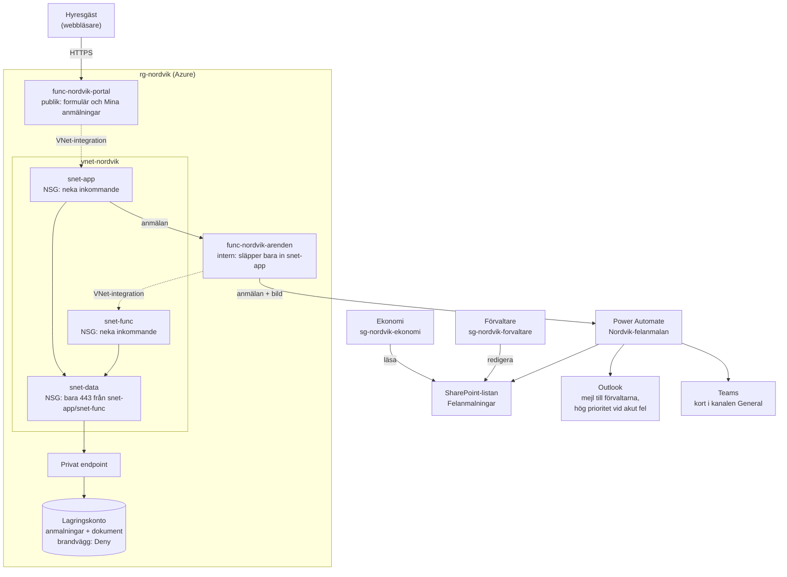

En felanmälan, steg för steg:

1. Hyresgästen fyller i formuläret i `func-nordvik-portal` och trycker Skicka.
2. Portalen skickar vidare server-till-server till `func-nordvik-arenden`. Webbläsaren når aldrig den interna funktionen.
3. `func-nordvik-arenden` sparar anmälan och bilden i lagringen via den privata endpointen, med sin egen hanterade identitet.
4. Den skickar samma uppgifter, plus bilden, till Power Automate-flödet.
5. Flödet skapar en rad i SharePoint, mejlar förvaltarna och postar ett kort i deras Teams-kanal. Är kategorin värme, vatten eller lås kommer ett extra mejl märkt hög prioritet. Kortet märks då också som akut.
6. Förvaltare redigerar raden i SharePoint, ekonomi kan bara läsa den. Hyresgästen ser sina anmälningar under "Mina anmälningar".

## Del A: Centrala tjänster och virtualiseringsnivåer

### Tjänsterna i lösningen

| Område | Tjänst | Vad den gör hos Nordvik |
|---|---|---|
| Compute | **Azure Functions** (Flex Consumption) | Kör portalen och mottagningen av anmälningar. Startar vid behov och stängs när ingen använder den. |
| Nätverk | **Virtual Network** med subnät | Ett eget, privat nätverk där funktionerna och lagringen pratar med varandra. |
| Nätverk | **Network Security Group (NSG)** | Brandväggsregler per subnät, bestämmer vilken trafik som släpps in. |
| Nätverk | **Private Endpoint** + **Private DNS** | Ger lagringskontot en privat adress inne i nätverket, så det aldrig behöver vara åtkomligt från internet. |
| Storage | **Blob Storage** med **lifecycle-policy** | Sparar anmälningar och bilder, flyttar gamla dokument till billigare lagring automatiskt. |
| IAM | **Entra ID**, **RBAC**, **hanterade identiteter** | Grupper för förvaltare och ekonomi, roller med minsta möjliga behörighet. Funktionerna loggar in mot lagringen utan lösenord. |
| IaC | **ARM-mallar** | Hela Azure-miljön beskriven som kod, kan byggas om identiskt med ett skript. |
| Automation | **Power Automate**, **SharePoint**, **Outlook**, **Teams** | Lägger anmälan i en lista, mejlar förvaltaren och postar ett kort i deras Teams-kanal, med extra mejl vid akuta fel. |
| Övervakning | **Application Insights** | Loggar och fel från funktionerna. |

### Tre nivåer av virtualisering

Alla tre kör kod på Microsofts hårdvara. Skillnaden är hur mycket man själv måste sköta.

| | Virtuell maskin (VM) | Container | Serverless |
|---|---|---|---|
| **Vad man får** | En hel dator med eget operativsystem | Ett paket med appen och det den behöver, som delar operativsystem med andra | Bara sin egen kod, Azure sköter resten |
| **Man sköter själv** | Operativsystem, uppdateringar, säkerhetspatchar, skalning, appen | Container-avbilden och appen, oftast skalning | Bara koden |
| **Kostnad** | Betalar så länge den är igång, även när ingen använder den | Betalar för igång-tid, kan ofta minskas | Betalar per körning, nästan noll när ingen använder den |
| **Skalning** | Man lägger till fler maskiner själv | Snabbare än VM, men måste konfigureras | Automatisk, Azure startar fler instanser vid behov |
| **Passar för** | Gamla system, full kontroll, specialprogram | Appar som ska flyttas lätt mellan miljöer | Händelsestyrda uppgifter med ojämn trafik |

### Varför serverless för Nordvik

Nordviks krav pekar alla åt samma håll:

- **Ojämn trafik.** Nästan inget mellan 00 och 06, toppar morgon och kväll, upp till 120 samtidiga användare vid månadsskifte. Serverless skalar upp själv vid toppar och ner till noll på natten.
- **Tåla att en instans faller bort.** En ensam VM eller container är en enda punkt som kan gå sönder. Med serverless sprider Azure körningarna över flera instanser automatiskt.
- **Inte betala för stillastående kapacitet.** Nordvik betalar bara när någon faktiskt använder portalen.
- **Lite drift.** Ingen behöver patcha operativsystem, det gör Azure.

**Bortvalt:** En VM hade krävt minst två maskiner och en lastbalanserare för att tåla att en faller bort och hade kostat pengar dygnet runt. En container löser mer av det, men kräver fortfarande att man själv bygger och underhåller avbilder och sätter upp skalning. För en portal som i grunden tar emot ett formulär och sparar det är serverless den enklaste och billigaste lösningen som uppfyller alla krav.

### Kostnad för portalmiljön

Ungefärlig månadskostnad med Nordviks trafik:

| Del | Kostnad |
|---|---|
| Funktionerna | Nära 0 kr. Även toppar på hundratals anmälningar i timmen ryms i den mängd körningar som ingår gratis varje månad. Natten kostar ingenting. |
| Privat endpoint | Runt 80 kr. Den största fasta kostnaden, oberoende av trafik. Det är priset för att lagringen inte är publik. |
| Lagring, privat DNS-zon, Application Insights | Några kronor |

Totalt runt 100 kr i månaden. Det mesta är säkerhet, inte trafik. Siffrorna är uppskattningar. Den faktiska kostnaden följer ekonomi i Cost Management (se Taggning).

**Avvägning:** efter en stund utan trafik tar första anropet några sekunder längre, eftersom en instans måste startas (cold start). Det märks till exempel första anmälan på morgonen, inte under toppar. Det går att undvika med en instans som alltid är igång, men den kostar dygnet runt och går emot kravet att inte betala för stillastående kapacitet.

## Namngivning

Följer kursens namnmönster typ-företag-syfte, t.ex. `rg-nordvik`, `vnet-nordvik`, `func-nordvik-portal`. Storage account: `stnordvik80idralt02` (typ + företag + användarnamn + löpnummer, `01` var redan taget globalt så löpnumret höjdes).

Kommandona i Delmoment 1-4 visar den första versionen, byggd för hand med dessa namn. Den slutliga miljön byggs av ARM-mallen, som lägger till ett unikt suffix på namn som måste vara globalt unika (se Delmoment 5).

## Taggning

Ekonomi vill följa kostnad per fastighet och avdelning, så alla resurser i `rg-nordvik` taggas med:

- `avdelning=fastighetsforvaltning`
- `kostnadsstalle=nordvik-portal`
- `fastighet=gemensam`

Portalen är en delad plattform för alla 48 fastigheter, inte en resurs per fastighet, så `fastighet`-taggen får värdet `gemensam` istället för en specifik beteckning. Det ger ekonomi samma dimension att filtrera på som en resurs knuten till en enskild fastighet hade haft, men visar tydligt att kostnaden är gemensam infrastruktur.

I ARM-mallen är taggarna en parameter som sätts på varje resurs. I den handbyggda versionen taggades allt i efterhand i ett svep, inklusive sådana resurser Azure skapar automatiskt (Application Insights, App Service-planer):

```powershell
$resourceIds = az resource list --resource-group rg-nordvik --query "[].id" -o tsv
foreach ($id in $resourceIds) {
    az resource tag --ids $id --tags avdelning=fastighetsforvaltning kostnadsstalle=nordvik-portal fastighet=gemensam --is-incremental
}
```

`--is-incremental` lägger till taggar utan att skriva över de som redan fanns.

Två saker visade sig när miljön byggdes från mallen:

- **Nätverkskortet** som den privata endpointen skapar går inte att tagga i efterhand (`CannotModifyNicAttachedToPrivateEndpoint`), vilket stoppade svepet i den handbyggda versionen. När mallen skapar endpointen ärver nätverkskortet däremot taggarna direkt.
- **Larmreglerna** som Azure skapar automatiskt för Application Insights (`Failure Anomalies` och `Application Insights Smart Detection`) dyker upp först efter att mallen kört och får inga taggar. `deploy.ps1` avslutar därför med att tagga allt i resursgruppen som saknar taggar, med samma värden som i parameterfilen.

Resultatet är att alla resurser i resursgruppen är taggade:

```
PS> az resource list --resource-group rg-nordvik --query "[].{namn:name, kostnadsstalle:tags.kostnadsstalle}" -o table
Namn                                                         Kostnadsstalle
-----------------------------------------------------------  ----------------
stdatau622wnde7uy7i                                          nordvik-portal
stfuncu622wnde7uy7i                                          nordvik-portal
func-nordvik-arenden-u622wnde7uy7i                           nordvik-portal
func-nordvik-portal-u622wnde7uy7i                            nordvik-portal
nsg-nordvik-data                                             nordvik-portal
privatelink.blob.core.windows.net                            nordvik-portal
plan-nordvik-portal-u622wnde7uy7i                            nordvik-portal
nsg-nordvik-func                                             nordvik-portal
nsg-nordvik-app                                              nordvik-portal
plan-nordvik-arenden-u622wnde7uy7i                           nordvik-portal
vnet-nordvik                                                 nordvik-portal
pe-nordvik-storage                                           nordvik-portal
func-nordvik-arenden-u622wnde7uy7i                           nordvik-portal
privatelink.blob.core.windows.net/link-nordvik               nordvik-portal
pe-nordvik-storage.nic.2387ccd2-98e1-4167-b1d6-97082f8367b9  nordvik-portal
func-nordvik-portal-u622wnde7uy7i                            nordvik-portal
Application Insights Smart Detection                         nordvik-portal
Failure Anomalies - func-nordvik-arenden-u622wnde7uy7i       nordvik-portal
Failure Anomalies - func-nordvik-portal-u622wnde7uy7i        nordvik-portal
```

Funktionsnamnen står två gånger eftersom varje funktion har en Application Insights-komponent med samma namn.

### Så använder ekonomi taggarna

Ekonomi följer kostnaden i **Cost Management → Cost analysis** i Azure-portalen och grupperar på en tagg (**Group by → Tag**). Grupperat på `kostnadsstalle` syns portalens kostnad som en egen del, `nordvik-portal`, skild från allt annat i prenumerationen. På samma sätt går det att gruppera eller filtrera på `avdelning` och `fastighet`:

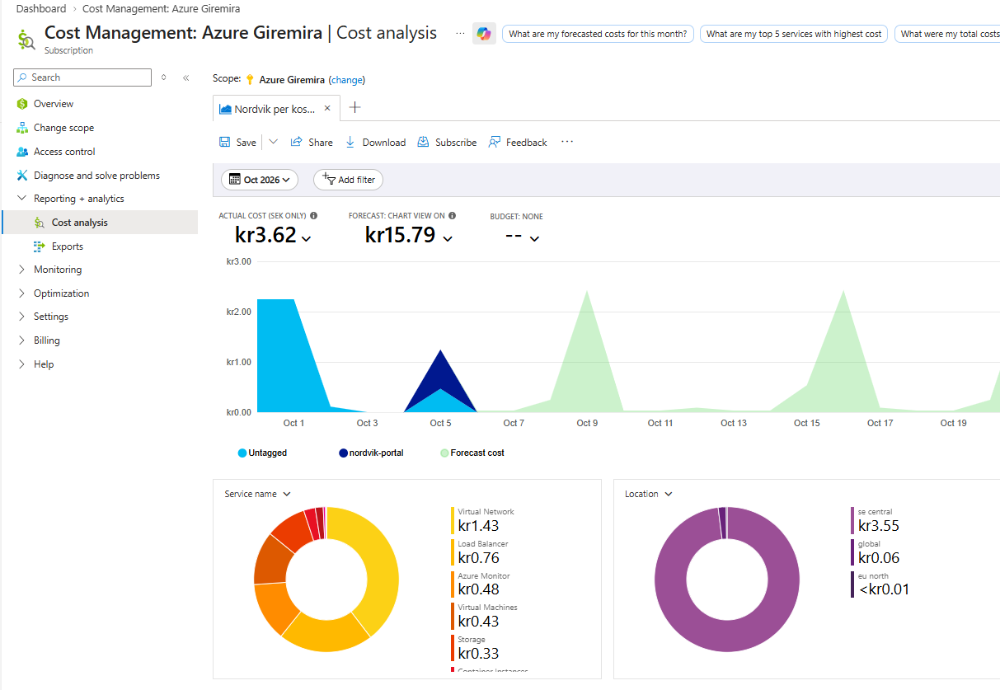

För att ekonomi ska kunna öppna kostnadsanalysen själva har `sg-nordvik-ekonomi` rollen **Cost Management Reader** på resursgruppen (se Delmoment 2). Rollen ger bara rätt att läsa kostnader, inte att ändra något.

I vardagen behöver ekonomi inte logga in i Azure alls. Vyn ovan är sparad som `Nordvik per kostnadsstalle` och skickas som **veckorapport via mejl** varje tisdag till ekonomi. Mottagaren får diagrammet direkt i mejlet, plus en länk till kostnadsdatan som CSV-fil för Excel. Så här såg den ut i `test.ekonomi`s inkorg:

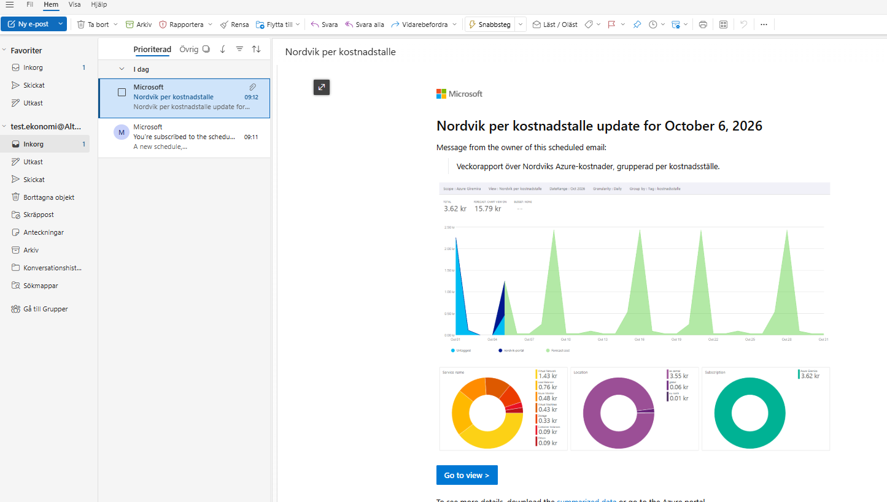

CSV-filen från mejlet har taggen som egna kolumner. Utdrag:

```
UsageDate,CostUSD,Cost,ForecastCost,Currency,TagKey,TagValue
10/5/2026,0.0470606716576341,0.469058420478804,,SEK,kostnadsstalle,
10/5/2026,0.0784058452850657,0.781478900540776,,SEK,kostnadsstalle,nordvik-portal
```

Raden med `nordvik-portal` är portalens kostnad den dagen. En tom `TagValue` betyder otaggade resurser, som inte hör till portalen. I Excel filtrerar ekonomi på `TagValue` för att få fram Nordviks kostnad.

Rapporten är inställd i portalen och ligger utanför ARM-mallen, eftersom den hör till ekonomins uppföljning och inte till själva portalmiljön. Den läser kostnaderna via taggarna och fortsätter därför fungera även när miljön rivs och byggs upp igen. Budgetlarm på prenumerationen mejlar dessutom om kostnaden passerar en gräns.

## Delmoment 1: Compute

Hela compute-delen körs som **Azure Functions i Flex Consumption-planen**, motiverat i Del A.

Två funktionsappar, båda Python 3.11, med ett gemensamt lagringskonto för sin egen drift (`stnordvik80idralt03`, separat från affärsdatan, se Delmoment 4):

- `func-nordvik-portal` (publik) - visar felanmälningsformuläret (rubrik, beskrivning, bild) och sidan "Mina anmälningar". Kopplad till `snet-app`.
- `func-nordvik-arenden` (bara nåbar inifrån nätverket) - tar emot anmälan, sparar den och startar Power Automate-flödet. Kopplad till `snet-func`.

```
$vnetId = az network vnet show --resource-group rg-nordvik --name vnet-nordvik --query id -o tsv

az functionapp create --resource-group rg-nordvik --name func-nordvik-arenden --storage-account stnordvik80idralt03 --flexconsumption-location swedencentral --runtime python --runtime-version 3.11 --vnet $vnetId --subnet snet-func --tags avdelning=fastighetsforvaltning kostnadsstalle=nordvik-portal

az functionapp create --resource-group rg-nordvik --name func-nordvik-portal --storage-account stnordvik80idralt03 --flexconsumption-location swedencentral --runtime python --runtime-version 3.11 --vnet $vnetId --subnet snet-app --tags avdelning=fastighetsforvaltning kostnadsstalle=nordvik-portal
```

VNet-kopplingen styr bara utgående trafik (vägen till lagringen), inte vem som får ringa in. `func-nordvik-arenden` stängs därför separat för publik åtkomst, så bara `func-nordvik-portal` kan nå den:

```
az functionapp config access-restriction add --resource-group rg-nordvik --name func-nordvik-arenden --rule-name allow-portal --priority 100 --action Allow --vnet-name vnet-nordvik --subnet snet-app
```

`func-nordvik-portal` skickar sin applikationstrafik (`outboundVnetRouting.applicationTraffic: true`), inklusive anrop till `func-nordvik-arenden`, via `snet-app`. Regeln släpper bara in trafik därifrån, allt annat nekas automatiskt så fort en regel finns:

```
[
  { "action": "Allow", "name": "allow-portal", "priority": 100, "vnetSubnetResourceId": ".../subnets/snet-app" },
  { "action": "Deny", "name": "Deny all", "priority": 2147483647, "ipAddress": "Any" }
]
```

### Koden i `func-nordvik-arenden`

Koden ligger i [`arenden/function_app.py`](arenden/function_app.py). Den tar emot rubrik, beskrivning, kategori, fastighet och hyresgästnummer, bygger ett eget id (`fa-åååmmdd-ttmmss-slump`), sparar en JSON-fil plus en eventuell bild i containern `anmalningar` och postar vidare till Power Automate. Kategorierna värme, vatten och lås markeras som akuta. Tidpunkten sparas läsbart och i svensk tid (`Europe/Stockholm`), som `2026-10-05:09:19`.

Testat direkt med curl:

```
PS> curl.exe -i -X POST -F "rubrik=Trasig kran" -F "beskrivning=Droppar konstant i koket" -F "kategori=vatten" -F "fastighet=Fastighet 12" -F "hyresgast=HG-1042" "https://func-nordvik-arenden.azurewebsites.net/api/arenden"
HTTP/1.1 200 OK
<h1>Tack för din anmälan</h1><p>Ditt ärende är sparat med id fa-20261005-091910-9b9388, mottaget 2026-10-05:09:19.</p>
```

Lagringskontot och funktionen är båda stängda för publik åtkomst, så för att se filen krävdes ett tillfälligt undantag för eget IP, borttaget direkt efter kontrollen:

```
PS> az storage blob list --account-name stnordvik80idralt02 --container-name anmalningar --auth-mode key --query "[].name" -o table
Result
--------------------------------------
fa-20261005-091910-9b9388/anmalan.json
```

### Koden i `func-nordvik-portal`

Koden ligger i [`portal/function_app.py`](portal/function_app.py). Tre rutter: `/` visar felanmälningsformuläret, `/skicka` tar emot det och skickar vidare server-till-server till `func-nordvik-arenden` och `/mina-arenden` låter en hyresgäst skriva in sitt hyresgästnummer och se sina anmälningar. Inget inloggningssystem byggdes, se Delmoment 2.

En hyresgäst som skriver in sitt hyresgästnummer ser sina anmälningar, med AKUT-märkning synlig. Sidan läser direkt från lagringen via den privata endpointen, så den bevisar också att nätverket och NSG:n släpper igenom rätt trafik:

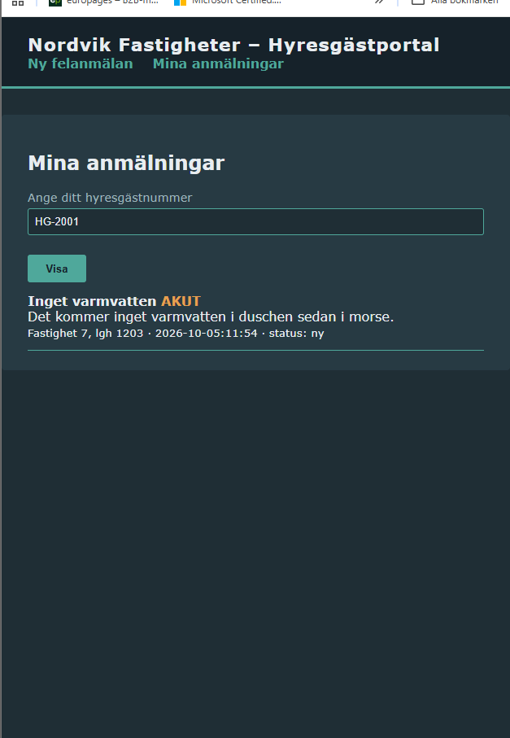

## Delmoment 2: IAM

Tre roller, enligt least privilege:

- **Hyresgäst:** ingen egen Entra-identitet och ingen inloggning. Formuläret är öppet och hyresgästnumret är ett vanligt fält, inte en hemlighet. "Mina anmälningar" filtrerar på det nummer som skrivs in, utan att kontrollera vem som skriver. En skarp lösning med 5500 externa hyresgäster hade använt Entra External ID, men det ingår inte i kursen, så det är en medveten avgränsning. Hyresgästen har aldrig någon direkt åtkomst till lagringen, bara portalens egen hanterade identitet har det och bara med läsrätt.
- **Förvaltare:** redigerar anmälningar i SharePoint och får mejlen. Skrivrätt till `anmalningar`-containern via RBAC.
- **Ekonomi:** läser anmälningar i SharePoint och följer kostnaderna i Cost Management. Bara läsrätt, både till `anmalningar`-containern och till kostnaderna.

### Två sorters grupper

| Grupp | Typ | Syfte | ID |
|---|---|---|---|
| `Nordvik-Forvaltare` | Microsoft 365-grupp | SharePoint-sajten, Teams-kanalen och mejladressen dit flödet skickar | `82f89c0e-2ccd-4a4b-a273-b633e2cd2805` |
| `sg-nordvik-forvaltare` | Säkerhetsgrupp | RBAC mot lagringen, Members (redigera) på SharePoint-sajten | `836c0262-c307-4b2d-91fe-5c89dfb6c286` |
| `sg-nordvik-ekonomi` | Säkerhetsgrupp | RBAC mot lagringen, Visitors (läsa) på SharePoint-sajten | `b11988a3-db82-4ca7-ab72-b0a960f1d752` |

Tanken var först att förvaltarna bara skulle ha en grupp, som både gav mejladressen och behörigheten till lagringen. Det gick inte. När gruppen skulle få sin roll i Azure kom felet `(GroupTypeNotSupported) Only security-enabled groups can be used in role assignments`. Azure delar bara ut roller till säkerhetsgrupper. En Microsoft 365-grupp är ingen säkerhetsgrupp. Därför har varje roll en egen säkerhetsgrupp för behörigheterna, medan Microsoft 365-gruppen bara står för SharePoint-sajten och mejlen.

Ekonomi har ingen egen Microsoft 365-grupp. Uppgiften ber bara om läsande insyn, inte om en egen kanal eller mejladress, så ekonomi får istället läsbehörighet på förvaltarnas SharePoint-sajt.

```
New-Team -DisplayName "Nordvik-Forvaltare" -MailNickName "nordvik-forvaltare" -Visibility Private -Description "Förvaltare, hanterar felanmälningar"

az ad group create --display-name "sg-nordvik-forvaltare" --mail-nickname "sgnordvikforvaltare"
az ad group create --display-name "sg-nordvik-ekonomi" --mail-nickname "sgnordvikekonomi"
```

### RBAC mot lagringen

Rollerna mot lagringen är scopade till `anmalningar`-containern, inte hela lagringskontot:

| Vem | Roll |
|---|---|
| `sg-nordvik-forvaltare` | Storage Blob Data Contributor |
| `sg-nordvik-ekonomi` | Storage Blob Data Reader |
| `func-nordvik-arenden` (hanterad identitet) | Storage Blob Data Contributor, sparar anmälningar |
| `func-nordvik-portal` (hanterad identitet) | Storage Blob Data Reader, visar listor men skriver aldrig |

Ekonomi har dessutom en roll till, scopad till resursgruppen:

| Vem | Roll | Varför |
|---|---|---|
| `sg-nordvik-ekonomi` | Cost Management Reader | Läsa kostnaderna per tagg i Cost Management (se Taggning) |

```
az role assignment create --assignee 836c0262-c307-4b2d-91fe-5c89dfb6c286 --role "Storage Blob Data Contributor" --scope $scope
az role assignment create --assignee b11988a3-db82-4ca7-ab72-b0a960f1d752 --role "Storage Blob Data Reader" --scope $scope
```

Funktionerna har inga lösenord eller nycklar till affärsdatan, de loggar in med sina hanterade identiteter.

### Behörigheter i SharePoint

Samma säkerhetsgrupper styr SharePoint, via sajtens standardgrupper:

- `sg-nordvik-forvaltare` → **Nordvik-Forvaltare Members** (redigera)
- `sg-nordvik-ekonomi` → **Nordvik-Forvaltare Visitors** (läsa)

En lista, två behörighetsnivåer, ingen dubblett av datan. Hyresgäster har ingen åtkomst till sajten.

### Verifierat med testanvändare

Två testkonton lades i varsin säkerhetsgrupp. Rätt roll ärvs genom gruppen, inget behövde tilldelas per person:

```
PS> az role assignment list --assignee <test-forvaltare-id> --include-groups --all -o table
Principal              Role                           Scope
sg-nordvik-forvaltare  Storage Blob Data Contributor  .../containers/anmalningar

PS> az role assignment list --assignee <test-ekonomi-id> --include-groups --all -o table
Principal           Role                      Scope
sg-nordvik-ekonomi  Storage Blob Data Reader  .../containers/anmalningar
```

Inloggad i SharePoint ser `Test Forvaltare` fullt verktygsfält (Nytt, Redigera, Ta bort) och kan ändra en anmälan:

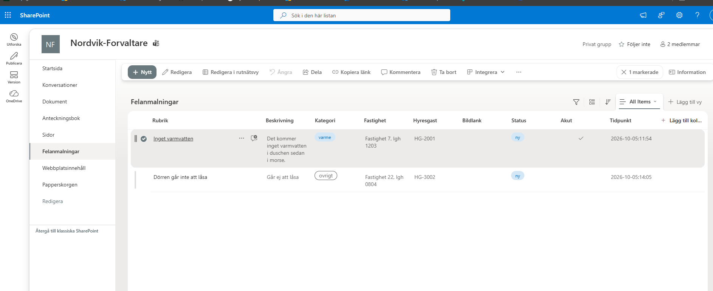

`Test Ekonomi` ser samma lista, men utan Nytt/Redigera/Ta bort. Varje rad har en överkorsad penna:

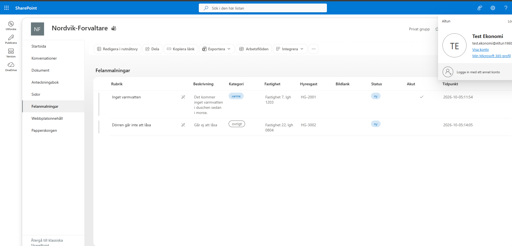

### Verifierat i Azure-portalen

Samma testkonton inloggade i Azure-portalen.

`Test Forvaltare` ser inga resursgrupper och inga kostnader. Förvaltarnas roll gäller bara filerna i `anmalningar`-containern, inte infrastrukturen.

`Test Ekonomi` ser kostnaden för `rg-nordvik`, grupperad per tagg:

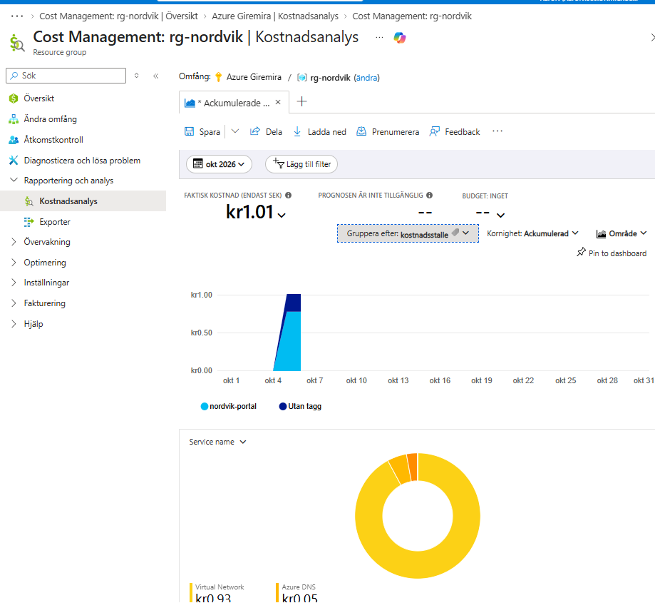

Men inte kostnaderna för resten av prenumerationen, eftersom rollen bara gäller Nordviks resursgrupp:

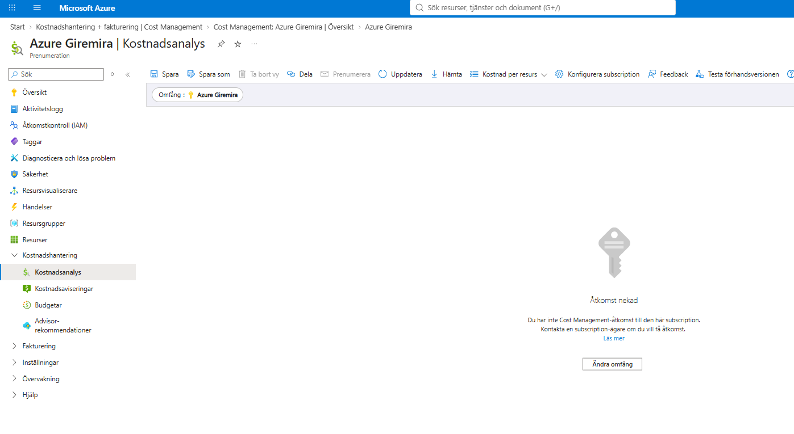

Ekonomi ser resursgruppen men inga resurser i den. Ett försök att ta bort resursgruppen nekas:

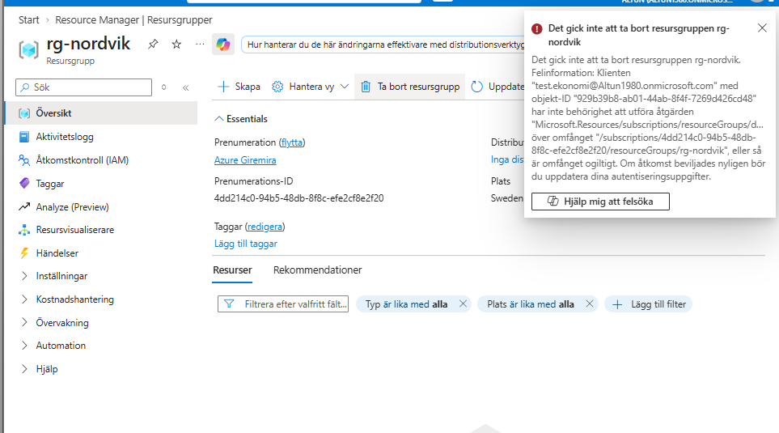

## Delmoment 3: Nätverk och säkerhet

Lagringen ska inte vara publikt åtkomlig. Lösningen är ett virtuellt nätverk med en **privat endpoint**, en egen ingång till lagringskontot som bara syns inifrån nätverket, i kombination med en **privat DNS-zon** som gör att kontots namn slår upp till en privat adress för den som frågar inifrån nätverket.

```
az network vnet create --name vnet-nordvik --resource-group rg-nordvik --location swedencentral --address-prefix 10.0.0.0/16 --subnet-name snet-data --subnet-prefix 10.0.1.0/24

az network private-dns zone create --resource-group rg-nordvik --name privatelink.blob.core.windows.net

az network private-dns link vnet create --resource-group rg-nordvik --zone-name privatelink.blob.core.windows.net --name link-nordvik --virtual-network vnet-nordvik --registration-enabled false

$storageId = az storage account show --name stnordvik80idralt02 --resource-group rg-nordvik --query id -o tsv

az network private-endpoint create --name pe-nordvik-storage --resource-group rg-nordvik --vnet-name vnet-nordvik --subnet snet-data --private-connection-resource-id $storageId --group-id blob --connection-name pe-nordvik-storage-koppling

az network private-endpoint dns-zone-group create --resource-group rg-nordvik --endpoint-name pe-nordvik-storage --name default --private-dns-zone privatelink.blob.core.windows.net --zone-name blob

az storage account update --name stnordvik80idralt02 --resource-group rg-nordvik --default-action Deny
```

Sista kommandot stänger den sista öppningen: allt som inte kommer via den privata endpointen avvisas. DNS-zongruppen skapade automatiskt rätt post:

```
stnordvik80idralt02.privatelink.blob.core.windows.net -> 10.0.1.4
```

Det första subnätet, `snet-data`, skapades tillsammans med VNet:et ovan. Därefter skapades två subnät till för compute-delen, delegerade till `Microsoft.App/environments`, den delegering Flex Consumption använder för VNet-integration:

```
az network vnet subnet create --name snet-app --resource-group rg-nordvik --vnet-name vnet-nordvik --address-prefixes 10.0.2.0/27 --delegations Microsoft.App/environments

az network vnet subnet create --name snet-func --resource-group rg-nordvik --vnet-name vnet-nordvik --address-prefixes 10.0.3.0/27 --delegations Microsoft.App/environments
```

| Subnät | Adresser | Används av |
|---|---|---|
| `snet-data` | 10.0.1.0/24 | Lagringens privata endpoint |
| `snet-app` | 10.0.2.0/27 | `func-nordvik-portal` |
| `snet-func` | 10.0.3.0/27 | `func-nordvik-arenden` |

### Nätverkssäkerhetsgrupper (NSG)

Varje subnät har en egen NSG med regler som uttrycker exakt det subnätets jobb:

| NSG | Subnät | Regler (inkommande) |
|---|---|---|
| `nsg-nordvik-data` | `snet-data` | Tillåt 443 från `snet-app` och `snet-func`, neka allt annat |
| `nsg-nordvik-app` | `snet-app` | Neka allt inkommande |
| `nsg-nordvik-func` | `snet-func` | Neka allt inkommande |

Privata endpoints ignorerar NSG-regler som standard, så på `snet-data` är `privateEndpointNetworkPolicies` satt till `NetworkSecurityGroupEnabled` för att reglerna ska gälla på riktigt. Compute-subnäten används bara för utgående trafik och ska aldrig ta emot något, så där nekas allt inkommande. Utgående trafik begränsas inte, eftersom funktionerna behöver nå DNS, Azure Monitor och Power Automate.

Verifierat i den deployade miljön:

```
PS> az network vnet subnet list --resource-group rg-nordvik --vnet-name vnet-nordvik --query "[].{subnat:name, nsg:networkSecurityGroup.id, pePolicy:privateEndpointNetworkPolicies}" -o table
snet-data  .../networkSecurityGroups/nsg-nordvik-data  NetworkSecurityGroupEnabled
snet-app   .../networkSecurityGroups/nsg-nordvik-app   Disabled
snet-func  .../networkSecurityGroups/nsg-nordvik-func  Disabled
```

### Defense in depth

| Lager | Skydd |
|---|---|
| Ingång | Bara `func-nordvik-portal` är publik och den visar bara ett formulär |
| Intern funktion | `func-nordvik-arenden` släpper bara in trafik från `snet-app` |
| Nätverk | NSG på varje subnät, lagringens subnät släpper bara in 443 från de två compute-subnäten |
| Lagring | Ingen publik adress, brandvägg `Deny`, publik blobåtkomst avstängd, TLS 1.2 |
| Identitet | Hanterade identiteter utan lösenord, RBAC scopad till en container |
| Hemligheter | Flödets URL finns aldrig i repot (se Delmoment 5) |

Testat utifrån, från en vanlig dator med ägarkontot. Både lagringen och den interna funktionen säger nej:

```
PS> az storage blob list --account-name stdatau622wnde7uy7i --container-name anmalningar --auth-mode login -o table
The request may be blocked by network rules of storage account.

PS> curl.exe -i -X POST "https://func-nordvik-arenden-u622wnde7uy7i.azurewebsites.net/api/arenden"
HTTP/1.1 403 Ip Forbidden
```

## Delmoment 4: Storage

Felanmälningar har två sorters innehåll med olika livslängd. Bilderna som hör till en anmälan läses ofta i början, medan kontrakt och besiktningsprotokoll läses sällan efter de första tre månaderna. De ligger därför i varsin container med olika regler.

```
az group create --name rg-nordvik --location swedencentral

az storage account create --name stnordvik80idralt02 --resource-group rg-nordvik --location swedencentral --sku Standard_LRS --kind StorageV2 --access-tier Hot --allow-blob-public-access false --min-tls-version TLS1_2

az storage container create --account-name stnordvik80idralt02 --name anmalningar --auth-mode key --public-access off
az storage container create --account-name stnordvik80idralt02 --name dokument --auth-mode key --public-access off
```

`--allow-blob-public-access false` stänger publik blobåtkomst på hela kontot. Nätverket låses i Delmoment 3.

| Container | Innehåll | Tier |
|---|---|---|
| `anmalningar` | felanmälningar, uppgifter plus bild | Hot |
| `dokument` | kontrakt och besiktningsprotokoll | Hot, flyttas till Cool efter 90 dagar |

Lifecycle-policyn ligger som kod i [`storage/lifecycle-policy.json`](storage/lifecycle-policy.json) och gäller bara filer i `dokument/`:

```
az storage account management-policy create --account-name stnordvik80idralt02 --resource-group rg-nordvik --policy @v41/storage/lifecycle-policy.json
```

Samma regel finns inbyggd i ARM-mallen. Azure går igenom den ungefär en gång per dygn och flyttar filer i `dokument/` som inte ändrats på över 90 dagar. Filen behåller namn och adress, bara priset ändras. Verifierat i den deployade miljön:

```
PS> az storage account management-policy show --account-name stdatau622wnde7uy7i --resource-group rg-nordvik --query "policy.rules[].{namn:name, prefix:definition.filters.prefixMatch[0], dagar:definition.actions.baseBlob.tierToCool.daysAfterModificationGreaterThan}" -o table
Namn                Prefix     Dagar
------------------  ---------  -------
dokument-till-cool  dokument/  90.0
```

Funktionernas egen drift (kodpaket, loggar) ligger i ett **separat** lagringskonto. Affärsdatan kan då låsas hårt utan att funktionernas drift påverkas. Funktionerna kan också rivas och byggas om medan anmälningarna ligger kvar.

**Tillgänglighet i skarp drift:** lagringskontona använder `Standard_LRS`, där alla kopior av datan ligger i ett och samma datacenter. Det räcker för den här demomiljön. Funktionerna tål att en instans faller bort, men om just det datacentret får problem kan de inte spara anmälningar. I skarp drift bör lagringskontot för affärsdata byta till `Standard_ZRS`, så att kopiorna sprids över tre datacenter i regionen. Det är en ändring på en rad i ARM-mallen.

## Delmoment 5: IaC

Allt i Azure beskrivs som kod i [`templates/azuredeploy.json`](templates/azuredeploy.json), ren ARM-JSON, med parametrar i [`templates/azuredeploy.parameters.json`](templates/azuredeploy.parameters.json).

### Vad som är med och vad som inte är det

**Med:** VNet med de tre subnäten och deras NSG:er, båda lagringskontona med containrar och lifecycle-policy, den privata DNS-zonen och endpointen, Application Insights, de två funktionsapparna (VNet-integrerade, med nätverksbegränsningen på `func-nordvik-arenden`) och de fem RBAC-rolltilldelningarna.

**Inte med:** Entra-grupperna, SharePoint-listan och Power Automate-flödet. De är inte Azure-resurser och kan inte beskrivas i en ARM-mall. Grupp-ID:na tas istället in som parametrar (`forvaltareGroupId`, `ekonomiGroupId`), så mallen vet vem som ska få vilken roll utan att själv skapa grupperna.

### Parametrar

| Parameter | Innehåll |
|---|---|
| `location` | Region, `swedencentral` |
| `forvaltareGroupId` | ID för `sg-nordvik-forvaltare` |
| `ekonomiGroupId` | ID för `sg-nordvik-ekonomi` |
| `flowUrl` | Power Automate-flödets URL, `securestring` |
| `tags` | Taggarna som sätts på alla resurser |

Namn som måste vara globalt unika får ett suffix från `uniqueString(resourceGroup().id)`, t.ex. `func-nordvik-portal-u622wnde7uy7i`. Den som klonar repot kan köra mallen utan att själv hitta på unika namn.

### En hemlighet som aldrig får hamna i repot

Power Automate-flödets URL innehåller en inbyggd signatur, i praktiken en nyckel till flödet. Repot är publikt, så den får aldrig committas. `flowUrl` är `securestring` i mallen. `azuredeploy.parameters.json` innehåller bara en platshållare. [`deploy.ps1`](deploy.ps1) frågar efter den riktiga URL:en vid varje körning och skriver den till en tillfällig parameterfil som tas bort direkt efter driftsättningen. Att skicka den direkt på kommandoraden fungerar inte, eftersom `&`-tecknen i adressen tolkas som kommandoavskiljare.

### Skripten

[`deploy.ps1`](deploy.ps1) skapar resursgruppen, kör mallen och publicerar koden i båda funktionerna. `func-nordvik-arenden` får sin kod via zip-deploy, eftersom `func azure functionapp publish` försöker ringa upp appen efteråt och alltid får `403` mot en funktion som medvetet är nätverksstängd. `func-nordvik-portal` publiceras med `func azure functionapp publish` och upp till fem försök, eftersom RBAC-rollerna kan ta en minut att slå igenom. [`destroy.ps1`](destroy.ps1) river hela resursgruppen.

### Samma miljö igen, var som helst

Ingenting i mallen är knutet till en viss resursgrupp. Resursgrupp och region är parametrar till skripten. Namnen som måste vara unika räknas fram ur resursgruppens id. Samma kod kan därför sätta upp en test- eller demomiljö, eller en helt ny miljö för en annan del av företaget, utan att något krockar med den befintliga:

```powershell
.\deploy.ps1 -ResourceGroup rg-nordvik-test
.\deploy.ps1 -ResourceGroup rg-nordvikvast -Location westeurope
```

Rivs på samma sätt:

```powershell
.\destroy.ps1 -ResourceGroup rg-nordvik-test
```

### Riven och återbyggd från mallen

Hela `rg-nordvik` revs med `destroy.ps1` och byggdes upp igen enbart från mallen med `deploy.ps1`, för att bevisa att mallen faktiskt fungerar och inte bara är giltig JSON. Samma end-to-end-test som i Delmoment 6 gick igenom efter återbygget. SharePoint-listan påverkas inte av att Azure-miljön rivs, så nya anmälningar hamnar bredvid de gamla.

RBAC kom tillbaka korrekt, scopat till den nya containern:

```
PS> az role assignment list --scope <nya-containerns-scope> -o table
Principal               Role
sg-nordvik-ekonomi      Storage Blob Data Reader
sg-nordvik-forvaltare   Storage Blob Data Contributor
<func-nordvik-arenden>  Storage Blob Data Contributor
<func-nordvik-portal>   Storage Blob Data Reader
```

### Buggar på vägen

VNet-integration för Flex Consumption visade sig vara sämre dokumenterad än resten av mallen. Flera saker som Azure CLI satte upp automatiskt när miljön byggdes för hand krävde uttrycklig kod i ARM. Fyra fel, ett i taget, alla med samma symptom: `403 Forbidden` när portalen försökte nå den interna funktionen.

1. **`vnetRouteAllEnabled` på fel nivå.** Lades först inuti `siteConfig`, men hör hemma direkt under resursens `properties`. Fel nivå gav inget felmeddelande, bara ingen effekt.
2. **`virtualNetworkSubnetId` räckte inte.** Lösningen var en separat resurs, `Microsoft.Web/sites/networkConfig`, samma mekanism som `az functionapp vnet-integration add` använder. Verifierat med `az functionapp vnet-integration list`, eftersom `az functionapp show` visade `null` även när kopplingen fanns.
3. **Fel routningsflagga.** Flex Consumption använder objektet `outboundVnetRouting` istället för den gamla booleanen. Det var `outboundVnetRouting.applicationTraffic: true` som behövdes.
4. **Käll-subnätet saknade en Service Endpoint.** En subnätbaserad åtkomstregel kräver att källsubnätet (`snet-app`) har tjänstslutpunkten `Microsoft.Web`, annars känner mottagaren inte igen trafiken som kommande därifrån.

Varje fel hittades genom att kontrollera den deployade resursen direkt (`az resource show`, `az functionapp vnet-integration list`) och jämföra med den handbyggda versionen, istället för att lita på hur mallen såg ut.

Det var den fjärde rättningen, Service Endpoint på `snet-app`, som till slut tog bort `403`. Rättningarna gjordes efter varandra och ligger alla kvar i mallen, så det är inte prövat vilka av de tre första som var nödvändiga var för sig. Det säkra är att mallen fungerar med alla fyra.

## Delmoment 6: Automation och integration

En inskickad felanmälan ska ge en post i en lista och en notis till förvaltaren, i Teams eller Outlook. Lösningen gör båda: **Outlook** för mejlen som förvaltarna kan agera på i efterhand och **Teams** för att nya ärenden ska synas direkt där förvaltarna arbetar.

### SharePoint-listan

Listan `Felanmalningar` ligger på `Nordvik-Forvaltare`s SharePoint-sajt, med samma datamodell som anmälan sparas med i lagringen:

| Kolumn | Typ |
|---|---|
| Rubrik (Title) | Enkel textrad |
| Beskrivning | Flera textrader |
| Kategori | Val: varme, vatten, las, ovrigt |
| Fastighet | Enkel textrad |
| Hyresgast | Enkel textrad |
| Status | Val: ny, pagaende, klar |
| Akut | Ja/Nej |
| Tidpunkt | Enkel textrad |

Behörigheterna beskrivs i Delmoment 2.

### Power Automate-flödet

Flödet `Nordvik-felanmalan` startas av en **HTTP-begäran**. `func-nordvik-arenden` postar dit efter att anmälan sparats. Fem steg:

1. **Skapa objekt** i `Felanmalningar`, alla fält kopplade mot det som kommer in.
2. **Välj** gör om bilagorna till filer som Outlook kan bifoga.
3. **Skicka ett e-postmeddelande (V2)** till `nordvik-forvaltare@Altun1980.onmicrosoft.com`, alltid, med bilden bifogad.
4. **Publicera kort i en chatt eller kanal** i Teams, kanalen General i `Nordvik-Forvaltare` (se nedan).
5. **Villkor:** om `akut` är sant skickas ett andra mejl till samma adress, markerat **Hög prioritet**, med ämnet "AKUT FELANMÄLAN: ..." och samma bild.

Flödets definition är exporterad och versionshanterad i [`automation/nordvik-felanmalan-flow.json`](automation/nordvik-felanmalan-flow.json), så logiken går att läsa och återskapa utan att klicka runt i Power Automate.

### Kortet i Teams

Teams-notisen är ett **adaptivt kort**, inte bara text. Rubriken blir röd och säger "AKUT FELANMÄLAN" när `akut` är sant, uppgifterna visas som en faktalista och en knapp öppnar SharePoint-listan direkt. Färg och rubrik styrs av ett uttryck i kortets JSON:

```
"text":  "@{if(equals(triggerBody()?['akut'], true), 'AKUT FELANMÄLAN', 'Ny felanmälan')}",
"color": "@{if(equals(triggerBody()?['akut'], true), 'Attention', 'Accent')}"
```

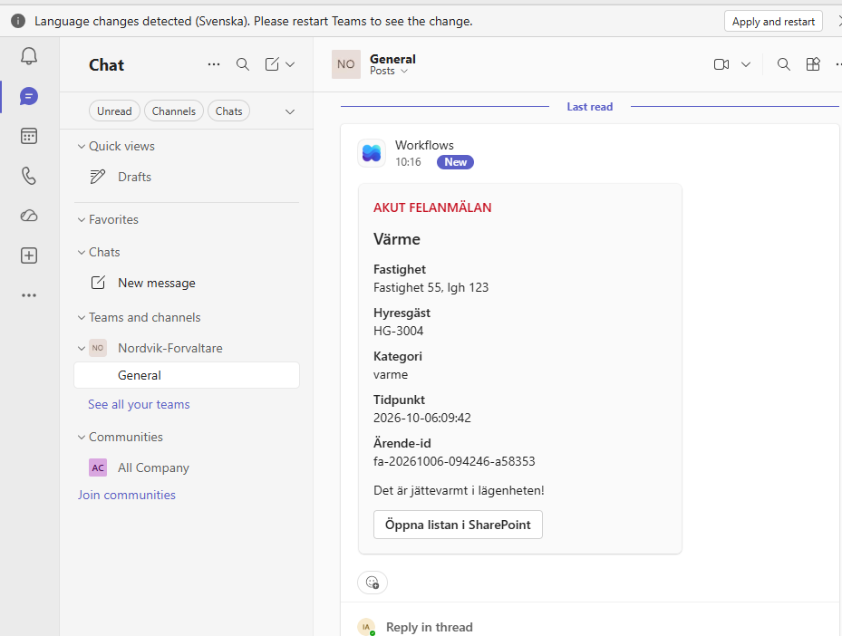

### Bilden i mejlet

Lagringskontot är nätverkslåst, så Power Automate kan inte hämta bilden via en länk. `func-nordvik-arenden` skickar därför med själva bilden, base64-kodad, i en lista `bilagor` (tom om ingen bild bifogades). Base64-datan skickas bara till flödet och sparas inte i `anmalan.json`.

Outlooks bilagefält vill ha en riktig fil, inte base64-text. Steget **Välj** avkodar varje bilaga innan mejlet skickas:

```
Name:         item()?['Name']
ContentBytes: base64ToBinary(item()?['ContentBytes'])
```

Båda mejlen tar sina bilagor från `body('Välj')`. En tom lista ger ett mejl utan bilaga, så inget extra villkor behövs.

### Verifierat end-to-end

En anmälan skickad via portalen, kategori värme och med en bild bifogad:

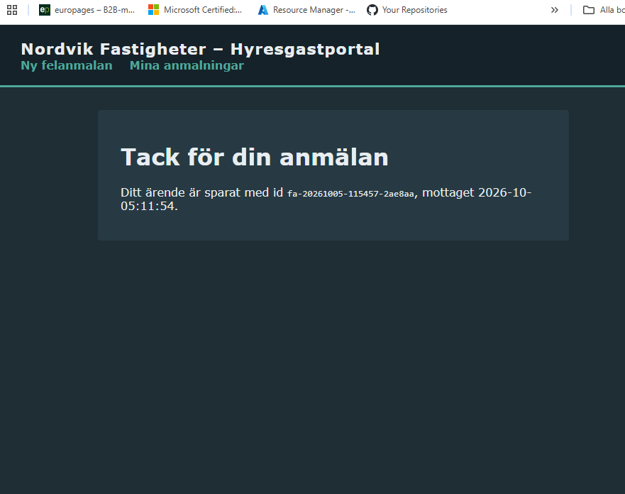

Raden i SharePoint:

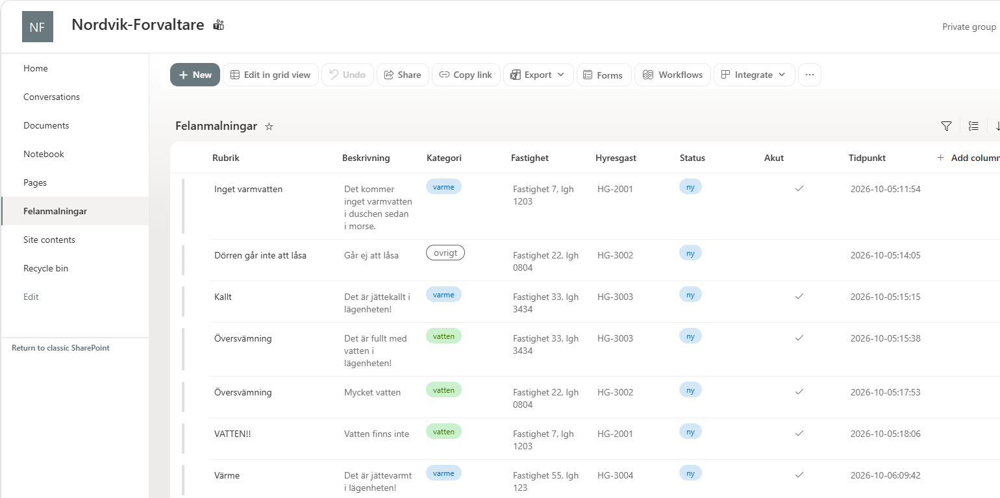

Det vanliga mejlet och det akuta med hög prioritet och bilden bifogad:

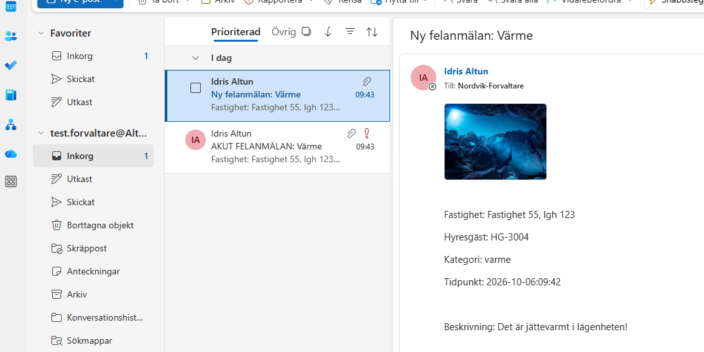
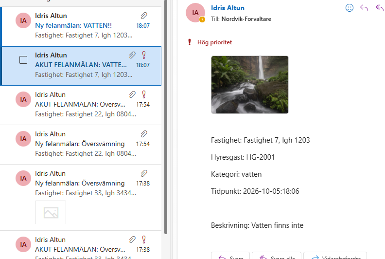

Flödets körningshistorik, alla körningar under testdagen lyckades:

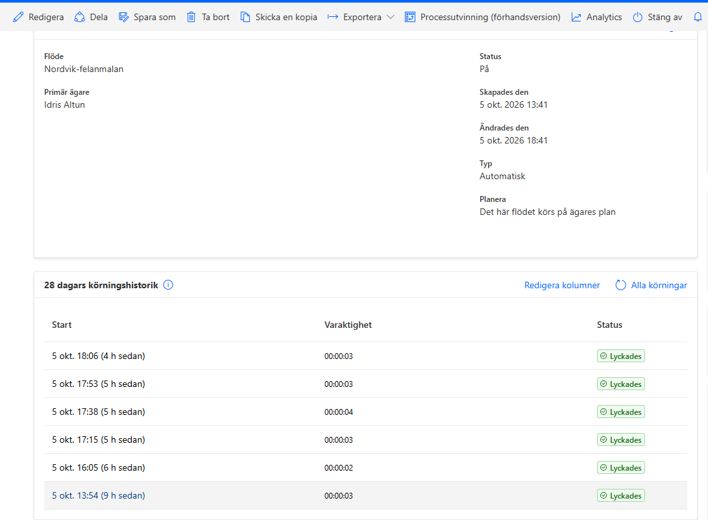

Och filerna i lagringen, kontrollerade med ett tillfälligt IP-undantag:

```
PS> az storage blob list --account-name stnordvik80idralt02 --container-name anmalningar --auth-mode key --query "[].name" -o table
Result
--------------------------------------
fa-20261005-091910-9b9388/anmalan.json
fa-20261005-115457-2ae8aa/anmalan.json
```

## Delmoment 7: Dokumentation

### Hur lösningen planerades och byggdes

1. **Analys.** Kraven från Nordvik (ojämn trafik, tåla bortfall, låg kostnad, tre roller, ingen publik lagring) styrde valet av serverless och en intern funktion bakom en publik (Del A).
2. **Byggd för hand, del för del.** Lagring, nätverk, compute, IAM och flödet byggdes med Azure CLI och testades ett i taget. Varje steg verifierades innan nästa påbörjades.
3. **Översatt till ARM.** När allt fungerade beskrevs hela Azure-miljön i en parametriserad ARM-mall.
4. **Riven och återbyggd.** Miljön revs och byggdes upp från mallen enbart. Felen som dök upp då rättades i mallen tills allt fungerade end-to-end (Delmoment 5).
5. **Versionshanterat hela vägen.** Varje steg committades till repot med korta meddelanden.

### Återskapa lösningen

**Förutsättningar:** Azure-prenumeration, Microsoft 365 med SharePoint och Power Automate, PowerShell 7, Azure CLI (`az login`) och Azure Functions Core Tools (`func`).

**En gång, utanför Azure:**

**1. Grupperna.** Skapa förvaltarnas Microsoft 365-grupp med Team (kräver PowerShell-modulen MicrosoftTeams och `Connect-MicrosoftTeams`) och de två säkerhetsgrupperna:

```powershell
New-Team -DisplayName "Nordvik-Forvaltare" -MailNickName "nordvik-forvaltare" -Visibility Private -Description "Förvaltare, hanterar felanmälningar"

az ad group create --display-name "sg-nordvik-forvaltare" --mail-nickname "sgnordvikforvaltare"
az ad group create --display-name "sg-nordvik-ekonomi" --mail-nickname "sgnordvikekonomi"
```

Hämta säkerhetsgruppernas ID:n och för in dem som `forvaltareGroupId` och `ekonomiGroupId` i `templates/azuredeploy.parameters.json`:

```powershell
az ad group show --group "sg-nordvik-forvaltare" --query id -o tsv
az ad group show --group "sg-nordvik-ekonomi" --query id -o tsv
```

Lägg sedan förvaltarna i `sg-nordvik-forvaltare` och ekonomipersonalen i `sg-nordvik-ekonomi`, under Entra ID → Grupper → Medlemmar.

**2. SharePoint-listan.** Öppna förvaltarnas sajt (Teams → Nordvik-Forvaltare → Filer → Öppna i SharePoint) och skapa en ny lista med namnet `Felanmalningar` och kolumnerna i tabellen under Delmoment 6.

**3. Listans behörigheter.** På sajten: Inställningar → Webbplatsbehörigheter → Avancerade behörighetsinställningar:
- Öppna **Nordvik-Forvaltare Members** och lägg till `sg-nordvik-forvaltare`.
- Öppna **Nordvik-Forvaltare Visitors** och lägg till `sg-nordvik-ekonomi`.

**4. Flödet.** Skapa ett nytt flöde i Power Automate med triggern **När en HTTP-begäran tas emot**, satt till "Vem som helst". Bygg stegen enligt `automation/nordvik-felanmalan-flow.json`: Skapa objekt, Välj, Skicka e-postmeddelande, Publicera kort och Villkor med akutmejlet. Klicka **Publicera** och kopiera HTTP-URL:en från triggern. Den behövs när `deploy.ps1` körs.

**Azure-miljön:**

```powershell
cd v41
.\deploy.ps1
```

Klistra in flödets URL när skriptet frågar. När det är klart skriver det ut portalens adress. Utan parametrar byggs miljön i `rg-nordvik`. En annan resursgrupp anges med `-ResourceGroup` (se Delmoment 5).

**Riva:**

```powershell
.\destroy.ps1
```

SharePoint-listan, grupperna och flödet påverkas inte av rivningen.

### Filerna i repot

```
v41/
├── README.md                          den här dokumentationen
├── deploy.ps1                         bygger hela Azure-miljön och publicerar koden
├── destroy.ps1                        river resursgruppen
├── templates/
│   ├── azuredeploy.json               ARM-mallen
│   └── azuredeploy.parameters.json    parametrar, utan hemligheter
├── portal/                            koden i func-nordvik-portal
├── arenden/                           koden i func-nordvik-arenden
├── storage/lifecycle-policy.json      Hot till Cool efter 90 dagar
├── automation/
│   └── nordvik-felanmalan-flow.json   Power Automate-flödets definition
└── images/                            skärmbilder
```
